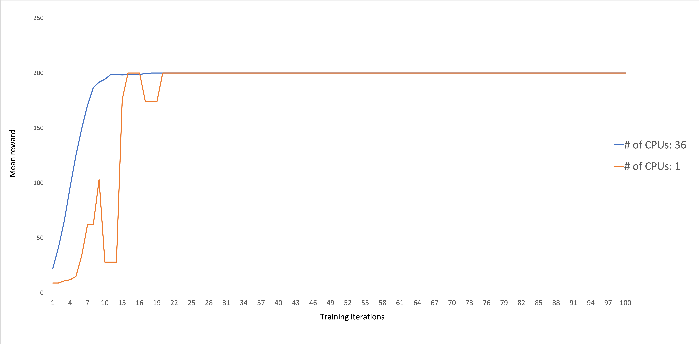

# Reinforcement Learning on Eagle

Here, we give directions for using Ray and OpenAI Gym environments to run experiments on Eagle. The full material of this tutorial are in the [NREL/HPC GitHub repo](https://github.com/erskordi/HPC/tree/HPC-RL/languages/python/openai_rllib).

## Create Anaconda environment

As a first step, you need to create an Anaconda environment that you will use for all your experiments. Below there is a list of the steps you need to follow:

### 1<sup>st</sup> step: Log in on Eagle

Login on Eagle with:
```
ssh eagle
```
or
```
ssh <username>@eagle.hpc.nrel.gov
```

### 2<sup>nd</sup> step: Set up Anaconda environment

Use the `env_example.yml` file that can be found in the aforementioned repo to create the new Anaconda environment. You can do it to a directory of your choosing. There are three main directories on Eagle where you can install the new environment, namely `/home`, `/scratch`, and `/projects`. Please go to [NREL HPC resources page](https://nrel.github.io/HPC/) to find more information about [the various Eagle directories](https://nrel.github.io/HPC/languages/python/NREL_python.html) and [how to create new Anaconda environments](https://nrel.github.io/HPC/languages/python/conda.html).

*Example:* 

Create a subdirectory `/scratch/$USER/github-repos/`. Then, `cd` there and clone the repo. Assuming you want to install your new environment in your `scratch` directory, you can also create a directory that will contain all your Anaconda environments, e.g. `/scratch/$USER/conda-envs/`:
```
conda env create --prefix=/scratch/$USER/conda-envs/myenv -f env_example.yml
```

### 3<sup>rd</sup> step: Run OpenAI Gym on a single node/single core

Now we need to make sure everything is working correctly. For OpenAI Gym, you can test your installation by running a small example using one of the standard Gym environments (e.g. `CartPole-v0`).

Begin by activating the enironment and start a Python session
```
module purge
conda activate /scratch/$USER/conda-envs/myenv
python
```
and run the following:
```python
import gym

env = gym.ens.make("CartPole-v0")
env.reset()

done = False

while not done:
    action = env.action_space.sample()
    obs, rew, done, _ = env.step(action)
    print(action, obs, rew, done)
```
If everything works correctly, you will see an output similar to:
```
0 [-0.04506794 -0.22440939 -0.00831435  0.26149667] 1.0 False
1 [-0.04955613 -0.02916975 -0.00308441 -0.03379707] 1.0 False
0 [-0.05013952 -0.22424733 -0.00376036  0.2579111 ] 1.0 False
0 [-0.05462447 -0.4193154   0.00139787  0.54940559] 1.0 False
0 [-0.06301078 -0.61445696  0.01238598  0.84252861] 1.0 False
1 [-0.07529992 -0.41950623  0.02923655  0.55376634] 1.0 False
0 [-0.08369004 -0.61502627  0.04031188  0.85551538] 1.0 False
0 [-0.09599057 -0.8106737   0.05742218  1.16059658] 1.0 False
0 [-0.11220404 -1.00649474  0.08063412  1.47071687] 1.0 False
1 [-0.13233393 -0.81244634  0.11004845  1.20427076] 1.0 False
1 [-0.14858286 -0.61890536  0.13413387  0.94800442] 1.0 False
0 [-0.16096097 -0.8155534   0.15309396  1.27964413] 1.0 False
1 [-0.17727204 -0.62267747  0.17868684  1.03854806] 1.0 False
0 [-0.18972559 -0.81966549  0.1994578   1.38158021] 1.0 False
0 [-0.2061189  -1.0166379   0.22708941  1.72943365] 1.0 True
```
Note that the above process does not involve any training.

# Agent training with Ray/RLlib

Reinforcement learning algorithms are notorious for the amount of data they need to collect in order to perform adequate agent training. The more data collected, the better the training will be. However, we also need to collect massive amounts of data in reasonable time. That is where RLlib can assist us. 

[RLlib](https://docs.ray.io/en/master/rllib.html) is an open-source library for reinforcement learning that offers both high scalability and a unified API for a variety of applications. It supports all known deep learning frameworks such as Tensorflow, Pytorch, although most parts are framework-agnostic and can be used by either one.

To demonstrate RLlib's capabilities, this page describes a simple example of training an RL agent. As above, the `CartPole-v0` OpenAI Gym environment will be used.

## Import packages

The main package you need to import is `ray`:
```python
import ray
from ray import tune
```
`Ray` consists of an API readily available for building distributed applications, hence its importance for parallel RL training. On top of it, there are several problem-solving libraries, one of which is RLlib.

`Tune` is another one of `Ray`'s libraries for scalable hyperparameter tuning. All RLlib trainers (scripts for RL agent training) are compatible with Tune API, making experimenting quite easy.

We also import the `argparse` package with which you can setup a number of flags. These flags will allow you to control certain hyperparameters, such as:
* RL algorithm (e.g. PPO, DQN)
* Number of CPUs/GPUs
* ...and others
```python
import argparse
```

## Create flags
Let's define the following flags:
```python
parser.add_argument("--num-cpus", type=int, default=0)
parser.add_argument("--num-gpus", type=int, default=0)
parser.add_argument("--name-env", type=str, default="CartPole-v0")
parser.add_argument("--run", type=str, default="DQN")
parser.add_argument("--local-mode", action="store_true")
```
All of them are self-explanatory, however let's see each one separately.
1. `--num-cpus`: Define how many CPU cores you want to utilize (Default value 0 means allocation of a single CPU core).
2. `--num-gpus`: If you allocate a GPU node, then you can set this flag equal to 1. It also accepts partial values, in case you don't want 100% of the GPU utilized.
3. `--name-env`: The name of the OpenAI Gym environment (later you will see how to register your own environment).
4. `--run`: Specify the RL algorithm for agent training.
5. `--local-mode`: This flag, set on True, is necessary to show that experiments run on a single core/single node.

### Extra flags

In the script you will also find a flag that we will use later:
```batch
parser.add_argument("--redis-password", type=str, default=None)
```
This flag will become essential for when you need to deploy your experiments on multiple Eagle nodes, so let's skip it for now.

## Initialize Ray

You can setup Ray to run either on a local mode (e.g. your laptop), or on a cluster. For convenience, we put an `if-else` statement on the `simple-trainer.py` script, which will automatically switch between modes, depending on your needs:
```python
if args.redis_password is None:
    # Single node
    ray.init(local_mode=args.local_mode)
    num_cpus = args.num_cpus - 1
else:
    # On a cluster
    ray.init(_redis_password=args.redis_password, address=os.environ["ip_head"])
    num_cpus = args.num_cpus - 1
```
Since on local mode you don't need a server for communication between nodes, you only need to setup ray to run on a local mode: `ray.init(local_mode=args.local_mode)`. The next line denotes the number of CPU cores you want to use. Remember that RLlib always allocates one CPU core, even if you put `--num-cpus=0`, hence you subtract one from your total number of cores.

## Run experiments with Tune

This is the final step in this basic trainer. Using Tune's `tune.run` function, you will initiate the agent training process. This function takes three basic arguments:
* RL algorithm (string): It is defined in the `--run` flag.
* `stop` (dictionary): Provide a criterion to stop training (in this example is the number of training iterations, stop training when iterations reach 10,000).
* `config` (dictionary): Basic information for training, contains the OpenAI Gym environment name, number of CPUs/GPUs, and possible others.
```python
tune.run(
    args.run,
    name=args.name_env,
    stop={"training_iteration": 10000},
    config={
        "env": args.name_env,
        "num_workers": args.num_cpus, 
        "num_gpus": args.num_gpus,
        "ignore_worker_failures": True
        }
    )
```
That's it! Your first RLlib trainer for running reinforcement learning experiments on Eagle is ready!

Note here that, except default hyperparameters like those above, [every RL algorithm](https://docs.ray.io/en/master/rllib-algorithms.html#available-algorithms-overview) provided by RLlib has its own hyperparameters and their default values that can be tuned in advance.

You can find the code of this example in the repo (`simple_trainer.py`), under the `simple-example` directory.


# Run experiments on Eagle

Here we give the necessary steps to succesfully run the `simple_trainer.py` example on Eagle. For any kind of experiment you want to run later, you have to follow the same steps.

## Allocate an interactive Eagle node

Firstly, allocate an interactive node. Let's start by allocating a `debug` node. Debug nodes have a maximum allocation time of one hour (60 minutes):
```
srun -n1 -t10 -<project_name> --partition debug --pty $SHELL
```
Then, activate your environment:
```
module purge
conda activate env_example
```
**VERY IMPORTANT!!** 
Before running your experiment, run
```
unset LD_PRELOAD
```
For communication between cores in a node (and between nodes in multi-node experiments), RLlib uses a Redis server. However, there is some kind of process running on Eagle causing Redis server to malfunction. Therefore, make sure you unset variable `LD_PRELOAD`, which disables that process and lets your experiment run smoothly.

## Run multi-core experiments

The example in the previous section is designed to run only on a single CPU core in a local machine. But it can also run on Eagle, if you allocate a single node and you decide to run the experiments on a single CPU. However, as explained above, RL training is highly benefited by running multiple concurrent OpenAI Gym rollouts. A single node on Eagle has 36 CPU cores, therefore you can use any number of those in order to speed up your agent training. 

If you want to use all 36 cores, you need to adjust the `--num-cpus` hyperparameter to reflect to all CPUs on the node. Therefore, you can run the following:
```
python simple_trainer.py --num-cpus 35
```
Again, RLlib by default utilizes a single CPU core, therefore by putting `--num-cpus` equal to 35 means that all 36 cores are requested.

Such is not the case with the `num_gpus` key, where zero means no GPU allocation is permitted. This is because GPUs are used for training the policy network and not running the OpenAI Gym environment instances, and thus they are not mandatory (although having a GPU node can assist the agent training by reducing training time).

# Outputs (single-core/multiple-core)

RLlib produces outputs of the following form:
```
== Status ==
Memory usage on this node: 9.1/187.3 GiB
Using FIFO scheduling algorithm.
Resources requested: 1/36 CPUs, 0/0 GPUs, 0.0/119.73 GiB heap, 0.0/38.13 GiB objects
Result logdir: /home/eskordil/ray_results/CartPole-v0
Number of trials: 1 (1 RUNNING)
+-----------------------------+----------+-------+
| Trial name                  | status   | loc   |
|-----------------------------+----------+-------|
| DQN_CartPole-v0_380be_00000 | RUNNING  |       |
+-----------------------------+----------+-------+


(pid=200639) 2021-04-29 10:44:55,555	INFO trainer.py:585 -- Tip: set framework=tfe or the --eager flag to enable TensorFlow eager execution
(pid=200639) 2021-04-29 10:44:55,555	INFO trainer.py:612 -- Current log_level is WARN. For more information, set 'log_level': 'INFO' / 'DEBUG' or use the -v and -vv flags.
(pid=200639) 2021-04-29 10:44:56,504	WARNING util.py:37 -- Install gputil for GPU system monitoring.
Result for DQN_CartPole-v0_380be_00000:
  custom_metrics: {}
  date: 2021-04-29_10-44-57
  done: false
  episode_len_mean: 22.906976744186046
  episode_reward_max: 86.0
  episode_reward_mean: 22.906976744186046
  episode_reward_min: 8.0
  episodes_this_iter: 43
  episodes_total: 43
  experiment_id: 66ccec197de8447fb178c8abebd26107
  experiment_tag: '0'
  hostname: r7i7n35
  info:
    last_target_update_ts: 1000
    learner:
      default_policy:
        cur_lr: 0.0005000000237487257
        max_q: 0.3239544630050659
        mean_q: -0.08293987810611725
        mean_td_error: -1.207885503768921
        min_q: -1.2971210479736328
        model: {}
    num_steps_sampled: 1000
    num_steps_trained: 32
    num_target_updates: 1
  iterations_since_restore: 1
  node_ip: 10.148.7.231
  num_healthy_workers: 0
  off_policy_estimator: {}
  perf:
    cpu_util_percent: 2.85
    ram_util_percent: 5.0
  pid: 200639
  policy_reward_max: {}
  policy_reward_mean: {}
  policy_reward_min: {}
  sampler_perf:
    mean_env_wait_ms: 0.042502815787727896
    mean_inference_ms: 0.49455801804701643
    mean_processing_ms: 0.1114586611965915
  time_since_restore: 0.9389147758483887
  time_this_iter_s: 0.9389147758483887
  time_total_s: 0.9389147758483887
  timers:
    learn_throughput: 197.465
    learn_time_ms: 162.054
  timestamp: 1619714697
  timesteps_since_restore: 0
  timesteps_total: 1000
  training_iteration: 1
  trial_id: 380be_00000
```
Most probably you won't need much of this information, however there are some parts of it that can give you an idea of the quality of results that you get.

One important piece of information is the utilization of resources achieved by RLlib during training, as well as the RL algorithm used for the experiment:
```
Resources requested: 1/36 CPUs, 0/0 GPUs, 0.0/119.73 GiB heap, 0.0/38.13 GiB objects
Result logdir: /home/eskordil/ray_results/CartPole-v0
Number of trials: 1 (1 RUNNING)
+-----------------------------+----------+---------------------+--------+------------------+------+----------+
| Trial name                  | status   | loc                 |   iter |   total time (s) |   ts |   reward |
|-----------------------------+----------+---------------------+--------+------------------+------+----------|
| DQN_CartPole-v0_380be_00000 | RUNNING  | 10.148.7.231:200639 |      2 |          2.55838 | 2000 |    19.69 |
+-----------------------------+----------+---------------------+--------+------------------+------+----------+
```
These lines inform us about the following:
* Number of CPUs utilized: If `--num-cpus` was defined as equal to zero, then by default RLlib acquired a single CPU core to run the experiment.
* No GPU resources were utilized: Expected since `--num-gpus` was set to zero.
* Trial name: Generated automatically, it gives information regarding the specific RL algorithm used (here DQN).
* status: either RUNNING or FAILED (in case there was an error during training).
* iter: Here you see the number of training iterations (remember, we set the maximum value for it to 10,000)
* total time (seconds): time spend for one iteration
* reward: The reward returned after the end of this iteration. Succesfull agent training will be shown through increase of that value during the process.

These are the most straightforward, but in the same time important, information you will get after every training iteration. The rest of this snippet contains more specialized information, but for most of it you will never have to be concerned about. 

When you set `--num-cpus` equal to 35, then the aforementioned printout will be like this:
```
== Status ==
Memory usage on this node: 10.6/92.8 GiB
Using FIFO scheduling algorithm.
Resources requested: 36/36 CPUs, 0/0 GPUs, 0.0/54.25 GiB heap, 0.0/18.7 GiB objects
Result logdir: /home/eskordil/ray_results/CartPole-v0
Number of trials: 1 (1 RUNNING)
+-----------------------------+----------+-----------------+--------+------------------+------+----------+
| Trial name                  | status   | loc             |   iter |   total time (s) |   ts |   reward |
|-----------------------------+----------+-----------------+--------+------------------+------+----------|
| DQN_CartPole-v0_b665a_00000 | RUNNING  | 127.0.0.1:92844 |      3 |          6.30516 | 3360 |    19.07 |
+-----------------------------+----------+-----------------+--------+------------------+------+----------+


Result for DQN_CartPole-v0_b665a_00000:
custom_metrics: {}
date: 2021-04-29_09-16-00
done: false
episode_len_mean: 17.37
episode_reward_max: 97.0
episode_reward_mean: 17.37
episode_reward_min: 8.0
episodes_this_iter: 75
episodes_total: 233
experiment_id: 573f3799c81946439a598d6d633df7d4
experiment_tag: '0'
hostname: r4i7n35
info:
last_target_update_ts: 4480
learner:
  default_policy:
    cur_lr: 0.0005000000237487257
    max_q: 12.753413200378418
    mean_q: 5.389695167541504
    mean_td_error: -1.9424524307250977
    min_q: 0.2038756161928177
    model: {}
num_steps_sampled: 4480
num_steps_trained: 800
num_target_updates: 7
iterations_since_restore: 4
node_ip: 127.0.0.1
num_healthy_workers: 35
off_policy_estimator: {}
perf:
cpu_util_percent: 7.4
ram_util_percent: 11.4
pid: 92844
policy_reward_max: {}
policy_reward_mean: {}
policy_reward_min: {}
sampler_perf:
mean_env_wait_ms: 0.04555504737231483
mean_inference_ms: 0.8442203457250892
mean_processing_ms: 0.1175659340957767
time_since_restore: 8.04318118095398
time_this_iter_s: 1.7380259037017822
time_total_s: 8.04318118095398
timers:
learn_throughput: 19616.739
learn_time_ms: 1.631
update_time_ms: 89.14
timestamp: 1619709360
timesteps_since_restore: 0
timesteps_total: 4480
training_iteration: 4
trial_id: b665a_00000
```
Obviously, RLlib here utilized the cardinality of CPU cores on the node (36/36). 

You may consider odd the fact that the `total time(s)` here is more than when using a single CPU core, but this happens because in the latter case the algorithm runs 36 instances of the OpenAI Gym environment concurrently, rather than a single instance. Therefore, more data is collected for policy training, which can lead to faster reward convergence. In any case, these times are not absolute, and will decrease during training, especially as the agent approaches the optimal reward value.

## Metadata

When you run RLlib experiments, a directory named `ray_results` will be automatically created on your `home` directory. Ray uses it to dump metadata for all your experiments that contain distilled from all this information you see in the training printouts. You can use these results later for evaluating the quality of the training process. 

After your experiment with `CartPole-v0` is finished, go to your home directory:
```
cd ~/
``` 
Then, do `cd ray_results`. You will see directories named after the OpenAI Gym environment you used for running experiments. Hence, for CartPole you will see a directory named `CartPole-v0`. Within this directory, you will find subdirectories with names being combinations of the RL algorithm that you used for training, the OpenAI Gym environment's name, the datetime when the experiment took place, and a unique string. 

So, if for example you ran an experiment for CartPole, using Deep Q-Network (DQN), and the experiment started on April 29, 2021, at 9:14:57AM, the subdirectory containing the metadata will have a name like this:
```
DQN_CartPole-v0_0_2021-04-29_09-14-573vmq2rio
```
You `cd` in that directory, where you will find various text, JSON, and CSV files. One of them, named `progress.csv` contains a dataframe with columns such as `episode_reward_mean`, that help you evaluate the quality of the training process.

## Comparisons

Let us now compare the outcomes from when running experiments on a single core versus on all cores on a single Eagle node. A first approach to do that is the values column `episode_reward_mean` in file `progress.csv`. These values will show you how fast (or not) the reward converged to the optimal value during agent training. The faster the convergence, the better.

The following image shows the agent training progress, in terms of reward convergence, for the `CartPole-v0` environment. The RL algorithm used was the [Proximal Policy Optimization](https://arxiv.org/pdf/1707.06347.pdf), and training was conducted for 100 iterations.

As you can see, training using the cardinality of CPU cores on a node led to faster convergence to the optimal value. 

It is necessary to say here that CartPole is a simple example where the optimal reward value (200) can be easily reached even when using a single CPU core on your laptop. The power of using multiple cores becomes more apparent in cases of more complex environments (such as the [Atari environments](https://gym.openai.com/envs/#atari)). RLlib website also gives examples of the [scalability benefits](https://docs.ray.io/en/master/rllib-algorithms.html#ppo) for many state-of-the-art RL algorithms.

# Run experiments on multiple nodes

There are some cases where the problem under consideration is highly complex and requires vast amounts of training data for the policy network to train in a reasonable amount of time. It could be then, that you will require more than one nodes to run your experiments. In this case, you need to write a slurm script file, where you will include all the necessary commands to train your agents on multiple CPUs and multiple nodes.

## Example: CartPole-v0

As explained above, CartPole is a rather simple environment and solving it using multiple cores on a single node feels like an overkill, let alone multiple nodes! However, it is a good example for giving you an experience on running RL experiments using RLlib.

For multiple nodes it is more convenient to use a slurm script instead of an interactive node, which you will submit as `sbatch <name_of_your_batch_script>`. The results will be exported in an `slurm-<job_id>.out` file, which you can dynamically access during training using the `tail -f slurm-<job_id>.out` command. Otherwise, you can open it using a standard text editor (e.g. `nano`) after training is finished.
Next, we describe the basic parts of the slurm script file, but we also provide [the complete script](https://github.com/erskordi/HPC/blob/HPC-RL/languages/python/openai_rllib/multi_node_trainer.sh).

You begin by defining some basic `SBATCH` options, including the desired training time, number of nodes, tasks per node, etc.

```bash
#!/bin/bash --login

#SBATCH --job-name=cartpole-multiple-nodes
#SBATCH --time=00:10:00
#SBATCH --nodes=3
#SBATCH --tasks-per-node=1
#SBATCH --cpus-per-task=36
#SBATCH --account=A<account>
env
```
Allocating multiple nodes means that we will utilize a Ray cluster. A Ray cluster consists of a head node and a set of worker nodes. The head node needs to be started first, and the worker nodes are given the address of the head node to form the cluster. 

We want to run our agent training for 20 minutes (`SBATCH --time=00:20:00`), and on three Eagle CPU nodes (`SBATCH --nodes=3`). Every node will execute a single task (`SBATCH --tasks-per-node=1`), which will be executed on all 36 cores (`SBATCH --cpus-per-task=36`). Then, you need to set is the project account. You can always add more options, such as whether you want your experiment prioritized (`--qos=high`).

Afterwards, activate your environment. Do not forget to `unset LD_PRELOAD`.
```batch
module purge
conda activate /scratch/$USER/conda-envs/env_example
unset LD_PRELOAD
```
Now comes the part where you have to set up the Redis server that will allow all the nodes you requested to communicate with each other. For that, you have to set a Redis password:
```batch
ip_prefix=$(srun --nodes=1 --ntasks=1 -w $node1 hostname --ip-address)
port=6379
ip_head=$ip_prefix:$port
redis_password=$(uuidgen)
```
Then, you submit your jobs one at a time at your workers, starting with the head node and moving on to the rest of them.
```batch
srun --nodes=1 --ntasks=1 -w $node1 ray start --block --head \
--node-ip-address="$ip_prefix" --port=$port --redis-password=$redis_password &
sleep 10

echo "starting workers"
for ((  i=1; i<=$worker_num; i++ ))
do
  node2=${nodes_array[$i]}
  echo "i=${i}, node2=${node2}"
  srun --nodes=1 --ntasks=1 -w $node2 ray start --block --address "$ip_head" --redis-password=$redis_password &
  sleep 5
done
```
Finally, you set your Python script to run. Since this experiment will run on a cluster, Ray will be initialized as:
```python
ray.init(_redis_password=args.redis_password, address=os.environ["ip_head"])
num_cpus = args.num_cpus - 1
```
Therefore, you need to activate the `--redis-password` option from your input arguments, along with the total number of CPUs. You do this as:
```batch
python -u simple_trainer.py --redis-password $redis_password --num-cpus $total_cpus
```
You are ready to start your experiment, simply run:
```
sbatch <your_slurm_file>
```
If the trainer script is on a different directory, make sure you `cd` to this directory in your slurm script before executing it.
```
# Example where the trainer is on scratch:
cd /scratch/$USER/path_to_specific_directory
python -u simple_trainer.py --redis-password $redis_password --num-cpus $total_cpus
```

# Experimenting using GPUs

It is now time to learn running experiments utilizing also GPU nodes on Eagle. This can boost your training times considerably. GPU nodes however is better to be utilized only on cases of highly complex environments with very large observation and/or action spaces. We will continue with CartPole for establishing a template which you can later use for your own experiments.

## Creating Anaconda environment

You need to create a new environment, this time installing `Tensorflow-GPU`. This is the specialized Tensorflow distribution that is able to recognize and utilize GPU hardware in your system. For your convenience, we provide a sample [yaml file](https://github.com/erskordi/HPC/blob/HPC-RL/languages/python/openai_rllib/simple-example-gpu/env_example_gpu.yml) that is tuned to create an Anaconda environment on Eagle with Tensorflow-gpu in it. For installing the new environment, follow the same process as before at a directory of your choice:
```
conda env create --prefix=/<path_to_chosen_directory>/env_example_gpu -f env_example_gpu.yml 
```

### **Only for Eagle users:** Creating Anaconda environment using Optimized Tensorflow

NREL's HPC group has recently created [a set of optimized Tensorflow drivers](https://github.com/NREL/HPC/tree/master/workshops/Optimized_TF) that maximize the efficiency of utilizing Eagle's Tesla V100 GPU units. The drivers are created for various Python 3 and Tensorflow 2.x.x versions. 

Here, we also provide a version of the tutorial for GPU experimentation using an [extended environment version](https://github.com/erskordi/HPC/blob/HPC-RL/languages/python/openai_rllib/simple-example-gpu/env_example_optimized_tf.yml) of a [similar environment](https://github.com/NREL/HPC/blob/master/workshops/Optimized_TF/py37tf22.yml) in the Optimized TF repo.

**This environment currently works for Python 3.7, Tensorflow 2.2, and the latest Ray version**

## Allocate GPU node 

*The following instructions are the same for both the aforementioned GPU environments*

Running experiments with combined CPU and GPU nodes is not so straightforward as running them using only CPU nodes (either single or multiple nodes). In this case, you need to submit heterogenous jobs using slurm. Here, we will see how to submit heterogenous jobs for RLlib experiments, by allocating both CPU/GPU resources.

We begin at first by specifying some basic options, similar to above:
```batch
#!/bin/bash  --login
#SBATCH --account=A<account>
#SBATCH --job-name=cartpole-gpus
#SBATCH --time=00:10:00
```
The slurm script will clearly define the various jobs. These jobs include the CPU nodes that will carry the environment rollouts (multiple iterative runs of the OpenAI Gym's `reset` and `step` functions), and the GPU node for policy training. Eagle has 44 GPU nodes, where each node has 2 GPUs. You can request either one GPU per node (`--gres=gpu:1`), or both of them (`--gres=gpu:2`). For the purposes of this tutorial, we will utilize one GPU core on a single node.

In total, we distinguish the nodes in the following categories: 
 * A head node, and multiple rollout nodes (as before)
 * A policy training node (GPU)

You have to include the `hetjob` option for both the rollout nodes and the policy training node. For this experiment, we request three nodes, with all 36 cores of each to be used for environment rollouts. Then, we request a single GPU node:
```batch
# Ray head node
#SBATCH --nodes=1
#SBATCH --tasks-per-node=1

# Rollout nodes - Nodes with multiple runs of OpenAI Gym 
#SBATCH hetjob
#SBATCH --nodes=3
#SBATCH --tasks-per-node=1
#SBATCH --cpus-per-task=36

# Policy training node - This is the GPU node
#SBATCH hetjob
#SBATCH --nodes=1
#SBATCH --tasks-per-node=1
#SBATCH --partition=debug
#SBATCH --gres=gpu:1
```
Of course, you can request any number of CPU/GPU nodes. For example, you can request a single node and perhaps just a single CPU core. However, requesting GPUs means that you want to run experiments for an OpenAI Gym environment that utilizes high-dimensional observation and/or action spaces, therefore multiple CPU nodes will be preferrable.

All three types of nodes (head, rollouts, training) we need to define three separate groups:
```batch
head_node=$(scontrol show hostnames $SLURM_JOB_NODELIST_HET_GROUP_0)
rollout_nodes=$(scontrol show hostnames $SLURM_JOB_NODELIST_HET_GROUP_1)
rollout_nodes_array=( $rollout_nodes )
learner_node=$(scontrol show hostnames $SLURM_JOB_NODELIST_HET_GROUP_2)
echo "head node    : "$head_node
echo "rollout nodes: "$rollout_nodes
echo "learner node : "$learner_node
```
Each group of nodes requires its separate `srun` command so that they will run independently of each other.
```batch
echo "starting head node at $head_node"
srun --pack-group=0 --nodes=1 --ntasks=1 -w $head_node ray start --block --head \
--node-ip-address="$ip_prefix" --port=$port --redis-password=$redis_password & # Starting the head
sleep 10

echo "starting rollout workers"
for ((  i=0; i<$rollout_node_num; i++ ))
do
  rollout_node=${rollout_nodes_array[$i]}
  echo "i=${i}, rollout_node=${rollout_node}"
  srun --pack-group=1 --nodes=1 --ntasks=1 -w $rollout_node \
   ray start --block --address "$ip_head" --redis-password=$redis_password & # Starting the workers
  sleep 5
done

echo "starting learning on GPU"
srun --pack-group=2 --nodes=1 --gres=gpu:1 -w $learner_node ray start --block --address "$ip_head" --redis-password=$redis_password &
```
The first two parts are identical to those from the previous section. We also add one more for engaging the GPU node.

Finally, we call
```batch
python -u simple_trainer.py --redis-password $redis_password --num-cpus $rollout_num_cpus --num-gpus 1
```
to begin training. Note that here we also add the `---num-gpus` argument to include the GPU node that RLlib will utilize for policy training. There is no need to manually declare the GPU for policy trainig in the `simple_trainer.py`, RLlib will automatically recognize the existence of GPU and use it accordingly.

The repo contains complete slurm file versions for both [`env_example_gpu`](https://github.com/erskordi/HPC/blob/HPC-RL/languages/python/openai_rllib/simple-example-gpu/gpu_trainer.sh) and [`env_gpu_optimized_tf`](https://github.com/erskordi/HPC/blob/HPC-RL/languages/python/openai_rllib/simple-example-gpu/env_example_optimized_tf.yml). They can be used as direct templates for your own experiments.

## Outcome

The output will be of the same nature as before, the only difference is that you will be able to confirm that a single GPU is also utilized (`1.0/1 GPUs`):
```
== Status ==
Memory usage on this node: 6.5/92.8 GiB
Using FIFO scheduling algorithm.
Resources requested: 108.0/180 CPUs, 1.0/1 GPUs, 0.0/807.51 GiB heap, 0.0/294.94 GiB objects (0.0/1.0 accelerator_type:V100)
Result logdir: /scratch/eskordil/ray_results/CartPole-v0
Number of trials: 1/1 (1 RUNNING)
+-----------------------------+----------+------------------+--------+------------------+-------+----------+----------------------+----------------------+--------------------+
| Trial name                  | status   | loc              |   iter |   total time (s) |    ts |   reward |   episode_reward_max |   episode_reward_min |   episode_len_mean |
|-----------------------------+----------+------------------+--------+------------------+-------+----------+----------------------+----------------------+--------------------|
| PPO_CartPole-v0_0339b_00000 | RUNNING  | 10.148.8.36:3651 |	   1 |          11.9292 | 21400 |  22.1782 |                   84 |                    8 |            22.1782 |
+-----------------------------+----------+------------------+--------+------------------+-------+----------+----------------------+----------------------+--------------------+


Result for PPO_CartPole-v0_0339b_00000:
  agent_timesteps_total: 42800
  custom_metrics: {}
  date: 2021-05-12_10-00-28
  done: false
  episode_len_mean: 47.06188118811881
  episode_media: {}
  episode_reward_max: 200.0
  episode_reward_mean: 47.06188118811881
  episode_reward_min: 9.0
  episodes_this_iter: 404
  episodes_total: 1302
  experiment_id: f5a33b1e020c4ef19dd38f1ab425b16d
  hostname: r103u23
  info:
    learner:
      default_policy:
        learner_stats:
          cur_kl_coeff: 0.30000001192092896
          cur_lr: 4.999999873689376e-05
          entropy: 0.5984720587730408
          entropy_coeff: 0.0
          kl: 0.01920320838689804
          model: {}
          policy_loss: -0.030758701264858246
          total_loss: 394.77838134765625
          vf_explained_var: 0.14716656506061554
          vf_loss: 394.8033447265625
    num_agent_steps_sampled: 42800
    num_steps_sampled: 42800
    num_steps_trained: 42800
  iterations_since_restore: 2
  node_ip: 10.148.8.36
  num_healthy_workers: 107
  off_policy_estimator: {}
  perf:
    cpu_util_percent: 6.346666666666667
    ram_util_percent: 3.200000000000001
  pid: 3651
  policy_reward_max: {}
  policy_reward_mean: {}
  policy_reward_min: {}
  sampler_perf:
    mean_action_processing_ms: 0.04437368377214986
    mean_env_render_ms: 0.0
    mean_env_wait_ms: 0.056431942853082055
    mean_inference_ms: 0.7302830909252791
    mean_raw_obs_processing_ms: 0.06735290716566901
  time_since_restore: 22.6750385761261
  time_this_iter_s: 10.745835304260254
  time_total_s: 22.6750385761261
  timers:
    learn_throughput: 1949.331
    learn_time_ms: 10978.124
    sample_throughput: 92888.12
    sample_time_ms: 230.385
    update_time_ms: 9.555
  timestamp: 1620835228
  timesteps_since_restore: 0
  timesteps_total: 42800
  training_iteration: 2
  trial_id: 0339b_00000
```

# Create custom Gym environments

So far we used a benchmark Gym environment (`CartPole-v0`) for our experiments. However, the true value of OpenAI Gym is that you can create your own environments using the same structure as the benchmark ones. Custom-made environments can become extremely complex due to the mechanics involved and may require many subscripts that perform parts of the simulation. Nevertheless, the basis of all environments is a Python class that inherits the `gym.Env` class and defines the three main functions that all Gym environments require:
 * `__init__`: This function initializes the environment and may contain initial values for variables and other information necessary for the environment to work. It also defines the dimensionality of the environment, that is the sizes of the observation and action spaces, which are given using the parameters `self.observation_space` and `self.action_space`, respectively. Depending on their nature, they can take discrete, continuous, or combinations of values. OpenAI provides [details and examples](https://gym.openai.com/docs/) of each one of these types of spaces.
 * `reset`: This function, when called, returns the environment on a previous state. This state can either be a user-defined initial state or it may be a random initial position. The latter can be found on environments that describe locomotion like `CartPole`, where the initial state can be any possible position of the pole on the cart.
 * `step`: This function is the heart of the environment class. It represents the inner mechanics of the environment, therefore it can be seen as some kind of simulator. It takes as input the sampled action, and traverses the environment into a new state and calculates the new reward. The new state and reward represent part of the function's output and they are the necessary data collected for policy training. Except those, this function also returns a boolean variable `done` that is True if the environment reached its final state (if it exists), and False otherwise. Make note that many environments do not consider a final state, since it might not make sense (e.g. a traffic simulator for fleets of autonomous ridesharing vehicles that reposition themselves based on a certain criterion. In this case the reward will get better every time, but there is no notion of a final vehicle position). Finally, this function returns a dictionary (`info`) that can be tuned by the developer to return further information from the inner workings of the environment that otherwise are not required for policy training.

Here we give you the basic directions of how to write and register a custom-made OpenAI Gym environment. After that, you will be able to start creating your own environments.

## Create an environment class

As stated above, the basis of any Gym environment is a Python class that inherits the `gym.Env` class and contains the three aforementioned functions. So, after importing the gym package, you define your class:
```python
import gym

class BasicEnv(gym.Env):(...)
```
The environment is represented by two possible states (0, 1) and 5 possible actions (0-4). You realize that this will be a very simple environment structure, but our point here is to understand the process of creating one. For the purposes of this tutorial, we consider state 0 to be the initial state, and state 1 the final state.

Inside the `BasicEnv` class, we define the dimensions of observation and action spaces in the `__init__` function:
```python
def __init__(self):
    self.action_space = gym.spaces.Discrete(5)
    self.observation_space = gym.spaces.Discrete(2)
```
The keyword here is `Discrete`. It shows us that both the possible observations and the actions are represented as discrete values. Other keywords are `Box` for continuous single- or multi-dimensional observations and states, `MultiDiscrete` for vectors of discrete values, etc. OpenAi provides [detailed explanation](https://gym.openai.com/docs/) for all different observations and states forms.

After `__init__`, we define the `reset` function. This function does not take any inputs:
```python
def reset(self):
    state = 0
    return state
```
In the case of our example, the reset function simply returns the environment to the initial state.

Finally, we define the `step` function, which takes as input the sampled action. In our example, the step function traverses the environment unto state 1 and based on the action value, returns a reward value of 1 or -1:
```python
def step(self, action):
    state = 1

    if action == 2:
        reward = 1
    else:
        reward = -1

    done = True
    info = {}

    return state, reward, done, info
```
That's it! You have just created a new OpenAI Gym environment. Make note that there is one more function that is usually found on Gym environments, although it is not been used frequently. This is the `render` function, which can be called in random intervals throughout training and return a snapshot of the environment at that time. While this might be helpful for evaluating the agent training process, it is not necessary for the actual training. OpenAI documentation [provides](https://gym.openai.com/docs/#environments) details for every function.

You can find the [full script](https://github.com/erskordi/HPC/blob/HPC-RL/languages/python/openai_rllib/custom_gym_env/custom_env.py) of this environment in the repo.

## Run experiments on RLlib

Now that our environment is ready, we proceed with agent training by utilizing RLlib. We provide in the repo the [full trainer script](https://github.com/erskordi/HPC/blob/HPC-RL/languages/python/openai_rllib/custom_gym_env/custom_env_trainer.py) as well.

The trainer is almost identical to [the one we used before](https://github.com/erskordi/HPC/blob/HPC-RL/languages/python/openai_rllib/simple-example/simple_trainer.py), with few additions that are necessary to register the new environment.

At first, except `ray` and `tune`, we also need to import:
```python
from ray.tune.registry import register_env
from custom_env import BasicEnv
```
The `register_env` function, as the name suggests, will be used to register the new environment, which is imported from the `custom_env.py` script here.

Function `register_env` takes two arguments:
* Name of the environment, which is chosen by the developer
* The actual name of the environment (`BasicEnv`) as a `lambda` function.
```python
env_name = "custom-env"
register_env(env_name, lambda config: BasicEnv())
```
RLlib provides [detailed explanation](https://docs.ray.io/en/master/rllib-env.html) of how `register_env` works.

Then, you define the `tune.run` function, but this time instead of `args.name_env`, we use the `env_name` that we defined above.

That's it! You can now proceed with agent training using the same slurm scripts we described above.

Creating your own OpenAI Gym environment is more like an art than science. The main issue is for you to really clarify what the environment represents and how it works, after that you only have to describe it using the Python functionality.
