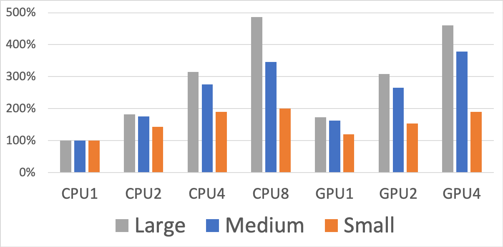

# How to Run Gaussian Jobs on Eagle's GPU nodes

Eagle currently has 50 computing nodes with dual *NVIDIA Tesla V100* GPUs and Gaussian *G16 C.01* has the capbility to run on those nodes using GPUs. This Readme file will show instructions on how to run Gaussian jobs on Eagle's GPU nodes.

For the slurm batch script, one extra line needs to be added for requesting GPU nodes:
```
#SBATCH --gres=gpu:2
```
And the following module commands should be used in the slurm batch script in order to load the Gaussian module with GPU support:
```
module purge
module use /nopt/nrel/apps/modules/centos77/modulefiles/
module load gaussian/G16C_GPU
```
For the Gaussian input file (usually the .com file), two extra lines need to be added to the beginning of the file:
```
%CPU=0-35
%GPUCPU=0,1=0,18
```
These commands state that CPU cores 0-35 and GPU 0 and 1 will be used in the job, with GPU 0 controlled by CPU 0, GPU 1 controlled by CPU 18.

Here, we have eight sample Gaussian DFT jobs with *"freq"* and *"B3LYP"* calculations. Users can either download them by using *"git clone"* or simply click these directories and files for contents. Their geometries are the same. Four of them in the *"large"* directory use *spaug-cc-pvtz* basis set with 1164 basis functions. Four of them in the *medium* directory use *6-311++G(2d,p)* basis set with 844 basis functions. And four of them in the *"small"* directory use *6-31G(d)* basis set with 443 basis functions. Four each directory, we compared the performance of four senarios: running on 1 node with CPU only (36 cores of CPU, no use of GPU), 2 nodes with CPU only (72 cores of CPU), 1 node with GPUs (36 cores of CPU and 2 V100 GPUs), and 2 nodes with GPUs (72 cores of CPU and 4 GPUs). The sub-directories are named as *cpu1*, *cpu2*, *gpu1*, and *gpu2*, respectively.

The following image shows the performance improvement of the four senarios for "large", "medium", and "small" DFT jobs. For the "large" jobs, running on 2 nodes without using GPU will be 1.82X faster than on 1 node without using GPU, running on 1 node with GPUs will be 1.73X faster, and running on 2 nodes with GPUs will be 3.15X faster. For the "medium" jobs, running on 2 nodes without using GPU will be 1.76X faster than on 1 node without using GPU, running on 1 node with GPUs will be 1.62X faster, and running on 2 nodes with GPUs will be 2.65X faster. For the "small" jobs, improvement is much less and scaling is worse. For "large" and "medium" jobs, one GPU nodes is roughly equivalent to two CPU nodes.

In order to utilize the GPU nodes efficiently, we encourage Gaussian users to **only run DFT jobs on GPU nodes with relatively large molecules and basis set (> 800 basis functions)**. According to the Gaussian's website *(http://gaussian.com/gpu/)*, **GPUs are also not suitable for post-SCF calculations such as MP2 or CCSD**.

For any questions on running Gaussian on GPU nodes, please contact *Hai.Long@nrel.gov*.

<p align="center"> 
    
</p>   


