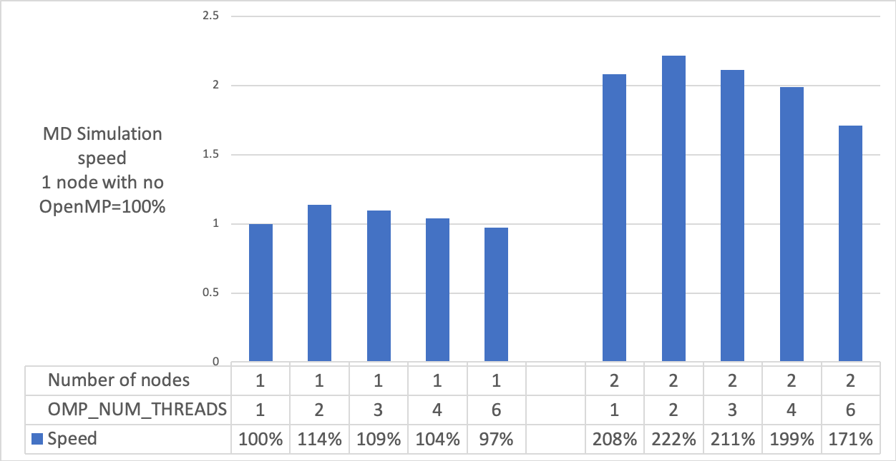

# Instruction for running LAMMPS with OpenMP

The sample input data file is in sub-directory "input" with name "data.begin". This file contains coordinates and velocities of ~0.7 million atoms in a cubic unit cell, ~20 nm on a side, representing a 35% LiCl solution pre-equlibrated to 300K and 1 atm. A 4X4X4 supercell is then generated (see the parameter input file "large.in") from this data file and results in a system with 45 million atoms. In this benchmark, we will only run it for 50 steps.

The sub-directory "n1.1" has a sample slurm file "md.slurm", it is straight forward with the following command to run LAMMPS on one node without OpenMP:
```
srun -n 36 lmp -in large.in 
```
It will take 2147 hours for one nanosecond (ns) molecular dynamics simulation to complete as estimated by the output (by "grep Performance md.log").

The sub-directory "n1.2" means that we run this job on 1 node with 18 MPI ranks and 2 OpenMP threads per rank. The following parameters are set in the slurm script:
```
srun -n 18 -c 2 lmp -sf omp -pk omp 2 -in large.in 
```
"srun -n 18 -c 2" means "srun" will generate 18 MPI ranks and assign each rank with 2 cpu cores. Then LAMMPS will run 2 OpenMP threads on the assigned 2 cpu cores for each MPI ranks ("-sf omp -pk omp 2"). It only takes 1890 hours for 1 ns simulation, 14% faster than the "n1.1" case.

By changing the parameter in the slurm script, we could run jobs with different numbers of OpenMP threads. We obtained the following results. The top performers for both 1-node and 2-node cases are all with 2 OpenMP threads. Thus, in this study we observed that using OpenMP could make LAMMPS simulation slightly faster.

<p align="center"> 
    
</p>   

It's possible to pin OpenMP threads to physical cores by using:
```
srun -n 18 -c 2 --cpu_bind=cores lmp -sf omp -pk omp 2 -in large.in 
```
However, we didn't observe any performance improvement by doing this. For the "n1.2" case, it takes 2001 hours for 1 ns simulation, slower than the one without pinning.
