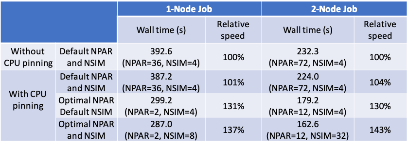
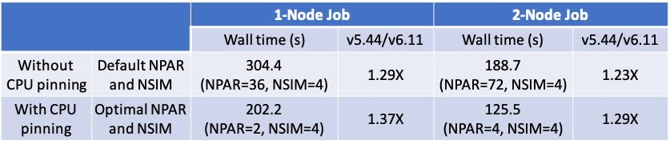

# How to Run VASP Jobs Efficiently

The sample input and data files are in directory "input". This benchmark contains  384 atom Si and we will only run molecular dynamics for only 10 steps. The following modules are used:
```
module load vasp/6.1.1 intel-mpi/2020.1.217 mkl/2020.1.217 
```

## 1.LREAL!!!

**The first thing you want to check is the LREAL parameter. Setting it to FALSE will make your calculation dramatically slow!** For this benchmark, setting LREAL=.FALSE. will take 3663.2 seconds for the job to complete on one Eagle node and LREAL=Auto only take 392.6 seconds, or 9X faster! More importantly, the default value for LREAL is FALSE, which means **if you don't set it explicitly in the INCAR file, it will be automatically set to FALSE!** Therefore, if you don't have any special reasons (for example, very high precision calculations need LREAL to be FALSE), please remember to set it to "On" or "Auto". 

## 2.CPU pinning

Second, cpu pinning may be able to make jobs running slightly faster. By changing this line in the md.slurm:
```
srun -n 36 vasp_std 
```
into:
```
srun -n 36 --cpu_bind=cores --distribution=block:block vasp_std
```
it will take 387.2 seconds to complete, a 1% improvement. If we run this benchmark on two eagle nodes, the wall time used without and with cpu pinning are 232.3 seconds and 224.0 seconds, a 4% improvement. 

## 3. Two important knobs: NPAR and NSIM
(In this section, we will always use cpu pinning.)

NPAR (or NCORE = (# of cpu cores)/NPAR) is another important parameter having big impact on the calculation speed. Unfortunately, the optimal value for NPAR depends on the job as well as # of nodes, and users need to explore it by themselves. If the user doesn't explcitily specify the NPAR value (as the smaple INCAR in the "input" directory), **the default value for NPAR** = # of total cpu cores will be used and it **usually is not a good choice.**

To run the benchmark job on one Eagle node, we have tried the NPAR=1,2,3,4,6,9,12,18,36 (# of cores = 36 must be divided exactly by NPAR), and we found the optimal value is NPAR=2, and the job takes 299.2 seconds, 29% faster than the default value (NPAR=36).

If we run the benchmark job on two Eagle nodes, the optimal value for NPAR becomes NPAR=12 and the job takes 179.2s, 25% faster than the default NPAR=72. Here, we also observe that optimal NPAR changes when using different # of nodes.

Another important parameter is NSIM, and the default value is 4. For the one node job, the optimal values that we have found are NPAR=2 and NSIM=8, and the job takes 287.0 seconds. For the two-node job, the optimal values are NPAR=12 and NSIM=32, and the job takes 162.6 seconds. 

We summarize the obtained results in the Table 1:

<p align="center"> 
Table 1. Job performance under different conditions.   
<br><br>
    
</p>   

This table shows that setting NPAR and NSIM to the optimal value can result in ~40% improvement of efficiency, and NPAR is more important than NSIM. Therefore, we encourage VASP users at least perform one study to identify the optimal NPAR value.

## 4. OpenMP

VASP version 6.1.1 on Eagle has OpenMP support. It can be run using the following command:
```
setenv OMP_NUM_THREADS 2
srun -n 18 -c 2 vasp_std
```
This will run on one Eagle 36-core node with with 18 MPI ranks and each rank with 2 OpenMP threads. However, We didn't observe any improvement for this benchmark. In addition, we didn't observe any improvement with CPU pinning. Users may explore if OpenMP and cpu pinning could bring benefit for their own jobs.

## 5. How to run multiple VASP jobs on one node

Some users with high-throughput jobs may want to run multiple VASP jobs simultaneously on the same node in order to improve calculation efficiency. In the directory "multi", we run two identical jobs on one Eagle node. The optimal values NPAR=2 and NSIM=16 are used for those runs. In the "nopin" subdirectory, we use the following commands to run two jobs simultaneously, which takes 632.6 seconds:
```
cd run1
srun -n 18 vasp_std &
cd ../run2
srun -n 18 vasp_std &
wait
```
In the "pin" subdirectory, we pin the first job to processor cores 0-17 and the second to cores 18-35 using the following commands: 

```
cd run1
srun -n 18 --cpu_bind=map_cpu:0,1,2,3,4,5,6,7,8,9,10,11,12,13,14,15,16,17 vasp_std &
cd ../run2
srun -n 18 --cpu_bind=map_cpu:18,19,20,21,22,23,24,25,26,27,28,29,30,31,32,33,34,35 vasp_std &
wait
```
This run uses 519.0 seconds. Since we run two jobs simultaneously, the average speed per job is 519/2=259.5 seconds. The best performer for running one job per node is 287.0 seconds, which is ~10% slower than running two jobs per node.

## 6. Use VASP 5.4.4

VASP 5.4.4 is ~30% faster than VASP 6.1.1, but it doesn't support OpenMP. We run this benchmark using the same conditions as in Table 1 but using the following modules and report the results in Table 2.
```
module load vasp/5.4.4 intel-mpi/2020.1.217 mkl/2020.1.217
```

<p align="center"> 
Table 2. Job performance for VASP 5.4.4.
<br><br>
    
</p>   

In general, VASP 5.4.4 is ~30% faster than VASP 6.1.1. It's interesting to see that optimizing NPAR/NSIM results in larger improvement in VASP 5.4.4 than 6.1.1 (40% vs 50%), and there is no need to optimize NSIM for this benchmark using VASP 5.4.4 as the default value of NSIM=4 is already the optimal value for NSIM.
