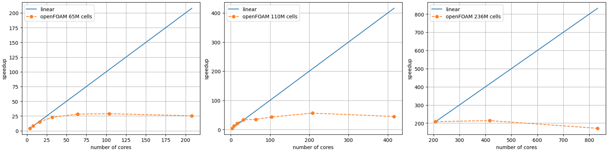
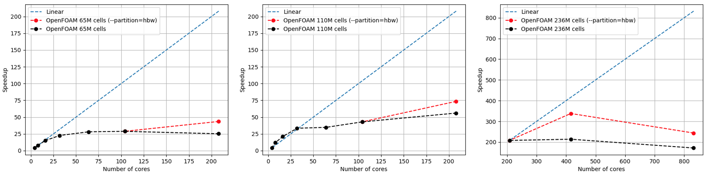
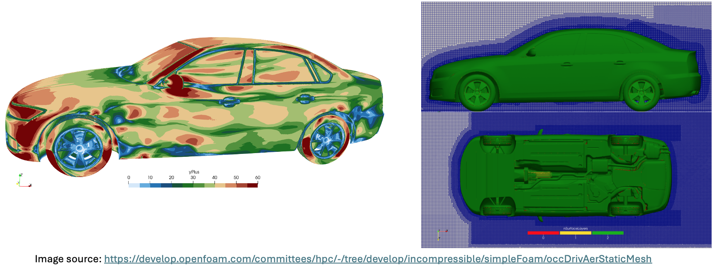

# OpenFOAM

## OpenFOAM Installation 

### Building OpenFOAM with cray-mpich and gcc 

Instructions for installing OpenFOAM are available [here](https://openfoam.org/download/source/).

In the instructions, you will be cloning the OpenFOAM folder which we will refer to as `$OPENFOAM`.

In order to build OpenFOAM with cray-mpich, two files need to be edited.

1. `$OPENFOAM/etc/bashrc`

    In this file, the variable `WM_MPLIB` will be defined as `MPICH`. 
    Search for the line where the variable is exported and replace it with 

    ```
    export WM_MPLIB=MPICH
    ```

1. `$OPENFOAM/etc/config.sh/mpi`

    This file defines where mpich is defined on the system. 
    You will search for the mpich definition block and replace it with 

    ```bash
    export MPI_ARCH_PATH=/opt/cray/pe/mpich/8.1.28/ofi/gnu/10.3
    export LD_LIBRARY_PATH="${MPI_ARCH_PATH}/lib:${LD_LIBRARY_PATH}"
    export PATH="${MPI_ARCH_PATH}/bin:${PATH}"
    export FOAM_MPI=mpich-8.1.28
    export MPI_HOME=/opt/cray/pe/mpich/8.1.28/ofi/gnu/10.3
    #export FOAM_MPI=mpich2-1.1.1p1
    #export MPI_HOME=$WM_THIRD_PARTY_DIR/$FOAM_MPI
    #export MPI_ARCH_PATH=$WM_THIRD_PARTY_DIR/platforms/$WM_ARCH$WM_COMPILER/$FOAM_MPI


    _foamAddPath    $MPI_ARCH_PATH/bin


    # 64-bit on OpenSuSE 12.1 uses lib64 others use lib
    _foamAddLib     $MPI_ARCH_PATH/lib$WM_COMPILER_LIB_ARCH
    _foamAddLib     $MPI_ARCH_PATH/lib


    _foamAddMan     $MPI_ARCH_PATH/share/man
    ;;
    ```

Before you install OpenFOAM, make sure to load `Prgenv-gnu`.
This will load gcc and cray-mpich. 
Make sure the same module is loaded at runtime.

<!-- ## OpenFOAM on Kestrel -->

## Running OpenFOAM cases using Modules

There are several modules for builds of OpenFOAM. After logging in to a CPU node on Kestrel, please use the `module avail` command to view available versions. 

```
CPU $ module avail openfoam
----------------------------- /nopt/nrel/apps/cpu_stack/modules/default/application -----------------------------
   openfoam/v2306-openmpi-gcc      openfoam/9-craympich (D)    openfoam/11-craympich
   openfoam/v2406-craympich-gcc    openfoam/9-ompi             openfoam/12-intelmpi
```


??? example "Sample job script: Kestrel"


    ```
    #!/bin/bash
    #SBATCH --job-name=myOpenFOAMjob
    #SBATCH --account=<your-account-name>
    #SBATCH --output=foamOutputLog.out
    #SBATCH --error=foamErrorLog.out
    #SBATCH --mail-user=<yourEmailAddress>@nrel.gov 
    #SBATCH --nodes=2
    #SBATCH --partition=hbw
    #SBATCH --ntasks-per-node=104 # set number of MPI ranks per node
    #SBATCH --time=04:00:00
    
    
    module load openfoam/<version>

    decomposePar

    srun -n 200 --cpu-bind=v,rank_ldom rhoReactingBuoyantFoam -parallel >> log.h2

    reconstructPar -time 0:5000  -fields '(H2 X_H2)'
    ```

### Installing additional OpenFOAM packages

Additional packages built on top of the OpenFOAM API can be installed after loading a compatible module. As an example, we show the process to install the [OpenFuelCell2](https://github.com/openFuelCell2/openFuelCell2) package.
```
# Download or clone the required package
$ git clone https://github.com/openFuelCell2/openFuelCell2.git

$ cd openFuelCell2

# Request an interactive node for compiling in parallel
$ salloc --account=<your-account-name> --time=00:30:00 --nodes=1 --ntasks-per-core=1 --ntasks-per-node=104 --cpus-per-task=1 --partition=debug

# Load the module compatible with your package
$ module load openfoam/v2306-openmpi-gcc

# Compile the application with the official instructions from the developers, e.g.
$ cd src
$ ./Allwmake  -j -prefix=${PWD}

# Test
$ cd ../run/SOFC/
$ make mesh
$ export NPROCS=4
$ make decompose
$ make parallel
$ make run
```

### Benchmarks

OpenFOAM v2412 compiled with cray-mpich has been used to perform [strong scaling tests](https://develop.openfoam.com/committees/hpc/-/tree/develop/incompressible/simpleFoam/occDrivAerStaticMesh) of the [DrivAer automobile model](https://www.epc.ed.tum.de/aer/forschungsgruppen/automobilaerodynamik/drivaer/) on Kestrel. The results are shown below for three levels of mesh resolution. For this particular setup, the application has shown to scale poorly beyond 2 nodes. However, for jobs requiring more than 1 node, using high bandwith nodes with `#SBATCH --partition=hbw` in your job script might yield better performance. Since the behaviour is consistent with some user reports about their own setups, we encourage users to switch to newer versions and perform strong & weak scaling [tests](https://hpc-wiki.info/hpc/Scaling) on their own before submitting a new large job.

{width=1000}
{width=1000}
{width=1000}