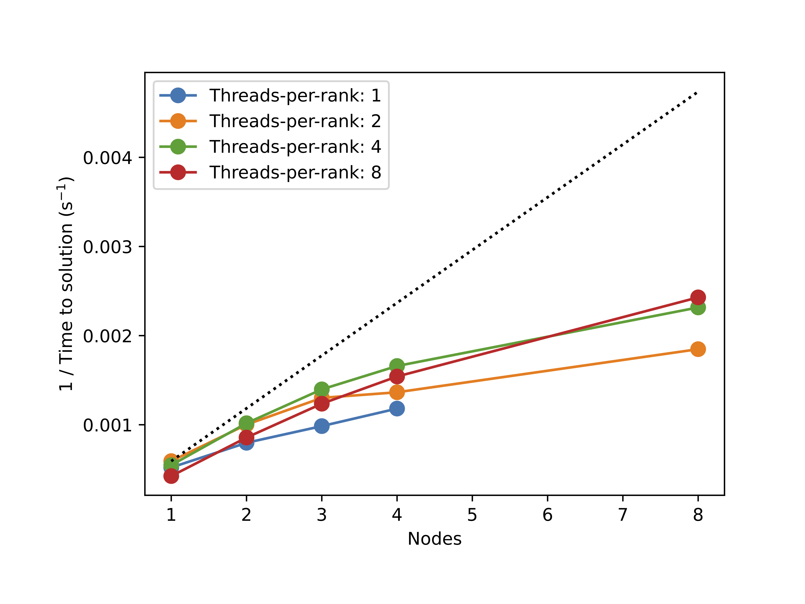
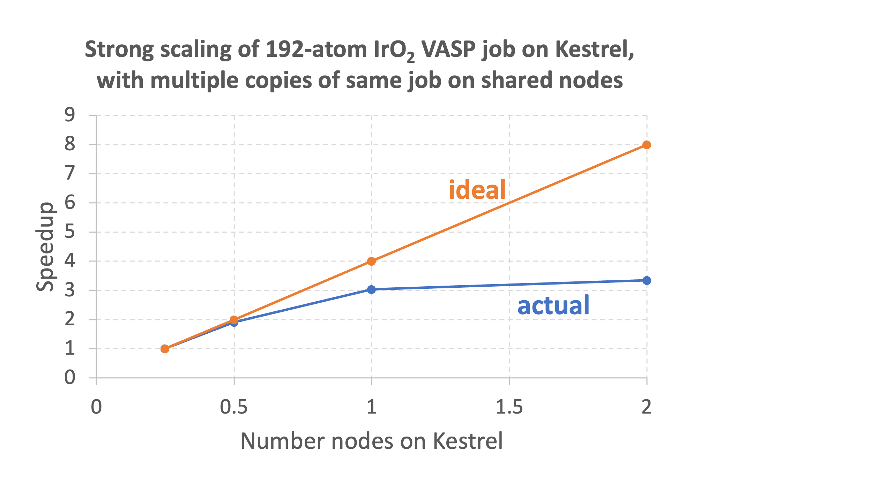

The Vienna Ab initio Simulation Package (VASP) is an application for atomic scale materials modelling from first principles. VASP computes an approximate solution to the many-body Schrödinger equation, either within density functional theory or within the Hartree-Fock approximation using pseudopotentials and plane wave basis sets. VASP can carry out a range of electronic structure and quantum-mechanical molecular dynamics calculations and has many features including hybrid functionals, Green's functions methods (GW quasiparticles, and ACFDT-RPA) and many-body perturbation theory (2nd-order Møller-Plesset). For a full list of capabilities, please see the [About VASP](https://www.vasp.at/info/about/) page and for further details, documentation, forums, and FAQs, visit the [VASP website](https://www.vasp.at/).

## Accessing VASP on NREL's HPC Clusters
!!! tip "Important"
	The VASP license requires users to be a member of a "workgroup" defined by the University of Vienna or Materials Design. If you are receiving "Permission denied" errors when trying to use VASP, you must be made part of the "vasp" Linux group first. To join, please contact [HPC Help](mailto:hpc-help@nrel.gov) with the following information:

	```
	- Your name
    - The workgroup PI
    - Whether you are licensed through Vienna (academic) or Materials Design, Inc. (commercial)
    - If licensed through Vienna:
        - The e-mail address under which you are registered with Vienna as a workgroup member (this may not be the e-mail address you used to get an HPC account)
        - Your VASP license ID
    - If licensed through Materials Design:
        - Proof of current licensed status

	```
    Once status can be confirmed, we can provide access to our VASP builds. 

## Getting Started
VASP is available through modules on all HPC systems. To view the available versions of VASP modules on each cluster, use the command `module avail vasp`. To see details for a specific version, use `module show vasp/<version>`. To load a specific version, use `module load vasp/<version>`. If no version is specified, the default module (marked with "(D)") will be loaded.  In the following sections, we will give sample submission scripts and performance recommendations. To run VASP, the following 4 input files are needed: POSCAR, POTCAR, INCAR, KPOINTS. For more information about VASP input files, see the [VASP wiki](https://www.vasp.at/wiki/index.php/Input).

Each VASP module provides three executables where the correct one should be chosen for the type of job:

1. `vasp_std` is for general k-point meshes with collinear spins

2. `vasp_ncl` is for general k-point meshes with non-collinear spins

3. `vasp_gam` is for Gamma-point-only calculations

NREL also offers build and module support for additional functionalities such as [transition state theory tools from University of Texas-Austin](http://theory.cm.utexas.edu/vtsttools/), [implicit solvation models from the University of Florida](http://vaspsol.mse.ufl.edu/), and [BEEF-vdw functionals](https://github.com/vossjo/libbeef). Please contact [HPC-Help](mailto:hpc-help@nrel.gov) if a functionality you need is not present in one of our builds.

!!! warning "Attention"
	If you would like to build your own VASP on Kestrel, please read our section [Building VASP on Kestrel](vasp.md#building-vasp-on-kestrel) carefully before compiling on Kestrel's cray architecture. 

## Supported Versions
NREL offers modules for VASP 5 and VASP 6 on CPUs as well as GPUs on certain systems. See table below for current availability, as well as system specific documentation for more details on running different builds.

|             |    Kestrel    |     Swift     |   Vermilion   |
| ----------- | ------------- | ------------- | ------------- |
| VASP 5      |       X       |               |       X       |
| VASP 6      |       X       |       X       |       X       |
| VASP 6 GPU  |       X       |       X       |       X       |


## VASP on Kestrel

### Running Using Modules

#### CPU

There are several modules for CPU builds of VASP 5 and VASP 6.

```
CPU $ module avail vasp
------------- /nopt/nrel/apps/cpu_stack/modules/default/application -------------
   vasp/5.4.4+tpc    vasp/6.3.2_openMP+tpc    vasp/6.4.2_openMP+tpc
   vasp/5.4.4        vasp/6.3.2_openMP        vasp/6.4.2_openMP     (D)
```

 Notes:
 
 * These modules have been built with the latest Cray Programming Environment (cpe23), updated compilers, and math libraries.
 * OpenMP capability has been added to VASP 6 builds.
 * Modules that include third-party codes (e.g., libXC, libBEEF, VTST tools, and VASPsol) are now denoted with +tpc. Use `module show vasp/<version>` to see details of a specific version.

**We encourage users to switch to the new builds and strongly recommend using OpenMP parallelism.**

!!! tip "Important: Conserving your AUs on Kestrel"
	Kestrel nodes have nearly 3x as many cores as Eagle's did. Our testing has indicated VASP DFT jobs up to 200 atoms run more efficiently on a fraction of a node (see performance notes below). We therefore highly recommend that VASP DFT users check the efficiency of their calculations and consider using the shared partition to get the most out of their allocations. Please see the sample shared job script provided below and the [Shared partition documentation](../Systems/Kestrel/Running/index.md#shared-node-partition).

??? example "Sample job script: Kestrel - Full node w/ OpenMP"

    Note: (--ntasks-per-node) x (--cpus-per-task) = total number of physical cores you want to use per node. Here 4x26=104, all cores/node.

    ```
    #!/bin/bash
    #SBATCH --nodes=2
    #SBATCH --tasks-per-node=26 # set number of MPI ranks per node
    #SBATCH --cpus-per-task=4 # set number of OpenMP threads per MPI rank
    #SBATCH --time=2:00:00
    #SBATCH --account=<your-account-name>
    #SBATCH --job-name=<your-job-name>

    module load vasp/<version with openMP>

    srun vasp_std &> out
    ```

??? note "Performance Note"

    The use of OpenMP threads is highly recommended on a system with as many cores per node as Kestrel. Testing of benchmark 2 has shown that OpenMP threads can both increase performance (faster time to solution) as well as scaling:

    

??? example "Sample job script: Kestrel - Full node"

    ```
    #!/bin/bash
    #SBATCH --nodes=2
    #SBATCH --tasks-per-node=104
    #SBATCH --cpus-per-task=1
    #SBATCH --time=2:00:00
    #SBATCH --account=<your-account-name>
    #SBATCH --job-name=<your-job-name>

    module load vasp/<version>

    srun vasp_std &> out
    ```

??? example "Sample job script: Kestrel - Shared (partial) node"

    As described in detail in the [Shared partition documentation](../Systems/Kestrel/Running/index.md#shared-node-partition), when you run on part of a node, you will be charged for the greater of either the fraction of cores (104 total) or of memory (about 240G total or 2.3G/core) requested. The script below shows how to request 1/4 of a node, but you can freely set `--tasks` and `--mem-per-cpu` as you see fit.

    ```
    #!/bin/bash
    #SBATCH --nodes=1
    #SBATCH --partition=shared
    #SBATCH --tasks=26 #How many cpus you want
    #SBATCH --mem-per-cpu=2G #Default is 1 GB/core but this is likely too little for electronic structure calculations
    #SBATCH --time=2:00:00
    #SBATCH --account=<your-account-name>
    #SBATCH --job-name=<your-job-name>

    module load vasp/<version>

    srun vasp_std &> out
    ```

??? note "Performance Note"

    Internal testing at NREL has indicated that standard VASP DFT calculations from sizes 50-200 atoms run most efficiently on a quarter to a half node. The graph below shows the performance of a 192-atom VASP DFT job using partial nodes on the shared partition. Up to 1/2 a node, near perfect scaling is observed, but using the full node gives a speedup of only 1.5 relative to using 1/2 a node. So, the calculation will cost 50% more AUs if run on a single node compared to a half node. For a 48-atom surface Pt calculation, using the full node gives no speedup relative to using 1/2 a node, so the calculation will cost 100% more AUs if run on a single node compared to half a node. 

    

#### GPU 

!!! tip "Important"
	Submit GPU jobs from a [GPU login node](../Systems/Kestrel/index.md).
    $ ssh <username>@kestrel-gpu.hpc.nrel.gov

There are several modules for GPU builds of VASP 5 and VASP 6: 

```
GPU $ module avail vasp

------------ /nopt/nrel/apps/gpu_stack/modules/default/application -------------
   vasp/6.3.2_openMP    vasp/6.3.2    vasp/6.4.2_openMP    vasp/6.4.2 (D)

```

??? example "Sample job script: Kestrel - Full GPU node"

    ```
    #!/bin/bash
    #SBATCH --account=<your-account-name> 
    #SBATCH --nodes=1
    #SBATCH --gpus=4 
    #SBATCH --ntasks-per-node=4
    #SBATCH --cpus-per-task=1 #The GPU partition is shared :. you must specify cpus needed even when requesting all the GPU resources
    #SBATCH --time=02:00:00
    #SBATCH --job-name=<your-job-name>
    #SBATCH --mem=350G # The GPU partition is shared: you must specify memory needed even when requesting all the GPU resources

    export MPICH_GPU_SUPPORT_ENABLED=1

    module load vasp/<version>

    srun vasp_std &> out

    ```

GPU nodes can be shared so you may request fewer than all 4 GPUs on a node. When doing so, you must also request appropriate CPU cores and memory. To run VASP on N GPUs, we recommend requesting `--gpus=N`, `--ntasks-per-node=N`, and `--mem=N*85G`. See the below sample script for running on 2 GPUs. 

??? example "Sample job script: Kestrel - Partial GPU node"

    ```
    #!/bin/bash
    #SBATCH --account=<your-account-name> 
    #SBATCH --nodes=1
    #SBATCH --gpus=2 
    #SBATCH --ntasks-per-node=2
    #SBATCH --mem=170G # request cpu memory 
    #SBATCH --cpus-per-task=1
    #SBATCH --time=02:00:00
    #SBATCH --job-name=<your-job-name>

    export MPICH_GPU_SUPPORT_ENABLED=1

    module load vasp/<version>

    srun vasp_std &> out
    ```
    
### Building VASP on Kestrel

Sample makefiles for vasp5 (cpu version) and vasp6 (cpu and gpu versions) on Kestrel can be found in our [Kestrel Repo](https://github.com/NREL/HPC/tree/master/kestrel) under the vasp folder.

!!! tip "Important"
    On Kestrel, any modules you have loaded on the login node will be copied to a compute node, and there are many loaded by default for the cray programming environment. Make sure you are using what you intend to. Please see the [Kestrel Environments](../Systems/Kestrel/Environments/index.md) page for more details on programming environments.

#### CPU
 
##### Compiling your build

??? example "Build recommendations for VASP - CPU "

    We recommend building vasp with a full intel toolchain and launching with the cray-mpich-abi at runtime. Additionally, you should build on a compute node so that you have the same architecture as at runtime:

    ```
    salloc -N 1 -t <time> -A <account>
    ```
    Then, load appropriate modules for your mpi, compilers, and math packages:
    ```
    module purge
    module load craype-x86-spr  #specifies sapphire rapids architecture
    module load intel-oneapi-compilers
    module load intel-oneapi-mpi
    module load intel-oneapi-mkl
    ```

    Sample makefiles for vasp5 and vasp6 on Kestrel can be found in our [Kestrel Repo](https://github.com/NREL/HPC/tree/master/kestrel) under the vasp folder.

##### Running your build

!!! tip "Important"
    We have found that it is optimal to run an Intel toolchain build of VASP using cray-mpich-abi at runtime. Cray-mpich-abi has several dependencies on cray network modules, so the easiest way to load it is to first load ```PrgEnv-intel``` and then swap the default cray-mpich module for the cray-mpich-abi ```module swap cray-mpich cray-mpich-abi```. You must then load your intel compilers and math libraries, and unload cray's libsci. A sample script showing all of this is in the dropdown below.

??? example "Sample job script: How to run your own build - CPU "

    ```
    #!/bin/bash
    #SBATCH --nodes=2
    #SBATCH --tasks-per-node=104
    #SBATCH --time=2:00:00
    #SBATCH --account=<your-account-name>
    #SBATCH --job-name=<your-job-name>

    # Load cray-mpich-abi and its dependencies within PrgEnv-intel, intel compilers, mkl, and unload cray's libsci
    module purge
    module load PrgEnv-intel
    module load craype-x86-spr
    module swap cray-mpich cray-mpich-abi
    module unload cray-libsci
    module load intel-oneapi-compilers
    module load intel-oneapi-mkl

    export VASP_PATH=/PATH/TO/YOUR/vasp_exe

    srun ${VASP_PATH}/vasp_std &> out

    ```

#### GPU

!!! tip "Important"
	Make sure to build GPU software on a [GPU login node](../Systems/Kestrel/index.md) or GPU compute node.

##### Compiling your build

??? example "Build recommendations for VASP - GPU"

    ```
    # Load appropriate modules for your build. For our example these are:
    ml gcc-stdalone/13.1.0
    ml PrgEnv-nvhpc/8.5.0
    ml nvhpc/23.9   #do not use the default nvhpc/24.1
    ml cray-libsci/23.05.1.4

    make DEPS=1 -j8 all
    ```

##### Running your build

??? example "Sample job script: How to run your own build - GPU"

    See sample jobs scripts above for SBATCH and export directives to request full or shared gpu nodes.

    ```
    # Load modules appropriate for your build. For ours these are:
    ml gcc-stdalone/13.1.0
    ml PrgEnv-nvhpc/8.5.0
    ml nvhpc/23.9   #do not use the default nvhpc/24.1
    ml cray-libsci/23.05.1.4

    # Export path to your buid
    export VASP_PATH=/PATH/TO/YOUR/BUILD/bin

    srun ${VASP_PATH}/vasp_std &> out
    ```

## VASP on Swift

#### CPU
??? example "Sample job script: Swift - VASP 6 CPU (Intel MPI)"
    
    ```
    #!/bin/bash
    #SBATCH --job-name="benchmark"
    #SBATCH --account=myaccount
    #SBATCH --time=4:00:00
    #SBATCH --ntasks-per-node=64
    #SBATCH --nodes=1

    #Set --exclusive if you would like to prevent any other jobs from running on the same nodes (including your own)
    #You will be charged for the full node regardless of the fraction of CPUs/node used
    #SBATCH --exclusive

    module purge

    #Load Intel MPI VASP build and necessary modules
    ml vaspintel 
    ml slurm/21-08-1-1-o2xw5ti 
    ml gcc/9.4.0-v7mri5d 
    ml intel-oneapi-compilers/2021.3.0-piz2usr 
    ml intel-oneapi-mpi/2021.3.0-hcp2lkf 
    ml intel-oneapi-mkl/2021.3.0-giz47h4

    srun -n 64 vasp_std &> out
    ```

??? example "Sample job script: Swift - VASP 6 CPU (Open MPI)"
  
    ```
    #!/bin/bash
    #SBATCH --job-name="benchmark"
    #SBATCH --account=myaccount
    #SBATCH --time=4:00:00
    #SBATCH --ntasks-per-node=64
    #SBATCH --nodes=1

    #Set --exclusive if you would like to prevent any other jobs from running on the same nodes (including your own)
    #You will be charged for the full node regardless of the fraction of CPUs/node used
    #SBATCH --exclusive

    module purge

    #Load OpenMPI VASP build and necessary modules
    ml vasp 
    ml slurm/21-08-1-1-o2xw5ti 
    ml openmpi/4.1.1-6vr2flz

    srun -n 64 vasp_std &> out
    ```

??? example "Sample job script: Swift - run multiple jobs on the same node(s)"
  
    The following script launches two instances of ```srun vasp_std``` on the same node using an array job. Each job will be constricted to 32 cores on the node. 
    ```
    #!/bin/bash
    #SBATCH --job-name="benchmark"
    #SBATCH --account=myaccount
    #SBATCH --time=4:00:00
    #SBATCH --ntasks-per-node=32
    #SBATCH --nodes=1

    #Set --exclusive=user if you would like to prevent anyone else from running on the same nodes as you
    #You will be charged for the full node regardless of the fraction of CPUs/node used
    #SBATCH --exclusive=user

    #Set how many jobs you would like to run at the same time as an array job
    #In this example, an array of 2 jobs will be run at the same time. This script will be run once for each job.
    #SBATCH --array=1-2

    #The SLURM_ARRAY_TASK_ID variable can be used to modify the parameters of the distinct jobs in the array.
    #In the case of array=1-2, the first job will have SLURM_ARRAY_TASK_ID=1, and the second will have SLURM_ARRAY_TASK_ID=2.
    #For example, you could assign different input files to runs 1 and 2 by storing them in directories input_1 and input_2 and using the following code:

    mkdir run_${SLURM_ARRAY_TASK_ID}
    cd run_${SLURM_ARRAY_TASK_ID}
    cp ../input_${SLURM_ARRAY_TASK_ID}/POSCAR .
    cp ../input_${SLURM_ARRAY_TASK_ID}/POTCAR .
    cp ../input_${SLURM_ARRAY_TASK_ID}/INCAR .
    cp ../input_${SLURM_ARRAY_TASK_ID}/KPOINTS .

    #Now load vasp and run the job...

    module purge

    #Load Intel MPI VASP build and necessary modules
    ml vaspintel 
    ml slurm/21-08-1-1-o2xw5ti 
    ml gcc/9.4.0-v7mri5d 
    ml intel-oneapi-compilers/2021.3.0-piz2usr 
    ml intel-oneapi-mpi/2021.3.0-hcp2lkf 
    ml intel-oneapi-mkl/2021.3.0-giz47h4

    srun -n 32 vasp_std &> out
    ```
??? example "Sample job script: Swift - run a single job on a node shared with other users"

    The following script launches ```srun vasp_std``` on only 32 cores on a single node. The other 32 cores remain open for other users to use. You will only be charged for half of the node hours. 

    ```
    #!/bin/bash
    #SBATCH --job-name="benchmark"
    #SBATCH --account=myaccount
    #SBATCH --time=4:00:00
    #SBATCH --ntasks-per-node=32
    #SBATCH --nodes=1

    #To make sure that you are only being charged for the CPUs your job is using, set mem=2GB*CPUs/node
    #--mem sets the memory used per node
    #SBATCH --mem=64G

    module purge

    #Load Intel MPI VASP build and necessary modules
    ml vaspintel 
    ml slurm/21-08-1-1-o2xw5ti 
    ml gcc/9.4.0-v7mri5d 
    ml intel-oneapi-compilers/2021.3.0-piz2usr 
    ml intel-oneapi-mpi/2021.3.0-hcp2lkf 
    ml intel-oneapi-mkl/2021.3.0-giz47h4

    srun -n 32 vasp_std &> out
    ```

??? note "Performance Notes"
    The Intel MPI builds are recommended over the Open MPI builds as they exhibit fastest performance.

    Use at most 64 cores/node. On Swift, each node has 64 physical cores, and each core is subdivided into two virtual cores in a process that is identical to hyperthreading. Because of this, up to 128 cores can be requested from a single Swift node, but each core will only represent half of a physical core. 

    On Swift, VASP is most efficiently run on partially full nodes. 

    Multiple jobs can run on the same nodes on Swift. If you are only using a fraction of a node, other users' jobs could be assigned to the rest of the node, which might deteriorate the performance. Setting "#SBATCH --exclusive" in your run script prevents other users from using the same node as you, but you will be charged the full 5AUs/node, regardless of the number of CPUs/node you are using. 

#### GPU

??? example "Sample job script: Swift - VASP 6 GPU (OpenACC)"
    ```
    #!/bin/bash
    #SBATCH --nodes=1
    #SBATCH --partition=gpu
    #SBATCH --gres=gpu:4
    #SBATCH --gpu-bind=map_gpu:0,1,2,3
    #SBATCH --exclusive
    #SBATCH --time=1:00:00
    #SBATCH --account=<your-account-name>
    #SBATCH --job-name=<your-job-name>

    #Load environment and openACC VASP module:
    module purge
    . /nopt/nrel/apps/env.sh
    module use /nopt/nrel/apps/modules
    module load vasp/openacc

    # Note: environment will soon become default and the module will be able to be loaded with
    # module purge
    # module load vasp/openacc

    #Launch vasp using mpirun
    mpirun -npernode 4 vasp_std &> out
    ```

## VASP on Vermilion

#### CPU
??? example "Sample job script: Vermilion - VASP 6 CPU (Intel MPI)"
  
    ```
    #!/bin/bash
    #SBATCH --job-name=vasp
    #SBATCH --nodes=1
    #SBATCH --time=8:00:00
    #SBATCH --error=std.err
    #SBATCH --output=std.out
    #SBATCH --partition=lg
    #SBATCH --exclusive
    #SBATCH --account=myaccount

    module purge
    ml vasp/6.3.1

    source /nopt/nrel/apps/220525b/myenv.2110041605
    ml intel-oneapi-compilers/2022.1.0-k4dysra
    ml intel-oneapi-mkl/2022.1.0-akthm3n
    ml intel-oneapi-mpi/2021.6.0-ghyk7n2

    # some extra lines that have been shown to improve VASP reliability on Vermilion
    ulimit -s unlimited
    export UCX_TLS=tcp,self
    export OMP_NUM_THREADS=1
    ml ucx

    srun --mpi=pmi2 -n 60 vasp_std

    # If the multi-node calculations are breaking, replace the srun line with this line
    # I_MPI_OFI_PROVIDER=tcp mpirun -iface ens7 -np 60 vasp_std
    ```
??? example "Sample job script: Vermilion - VASP 6 CPU (Open MPI)"
  
    ```
    #!/bin/bash
    #SBATCH --job-name=vasp
    #SBATCH --nodes=1
    #SBATCH --time=8:00:00
    #SBATCH --error=std.err
    #SBATCH --output=std.out
    #SBATCH --partition=lg
    #SBATCH --exclusive
    #SBATCH --account=myaccount

    module purge
    ml gcc
    ml vasp/6.1.1-openmpi

    # some extra lines that have been shown to improve VASP reliability on Vermilion
    ulimit -s unlimited
    export UCX_TLS=tcp,self
    export OMP_NUM_THREADS=1
    ml ucx

    # lines to set "ens7" as the interconnect network
    module use /nopt/nrel/apps/220525b/level01/modules/lmod/linux-rocky8-x86_64/gcc/12.1.0
    module load openmpi
    OMPI_MCA_param="btl_tcp_if_include ens7"

    srun --mpi=pmi2 -n 60 vasp_std
    ```
??? example "Sample job script: Vermilion - VASP 5 CPU (Intel MPI)"
  
    ```
    #!/bin/bash
    #SBATCH --job-name=vasp
    #SBATCH --nodes=1
    #SBATCH --time=8:00:00
    ##SBATCH --error=std.err
    ##SBATCH --output=std.out
    #SBATCH --partition=lg
    #SBATCH --exclusive
    #SBATCH --account=myaccount

    module purge

    ml vasp/5.4.4

    source /nopt/nrel/apps/220525b/myenv.2110041605
    ml intel-oneapi-compilers/2022.1.0-k4dysra
    ml intel-oneapi-mkl/2022.1.0-akthm3n
    ml intel-oneapi-mpi/2021.6.0-ghyk7n2

    # some extra lines that have been shown to improve VASP reliability on Vermilion
    ulimit -s unlimited
    export UCX_TLS=tcp,self
    export OMP_NUM_THREADS=1
    ml ucx

    srun --mpi=pmi2 -n 60 vasp_std

    # If the multi-node calculations are breaking, replace the srun line with this line
    # I_MPI_OFI_PROVIDER=tcp mpirun -iface ens7 -np 60 vasp_std
    ```

??? note "Performance Notes"

    On Vermilion, VASP runs more performantly on a single node. Many issues have been reported for running VASP on multiple nodes, especially when requesting all available cores on each node. In order for MPI to work reliably on Vermilion, it is necessary to specify the interconnect network that Vermilion should use to communicate between nodes. If many cores are needed for your VASP calculation, it is recommended to run VASP on a singe node in the lg partition (60 cores/node), which provides the largest numbers of cores per node and use the following settings that have been shown to work well for multi-node jobs on 2 nodes. The Open MPI multi-node jobs are more reliable on Vermilion, but Intel MPI VASP jobs show better runtime performance as usual.
    
    If your multi-node **Intel MPI VASP** job is crashing on Vermilion, try replacing your srun line with the following mpirun run line. ```-iface ens7``` sets ens7 as the interconnect. 
    ```
    I_MPI_OFI_PROVIDER=tcp mpirun -iface ens7 -np 16 vasp_std
    ```

    If your multi-node **Open MPI VASP** job is crashing on Vermilion, replace a call to load an openmpi module with the following lines. The OMPI_MCA_param variable sets ens7 as the interconnect. 

    ```
    module use /nopt/nrel/apps/220525b/level01/modules/lmod/linux-rocky8-x86_64/gcc/12.1.0
    module load openmpi
    OMPI_MCA_param="btl_tcp_if_include ens7"
    ```

#### GPU

??? example "Sample job script: Vermilion - VASP 6 CPU (OpenACC)"
  
    ```
    #!/bin/bash
    #SBATCH --job-name=vasp
    #SBATCH --nodes=2
    #SBATCH --time=1:00:00
    ##SBATCH --error=std.err
    ##SBATCH --output=std.out
    #SBATCH --partition=gpu
    #SBATCH --gpu-bind=map_gpu:0,1,0,1
    #SBATCH --exclusive
    #SBATCH --account=myaccount

    # Load the OpenACC build of VASP
    ml vasp/6.3.1-nvhpc_acc

    # Load some additional modules
    module use  /nopt/nrel/apps/220421a/modules/lmod/linux-rocky8-x86_64/gcc/11.3.0/
    ml nvhpc
    ml fftw

    mpirun -npernode 1 vasp_std > vasp.$SLURM_JOB_ID
    ```

??? note "Performance Notes"
    The OpenACC build shows significant performance improvement compared to the Cuda build, but is more susceptible to running out of memory. The OpenACC GPU-port of VASP was released with VASP 6.2.0, and the Cuda GPU-port of VASP was dropped in VASP 6.3.0.


    


