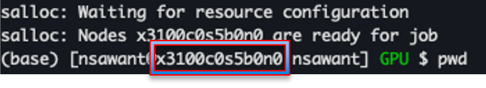
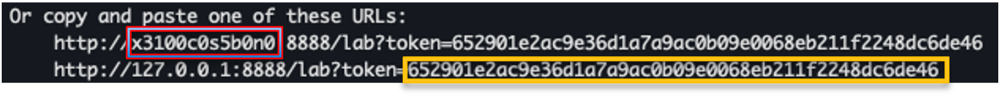

# Interactive Parallel Python with Jupyter

For a general introduction to using Jupyter notebooks on Kestrel, please refer to the [official documentation](../../../Jupyter/index.md). This page covers how to leverage parallel computing with python through Jupyter notebooks on compute nodes. Accompanying notebooks to test if the environment and the job have been configured correctly are under the topic 'Parallel Interactive Tutorials' on the main [Python](../index.md/#parallel-interactive-tutorials) page.

## Setting up your account

Login to Kestrel
```
$ ssh -X <username>@kestrel-gpu.hpc.nrel.gov
```

Navigate to your /projects directory
```
$ cd /projects/<projectname>/<username>/
```

Load the Nvidia HPC programming environment
```
$ module load PrgEnv-nvhpc/8.5.0
```

Check available conda modules and load one
```
$ module avail conda
$ module load anaconda3/2024.06.1
```

Create a new environment named ‘myEnv’ in the current directory

!!! Warning
    Conda environments should be *always* be installed outside of your home directory for storage and performance reasons. **This is especially important for frameworks like Dask**, whose parallel processes can particularly strain the `/home` filesystem. Please refer to our dedicated [conda documentation](../../../../Environment/Customization/conda.md#creating-environments-by-location) for more information on how to setup your conda environments to redirect the installation outside of `/home` by default.

```
$ conda create --prefix ./myEnv
```

Activate your new environment
```
$ conda activate /kfs2/projects/<projectname>/<username>/myEnv
# (or) From the same directory
$ conda activate ./myEnv
```

Create a jupyter kernel named ‘myEnvJupyter’ from the myEnv environment
```
$ conda install ipykernel
$ python -m ipykernel install --user --name=myEnvJupyter
```

(Optional) To access your `/scratch` directory from your `/projects` directory, execute the following in your project directory
```
$ ln -s /scratch/<username>/ scratch
```
The above command will create a symbolic link to the `scratch` folder, which can be navigated to from JupyterHub to access files in your scratch directory.

## Install packages

CuPy : [“An open-source array library for GPU-accelerated computing with Python”](https://cupy.dev/)
```
$ nvcc –version
$ conda install -c conda-forge cupy
$ conda install -c conda-forge cupy cudnn cutensor nccl
```

numba-cuda : [“CUDA GPU programming by directly compiling a restricted subset of Python code into CUDA kernels”](https://nvidia.github.io/numba-cuda/user/index.html)
```
$ conda install -c conda-forge numba-cuda
$ conda install -c conda-forge cuda-nvcc cuda-nvrtc "cuda-version>=12.0"
```

mpi4py : [“Python bindings for the Message Passing Interface (MPI) standard to exploit multiple processors”](https://mpi4py.readthedocs.io/en/stable/) 
```
$ conda install -c conda-forge mpi4py openmpi
$ conda install cuda-cudart cuda-version=12
```

ipyparallel : [“Interactive Parallel Computing with IPython”](https://ipyparallel.readthedocs.io/en/latest/)
```
$ conda install ipyparallel
```

Dask : [“A flexible open-source Python library for parallel and distributed computing”](https://www.dask.org/)
```
$ conda install dask
$ conda install dask-jobqueue
$ conda install graphviz
$ conda install ipycytoscape
$ conda install matplotlib
```

## Launching jobs

A general guide to running jobs on Kestrel can be found in the [official documentation](../../../../Systems/Kestrel/Running/index.md). Below are example procedures suitable for running jobs involving specific python modules, depending on their parallelization capability.

The text in the red box shows an example of the output parameter `<nodename>` and the text in the yellow box shows an example of the output parameter `<alphabet soup>`, relevant to the following tutorial.

<!-- " width="300"/>

" width="600"/> -->

{width=400}


<!--  -->

### GPU compatible modules: E.g. CuPy, numba-cuda etc.

1. Kestrel: Launch an interactive job
    ```
    $ salloc -A <projectname> -t 00:15:00 --partition=debug --gres=gpu:1
    $ module load anaconda3/2024.06.1
    $ conda activate ./myEnv
    $ jupyter-lab --no-browser --ip=$(hostname -s)
    ```


2. Local terminal: Establish a SSH tunnel
    ```
    $ ssh -N -L 8888:<nodename>:8888 <username>@kestrel-gpu.hpc.nrel.gov
    ```

3. Web browser
    ```
    http://127.0.0.1:8888/?token=<alphabet soup>
    ```

    File > New > Notebook > myEnvJupyter

[Jupyter test notebook for CuPy](./exampleNotebooks/cupyOnly.ipynb)

[Jupyter test notebook for numba-cuda](./exampleNotebooks/numbaCUDA.ipynb)

### Multithread capable modules: E.g. Dask

1. Kestrel: Launch a multithread interactive job
    ```
    $ salloc -A <projectname> -t 00:15:00 --nodes=1 --ntasks-per-node=104 --partition=debug
    $ module load anaconda3/2024.06.1
    $ conda activate ./myEnv
    $ jupyter-lab --no-browser --ip=$(hostname -s)
    ```

2. Local terminal: Establish a SSH tunnel
    ```
    $ ssh -N -L 8888:<nodename>:8888 <username>@kestrel.hpc.nrel.gov
    ```

3. Web browser
    ```
    http://127.0.0.1:8888/?token=<alphabet soup>
    ```

    File > New > Notebook > myEnvJupyter

[Jupyter test notebook for dask](./exampleNotebooks/dask.ipynb)

### Multinode capable job. E.g. mpi4py through ipyparallel 

1. Kestrel: Launch a multinode interactive job
    ```
    $ salloc -A <projectname> -t 00:15:00 --nodes=2 --ntasks-per-node=1 --partition=short
    $ module load anaconda3/2024.06.1
    $ conda activate ./myEnv
    $ jupyter-lab --no-browser --ip=$(hostname -s)
    ```

2. Local terminal: Establish a SSH tunnel
    ```
    $ ssh -N -L 8888:<nodename>:8888 <username>@kestrel.hpc.nrel.gov
    ```

3. Web browser
    ```
    http://127.0.0.1:8888/?token=<alphabet soup>
    ```

    File > New > Notebook > myEnvJupyter

[Jupyter test notebook for mpi4py](./exampleNotebooks/cupyAndIpyparallel.ipynb)

### GPU + multinode jobs. E.g. CuPy + mpi4py through ipyparallel

1. Kestrel: Launch an interactive job
    ```
    $ salloc -A projectname -t 00:15:00 --nodes=2 --ntasks-per-node=1 --gres=gpu:1 
    $ module load anaconda3/2024.06.1
    $ conda activate ./myEnv
    $ jupyter-lab --no-browser --ip=$(hostname -s)
    ```

2. Local terminal: Establish a SSH tunnel
    ```
    $ ssh -N -L 8888:<nodename>:8888 <username>@kestrel-gpu.hpc.nrel.gov
    ```

3. Web browser
    ```
    http://127.0.0.1:8888/?token=<alphabet soup>
    ```

    File > New > Notebook > myEnvJupyter

[Jupyter test notebook for CuPy + mpi4py](./exampleNotebooks/cupyAndIpyparallel.ipynb)

###

