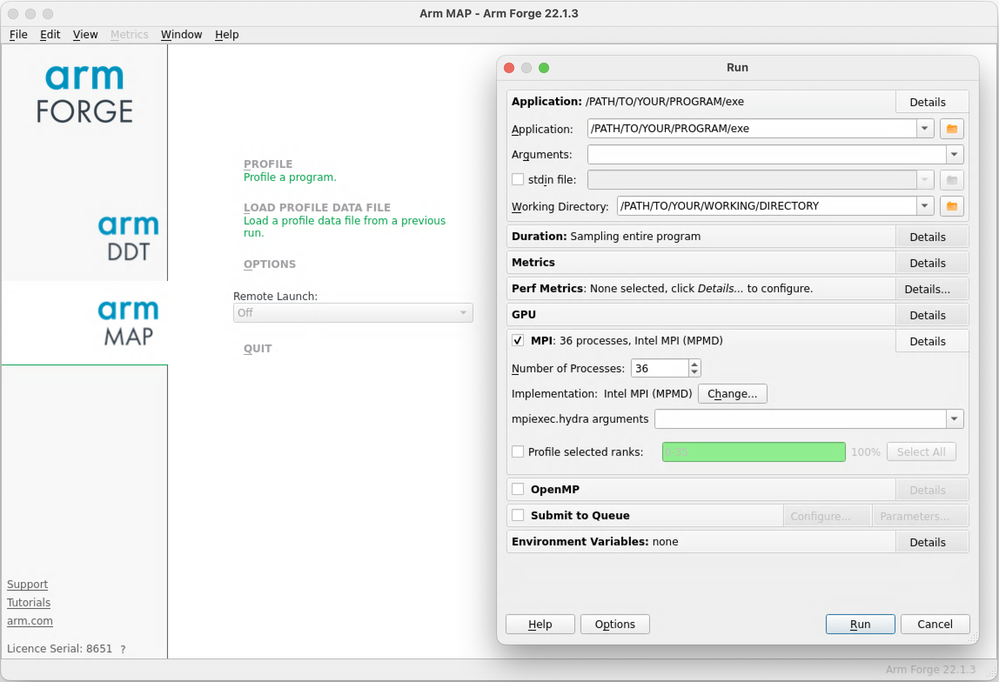
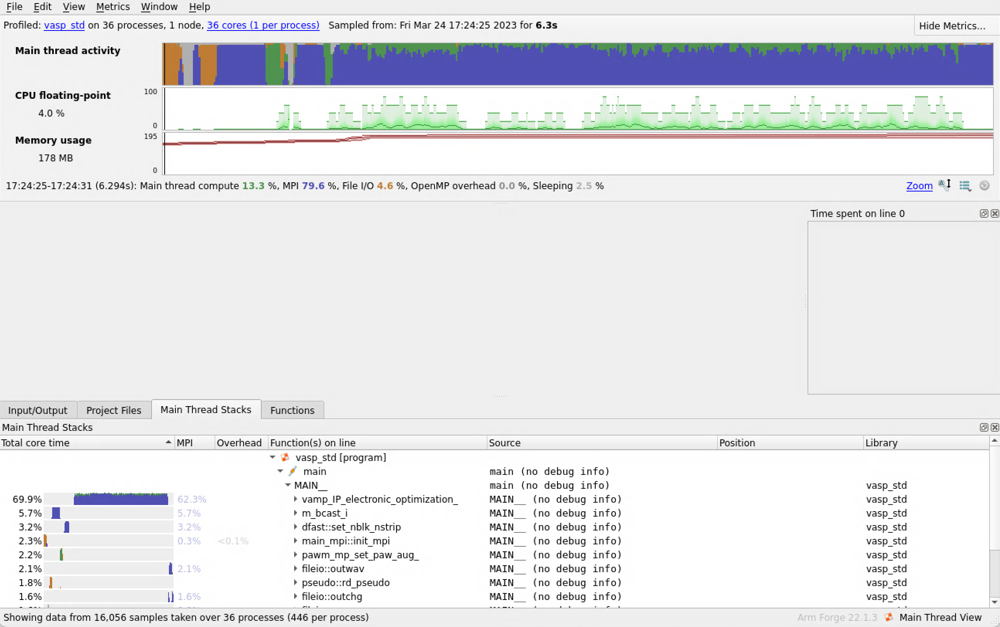
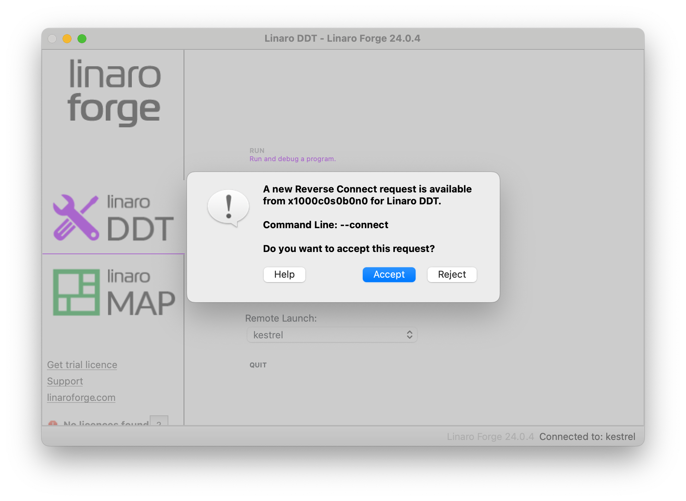
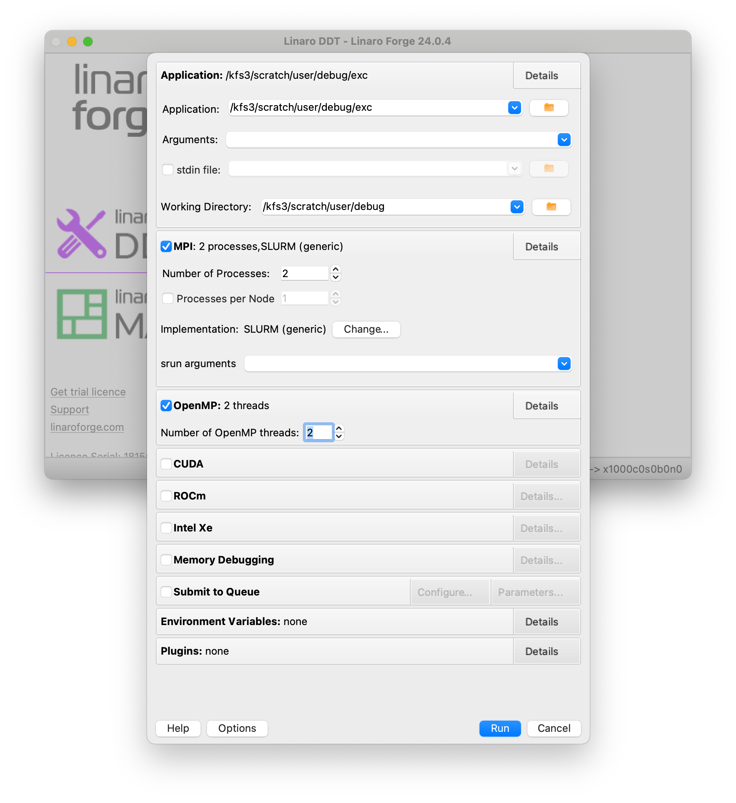
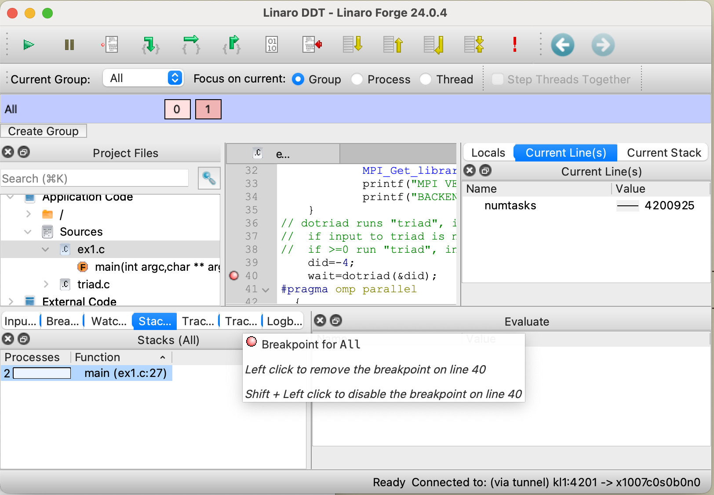

# How to run MAP

## Program Setup
Linaro-MAP can show you how much time was spent on each line of code. To see the source code in MAP, you must use a version of your code that is compiled with the debug flag. For most compilers, this is `-g`. Note: You should not just use a debug build but should keep optimization flags `-O0` turned on when profiling. 

For more information, see the [Linaro Forge Documentation](https://www.linaroforge.com/documentation/) on [getting started with MAP](https://docs.linaroforge.com/22.1.3/html/101136_arm-forge-user-guide/map/get_started_map/index.html). In particular, if your program uses statically linked libraries, the MAP profiler libraries will not be automatically linked and you will need to do so yourself. 

!!! note 

    Ensure that your program is working before trying to run it in MAP

## MAP Setup
There are two options for how to run MAP. The first method is to use the remote client (recommended to reduce latencies from X forwarding the display.). The second method is to use FastX. Both are described here.

### Option 1: Remote Client Setup
Download the remote client from the [Linaroforge Website](https://www.linaroforge.com/downloadForge/) Select the client for your platform (Mac/Windows/Linux) and ensure the client version number matches the version number of the Linaro suite you are using. You can see all the versions of linaro-forge available using:

`$ module avail forge`

Once you have the client installed, you will need to configure it to connect to the host:

1.	Open the Linaro Forge Client application
2.	Select the configure option in the "Remote Launch" dropdown menu, click "Add" and set the hostname to "USER@HOST.hpc.nrel.gov" where USER is your username and HOST is the host you are trying to connect to. We recommend using DAV nodes if available on your system.
3.	In the Remote Installation Directory field, set the path to the Linaro installation on your host. This can be found by running the command: 


    ```
    dirname $(dirname $(which map))
    ```
    
    For example:
    
    ```
    module load forge/24.0.4
    dirname $(dirname $(which map))
    /nopt/nrel/apps/cpu_stack/software/forge/24.0.4
    ```

4.	Hit "Test Remote Launch" to test the configuration. 

Once the remote client is correctly set up, start a terminal and connect to the desired HPC system.
`$ ssh USER@$HOST.hpc.nrel.gov` 

Continue to the [profiling section](map.md#profiling-a-program)


### Option 2: FastX Setup
To run MAP with FastX, follow instructions to download and install the desktop client and connect to a host on the [FastX](../../../Viz_Analytics/virtualgl_fastx.md) page.

Once you have FastX installed and an appropriate build of your program to profile, start an xterm window from within FastX connected to an HPC host (We recommend using DAV nodes if available on your system). Then continue to the [profiling section](map.md#profiling-a-program)

## Profiling a program
Once you have an appropriate build of your program to profile and either the Linaro Forge Client or FastX installed, you can obtain profiling data through map with the following steps. We will profile VASP as an example.

1.	Start an xterm window from within FastX connected to a DAV node
2.	Start an interactive job session.  
    Use the debug or other partitions as appropriate.  
    `$ salloc --nodes=<N>  --time=<time> --account=<handle>`
3.	Load the linaro-forge module (formerly arm)  
    Additionally load any other modules needed to run your program  
    `$ module load linaro-forge`  
    `$ module load mkl intel-mpi #for VASP`  
4.	Start a map session using the command `map --connect` if you are using the desktop client or simply `map` if you are using FastX.   
    Optionally, navigate to your working directory and give map the path to your exe  
    `$ cd PATH/TO/YOUR/WORKING/DIRECTORY`  
    `$ map --connect PATH/TO/YOUR/PROGRAM/exe` (remove --connect if using FastX)
    If using the remote client, it will send a Reverse Connection request. Click 'Accept'. 
    
    You should now see the linaro forge GUI appear and a submission box with some information filled out if you followed the optional directions. Otherwise use the GUI to input them now.
    Make sure the path to the application includes your program exe.
    Make sure your working directory includes your input files, or specify your stdin file and its path.
    Adjust other parameters as needed for profiling.

    

5.	Start your profile by clicking “Run”

You should now see the profiling data we described in the previous section [MAP](index.md). Please refer to that page as well as the [Linaro Forge Documentation](https://www.linaroforge.com/documentation/) for more details on what you can learn from such profiles.




## Debugging a program

The Forge debugger is ddt.  It uses the same local client at map and perf-report.  To get started, set up your local client version of Forge as described above in the section [MAP Setup - Option 1: Remote Client Setup](#option-1-remote-client-setup).

There are many ways to launch a debug session.  Probably the simplest is to launch from an interactive session on a compute node.  

Get an interactive session replacing MYACCOUNT with your account:

```
salloc --exclusive --mem=0 --tasks-per-node=104 --nodes=1 --time=01:00:00 --account=MYACCOUNT --partition=debug
```

As with map your application needs to be compiled with the -g option.  Here is a simple build with make.  (Here we also have a OpenMP program so we add the flag -fopenmp.)

```

make
cc  -g -fopenmp -c triad.c
cc  -g -fopenmp ex1.c triad.o -o exc
```

Our executable is *exc*.

We are going to need our remote directory so we run *pwd*.

```
pwd
/kfs3/scratch/user/debug
```

We load the module:

```
module load forge/24.0.4
```

Then run the command:

```
ddt --connect
```

Ddt is running on the compute node, waiting for you to connect with the local client.  Launch your local client.  Then under **Remote Launch:** select the machine to which you want to connect.  After a few seconds you will see a window announcing that the ddt wants to connect you to your client.  Hit **Accept**. 



After acceptance completes click **Run and debug a program**.

Here is where you need the directory for your program.  Put the full path to your application in the **Application** box and the directory in **Working Directory**.  We assume the Working Directory, the directory which would normally contain your data is the same as your program directory.

This is an MPI program so select MPI.  After that you will see more options.  For most programs the Implementation should be SLURM (generic). If this is not what is shown or you know you need something else, select Change... to set it.  For OpenMP programs select that box also.  




Finally hit Run.  After a few seconds you will see the debug window with the "main" source in the center window.  You can set Break Points by clicking in the leftmost column of the source window.  To start your program click the right facing triangle in the top left corner of the window.  



See the full documentation for complete instructions.  There is a copy of *userguide-forge.pdf* in the *doc* directory of the Forge directory.  

```
module load forge

$echo `dirname $(dirname $(which ddt))`/doc
/nopt/nrel/apps/cpu_stack/software/forge/24.0.4/doc

ls /nopt/nrel/apps/cpu_stack/software/forge/24.0.4/doc
RELEASE-NOTES  stacks.dtd  userguide-forge.pdf
```


 


