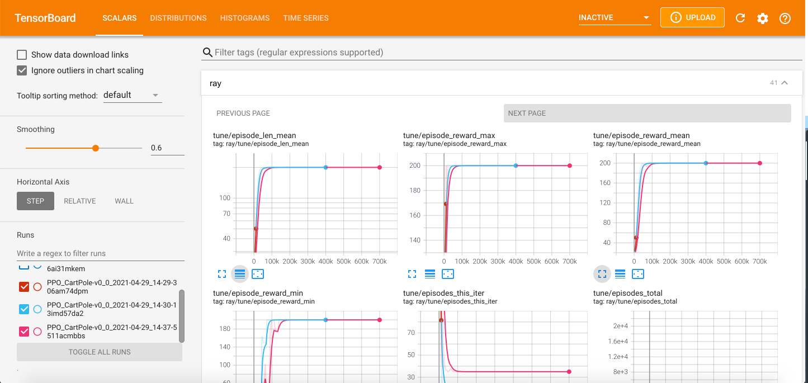

# Reinforcement Learning on Eagle

Welcome to the first NREL HPC tutorial for Reinforcement Learning (RL)! 

This tutorial covers an extended, albeit simplified, introduction of OpenAI Gym and Ray/RLlib which you can use to effortlessly design, create, and run your own RL experiments on Eagle. 

You can find the full material of this tutorial in the [NREL/HPC GitHub repo](https://github.com/erskordi/HPC/tree/HPC-RL/languages/python/openai_rllib).

The tutorial covers the following:

 * Brief introduction to RL and Ray
 * Agent training with Ray/RLlib:
    - Experimenting with Ray Tune
    - Single node/Single core.
    - Single node/Multiple cores. 
    - Multiple nodes.
 * Run experiments using GPUs for policy learning (helpful for large-scale observation and/or action spaces)


## Run OpenAI Gym on a single node/single core

Login on your Eagle account, create a new Anaconda environment as described in the [tutorial repo](https://github.com/erskordi/HPC/blob/HPC-RL/languages/python/openai_rllib/README.md), and test your installation by running a small example using one of the standard Gym environments (e.g. `CartPole-v0`).

Activate the Anaconda enironment and start a Python session
```
module purge
conda activate /scratch/$USER/conda-envs/myenv
python
```
Then, run the following:
```python
import gym

env = gym.ens.make("CartPole-v0")
env.reset()

done = False

while not done:
    action = env.action_space.sample()
    obs, rew, done, _ = env.step(action)
    print(action, obs, rew, done)
```
If everything works correctly, you will see an output similar to:
```
0 [-0.04506794 -0.22440939 -0.00831435  0.26149667] 1.0 False
1 [-0.04955613 -0.02916975 -0.00308441 -0.03379707] 1.0 False
0 [-0.05013952 -0.22424733 -0.00376036  0.2579111 ] 1.0 False
0 [-0.05462447 -0.4193154   0.00139787  0.54940559] 1.0 False
0 [-0.06301078 -0.61445696  0.01238598  0.84252861] 1.0 False
1 [-0.07529992 -0.41950623  0.02923655  0.55376634] 1.0 False
0 [-0.08369004 -0.61502627  0.04031188  0.85551538] 1.0 False
0 [-0.09599057 -0.8106737   0.05742218  1.16059658] 1.0 False
0 [-0.11220404 -1.00649474  0.08063412  1.47071687] 1.0 False
1 [-0.13233393 -0.81244634  0.11004845  1.20427076] 1.0 False
1 [-0.14858286 -0.61890536  0.13413387  0.94800442] 1.0 False
0 [-0.16096097 -0.8155534   0.15309396  1.27964413] 1.0 False
1 [-0.17727204 -0.62267747  0.17868684  1.03854806] 1.0 False
0 [-0.18972559 -0.81966549  0.1994578   1.38158021] 1.0 False
0 [-0.2061189  -1.0166379   0.22708941  1.72943365] 1.0 True
```
*Note that the above process does not involve any training.*

##  Agent training with Ray/RLlib

RL algorithms are notorious for the amount of data they need to collect in order to learn policies. The more data collected, the better the training will (usually) be. The best way to do it is to run many Gym instances in parallel and collecting experience, and this is where RLlib assists.

[RLlib](https://docs.ray.io/en/master/rllib/index.html) is an open-source library for reinforcement learning that offers both high scalability and a unified API for a variety of applications. It supports all known deep learning frameworks such as Tensorflow, Pytorch, although most parts are framework-agnostic and can be used by either one.

The RL policy learning examples provided in this tutorial demonstrate the RLlib abilities. For convenience, the `CartPole-v0` OpenAI Gym environment will be used.

The most straightforward way is to create a Python "trainer" script. It will call the necessary packages, setup flags, and run the experiments, all nicely put in a few lines of Python code.

### Import packages

Begin trainer by importing the `ray` package:
```python
import ray
from ray import tune
```
`Ray` consists of an API readily available for building [distributed applications](https://docs.ray.io/en/master/index.html). On top of it, there are several problem-solving libraries, one of which is RLlib.

`Tune` is also one of `Ray`'s libraries for scalable hyperparameter tuning. All RLlib trainers (scripts for RL agent training) are compatible with Tune API, making experimenting easy and streamlined.

Import also the `argparse` package and setup some flags. Although that step is not mandatory, these flags will allow controlling of certain hyperparameters, such as:

* RL algorithm utilized (e.g. PPO, DQN)
* Number of CPUs/GPUs
* ...and others

```python
import argparse
```

### Create flags
Begin by defining the following flags:
```python
parser.add_argument("--num-cpus", type=int, default=0)
parser.add_argument("--num-gpus", type=int, default=0)
parser.add_argument("--name-env", type=str, default="CartPole-v0")
parser.add_argument("--run", type=str, default="DQN")
parser.add_argument("--local-mode", action="store_true")
```
All of them are self-explanatory, however let's see each one separately.

1. `--num-cpus`: Defines the number of CPU cores used for experience collection (Default value 0 means allocation of a single CPU core).
2. `--num-gpus`: Allocates a GPU node for policy learning (works only for Tensorflow-GPU). Except whole values (1,2,etc.), it also accepts partial values, in case 100% of the GPU is not necessary.
3. `--name-env`: The name of the OpenAI Gym environment.
4. `--run`: Specifies the RL algorithm for agent training.
5. `--local-mode`: Helps defining whether experiments running on a single core or multiple cores.

### Initialize Ray

Ray is able to run either on a local mode (e.g. laptop, personal computer), or on a cluster.

For the first experiment, only a single core is needed, therefore, setup ray to run on a local mode. Then, set the number of CPU cores to be used.

### Run experiments with Tune

This is the final step in this basic trainer. Tune's `tune.run` function initiates the agent training process. There are three main arguments in this function:

* RL algorithm (string): It is defined in the `--run` flag (PPO, DQN, etc.).
* `stop` (dictionary): Provides a criterion to stop training (in this example is the number of training iterations; stop training when iterations reach 10,000).
* `config` (dictionary): Basic information for training, contains the OpenAI Gym environment name, number of CPUs/GPUs, and others.

```python
tune.run(
    args.run,
    name=args.name_env,
    stop={"training_iteration": 10000},
    config={
        "env": args.name_env,
        "num_workers": args.num_cpus, 
        "num_gpus": args.num_gpus,
        "ignore_worker_failures": True
        }
    )
```
The RLlib trainer is ready!

Except the aforementioned default hyperparameters, [every RL algorithm](https://docs.ray.io/en/master/rllib-algorithms.html#available-algorithms-overview) provided by RLlib has its own hyperparameters and their default values that can be tuned in advance.

The code of the trainer in this example can be found [in the tutorial repo](https://github.com/erskordi/HPC/blob/HPC-RL/languages/python/openai_rllib/simple-example/simple_trainer.py).


## Run experiments on Eagle

Follow the steps in the [tutorial repo](https://github.com/erskordi/HPC/tree/HPC-RL/languages/python/openai_rllib/simple-example) carefully.

### Run multi-core experiments

The previous example is designed to run on a single CPU core. However, as explained above, RL training is highly benefited from running multiple concurrent OpenAI Gym rollouts. A single node on Eagle has 36 CPU cores, therefore use any number of those in order to speed up your agent training. 

For all 36 cores, adjust the `--num-cpus` hyperparameter to reflect to all CPUs on the node:
```
python simple_trainer.py --num-cpus 35
```
Again, RLlib by default utilizes a single CPU core, therefore by putting `--num-cpus` equal to 35 means that all 36 cores are requested.

Such is not the case with the `num_gpus` key, where zero means no GPU allocation is permitted. This is because GPUs are used for policy training and not running the OpenAI Gym environment instances, thus they are not mandatory (although having a GPU node can assist the agent training by reducing training time).


### Run experiments on multiple nodes

Let's focus now on cases where the problem under consideration is highly complex and requires vast amounts of training data for training the policy network in a reasonable amount of time. It could be then, that you will require more than one nodes to run your experiments. In this case, it is better to use a slurm script file that will include all the necessary commands for agent train using multiple CPUs **and** multiple nodes.

### Example: CartPole-v0

As explained above, CartPole is a rather simple environment and solving it using multiple cores on a single node feels like an overkill, let alone multiple nodes! However, it is a good example for giving you an experience on running RL experiments using RLlib.

For multiple nodes it is more convenient to use a slurm script instead of an interactive node. Slurm files are submitted as `sbatch <name_of_your_batch_script>`, and the results are exported in an `slurm-<job_id>.out` file. The `.out` file can be interactively accessed during training using the `tail -f slurm-<job_id>.out` command. Otherwise, after training, open it using a standard text editor (e.g. `nano`).
Next, the basic parts of the slurm script file are given. The repo also provides [the complete script](https://github.com/erskordi/HPC/blob/HPC-RL/languages/python/openai_rllib/simple-example/multi_node_trainer.sh).

The slurm file begins with defining some basic `SBATCH` options, including the desired training time, number of nodes, tasks per node, etc.

```bash
#!/bin/bash --login

#SBATCH --job-name=cartpole-multiple-nodes
#SBATCH --time=00:10:00
#SBATCH --nodes=3
#SBATCH --tasks-per-node=1
#SBATCH --cpus-per-task=36
#SBATCH --account=A<account>
env
```
Allocating multiple nodes means creating a Ray cluster. A Ray cluster consists of a head node and a set of worker nodes. The head node needs to be started first, and the worker nodes are given the address of the head node to form the cluster. 

The agent training will run for 20 minutes (`SBATCH --time=00:20:00`), and on three Eagle CPU nodes (`SBATCH --nodes=3`). Every node will execute a single task (`SBATCH --tasks-per-node=1`), which will be executed on all 36 cores (`SBATCH --cpus-per-task=36`). Then, define the project account. Other options are also available, such as whether to prioritize the experiment (`--qos=high`).

Use the commands to activate the Anaconda environment. Do not forget to `unset LD_PRELOAD`.
```batch
module purge
conda activate /scratch/$USER/conda-envs/env_example
unset LD_PRELOAD
```
Set up the Redis server that will allow all the nodes you requested to communicate with each other. For that, set a Redis password:
```batch
ip_prefix=$(srun --nodes=1 --ntasks=1 -w $node1 hostname --ip-address)
port=6379
ip_head=$ip_prefix:$port
redis_password=$(uuidgen)
```
Submit the jobs one at a time at the workers, starting with the head node and moving on to the rest of them.
```batch
srun --nodes=1 --ntasks=1 -w $node1 ray start --block --head \
--node-ip-address="$ip_prefix" --port=$port --redis-password=$redis_password &
sleep 10

echo "starting workers"
for ((  i=1; i<=$worker_num; i++ ))
do
  node2=${nodes_array[$i]}
  echo "i=${i}, node2=${node2}"
  srun --nodes=1 --ntasks=1 -w $node2 ray start --block --address "$ip_head" --redis-password=$redis_password &
  sleep 5
done
```
Set the Python script to run. Since this experiment will run on a cluster, Ray will be initialized as:
```python
ray.init(_redis_password=args.redis_password, address=os.environ["ip_head"])
num_cpus = args.num_cpus - 1
```
The `--redis-password` option must be active, along with the total number of CPUs:
```batch
python -u simple_trainer.py --redis-password $redis_password --num-cpus $total_cpus
```
The experiment is ready to begin, simply run:
```
sbatch <your_slurm_file>
```
If the trainer script is on a different directory, make sure to `cd` to this directory in the slurm script before executing it.
```
### Example where the trainer is on scratch:
cd /scratch/$USER/path_to_specific_directory
python -u simple_trainer.py --redis-password $redis_password --num-cpus $total_cpus
```

## Experimenting using GPUs

It is now time to learn running experiments using GPU nodes on Eagle that can boost training times considerably. GPU nodes however is better to be utilized only in cases of environments with very large observation and/or action spaces. CartPole will be used again for establishing a template.

### Allocate GPU node 

*The following instructions are the same for both regular and Optimized TF versions of the Anaconda environments*

Running experiments with combined CPU and GPU nodes is not so straightforward as running them using only CPU nodes (either single or multiple nodes). Particularly, heterogenous jobs using slurm have to be submitted.

Begin at first by specifying some basic options, similarly to previous section:
```batch
#!/bin/bash  --login

#SBATCH --account=A<account>
#SBATCH --job-name=cartpole-gpus
#SBATCH --time=00:10:00
```
The slurm script will clearly define the various jobs. These jobs include the CPU nodes that will carry the environment rollouts, and the GPU node for policy learning. Eagle has 44 GPU nodes and each node has 2 GPUs. Either request one GPU per node (`--gres=gpu:1`), or both of them (`--gres=gpu:2`). For the purposes of this tutorial, one GPU core on a single node is utilized.

In total, slurm nodes can be categorized as: 

 * A head node, and multiple rollout nodes (as before)
 * A policy training node (GPU)

Include the `hetjob` header for both the rollout nodes and the policy training node. Three CPU nodes are requested to be used for rollouts and a single GPU node is requested for policy learning:
```batch
# Ray head node
#SBATCH --nodes=1
#SBATCH --tasks-per-node=1

# Rollout nodes - Nodes with multiple runs of OpenAI Gym 
#SBATCH hetjob
#SBATCH --nodes=3
#SBATCH --tasks-per-node=1
#SBATCH --cpus-per-task=36

# Policy training node - This is the GPU node
#SBATCH hetjob
#SBATCH --nodes=1
#SBATCH --tasks-per-node=1
#SBATCH --partition=debug
#SBATCH --gres=gpu:1
```
Of course, any number of CPU/GPU nodes can be requested, depending on problem complexity. 

As an example, a single node and perhaps just a single CPU core may be requested. Now, it is more reasonable to request GPUs for an OpenAI Gym environment that utilizes high-dimensional observation and/or action spaces. Hence, the first priority would be to start with multiple CPU nodes, and request GPUs only if they are needed.

For the three types of nodes (head, rollouts, training), define three separate groups:
```batch
head_node=$(scontrol show hostnames $SLURM_JOB_NODELIST_HET_GROUP_0)
rollout_nodes=$(scontrol show hostnames $SLURM_JOB_NODELIST_HET_GROUP_1)
rollout_nodes_array=( $rollout_nodes )
learner_node=$(scontrol show hostnames $SLURM_JOB_NODELIST_HET_GROUP_2)
echo "head node    : "$head_node
echo "rollout nodes: "$rollout_nodes
echo "learner node : "$learner_node
```
Each group of nodes requires its separate `srun` command so that they will run independently of each other.
```batch
echo "starting head node at $head_node"
srun --pack-group=0 --nodes=1 --ntasks=1 -w $head_node ray start --block --head \
--node-ip-address="$ip_prefix" --port=$port --redis-password=$redis_password & # Starting the head
sleep 10

echo "starting rollout workers"
for ((  i=0; i<$rollout_node_num; i++ ))
do
  rollout_node=${rollout_nodes_array[$i]}
  echo "i=${i}, rollout_node=${rollout_node}"
  srun --pack-group=1 --nodes=1 --ntasks=1 -w $rollout_node \
   ray start --block --address "$ip_head" --redis-password=$redis_password & # Starting the workers
  sleep 5
done

echo "starting learning on GPU"
srun --pack-group=2 --nodes=1 --gres=gpu:1 -w $learner_node ray start --block --address "$ip_head" --redis-password=$redis_password &
```
The slurm commands for the head and rollout nodes are identical to those from the previous section. A third command is also added for engaging the GPU node.

Finally, call
```batch
python -u simple_trainer.py --redis-password $redis_password --num-cpus $rollout_num_cpus --num-gpus 1
```
to begin training. Add the `---num-gpus` argument to include the requested GPU node (or nodes in case of `--gres=gpu:2`) for policy training. There is no need to manually declare the GPU for policy training in the `simple_trainer.py`, RLlib will automatically recognize the available GPU and use it accordingly.

The repo contains the complete slurm file versions for both [`env_example_gpu`](https://github.com/erskordi/HPC/blob/HPC-RL/languages/python/openai_rllib/simple-example-gpu/gpu_trainer.sh) and [`env_gpu_optimized_tf`](https://github.com/erskordi/HPC/blob/HPC-RL/languages/python/openai_rllib/simple-example-gpu/env_example_optimized_tf.yml), and they can be used as templates for future projects.


### Create Gym environments from scratch

So far, only benchmark Gym environments were used in order to demonstrate the processes for running experiments. It is time now to see how one can create their own Gym environment, carefully tailor-made to one's needs. OpenAI Gym functionality allows the creation of custom-made environments using the same structure as the benchmark ones. 

Custom-made environments can become extremely complex due to the mechanics involved and may require many subscripts that perform parts of the simulation. Nevertheless, the basis of all environments is simply a Python class that inherits the `gym.Env` class, where the user can implement the three main Gym functions and define any hyperpameters necessary:

 * `def __init__(self)`: Initializes the environment. It defines initial values for variables/hyperparameters and may contain other necessary information. It also defines the dimensionality of the problem. Dimensionality is expressed at the sizes of the observation and action spaces, which are given using the parameters `self.observation_space` and `self.action_space`, respectively. Depending on their nature, they can take discrete, continuous, or a combination of values. OpenAI provides [detailed examples](https://gym.openai.com/docs/) of each one of these types of spaces.
 * `def reset(self)`: When called, it *resets* the environment on a previous state (hence the name). This state can either be a user-defined initial state or it may be a random initial position. The latter can be found on environments that describe locomotion like `CartPole`, where the initial state can be any possible position of the pole on the cart.
 * `def step(self, action)`: The heart of the class. It defines the inner mechanics of the environment, hence it can be seen as some kind of simulator. Its main input is the sampled action, which when acted upon moves the environment into a new state and calculates the new reward. The new state and reward are two of the function's output and they are necessary for policy training since they are also inputs to the policy network. Other outputs include a boolean variable `done` that is **True** when the environment reaches its final state (if it exists), and **False** otherwise<sup>\*</sup>, as well as a dictionary (`info`) with user-defined key-value objects that contain further information from the inner workings of the environment.
 
<sup>\*</sup> *Many environments do not consider a final state, since it might not make sense (e.g. a traffic simulator for fleets of autonomous ridesharing vehicles that reposition themselves based on a certain criterion. In this case the reward will get better every time, but there is no notion of a final vehicle position).*

Directions of how to create and register a custom-made OpenAI Gym environment are given below.

### Create an environment class

As stated above, the basis of any Gym environment is a Python class that inherits the `gym.Env` class. After importing the gym package, define the class as:
```python
import gym

class BasicEnv(gym.Env):(...)
```
The example environment is very simple and is represented by two possible states (0, 1) and 5 possible actions (0-4). For the purposes of this tutorial, consider state 0 as the initial state, and state 1 as the final state.

Define the dimensions of observation and action spaces in the `def __init__(self)` function:
```python
def __init__(self):
    self.action_space = gym.spaces.Discrete(5) # --> Actions take values in the 0-4 interval
    self.observation_space = gym.spaces.Discrete(2) # --> Two possible states [0,1]
```
Both spaces take discrete values, therefore they are defined using Gym's `Discrete` function. Other possible functions are `Box` for continuous single- or multi-dimensional observations and states, `MultiDiscrete` for vectors of discrete values, etc. OpenAi provides [detailed explanation](https://gym.openai.com/docs/) for all different space forms.

Next, define the `def reset(self)` function:
```python
def reset(self):
    state = 0
    return state
```
In this example, the reset function simply returns the environment to the initial state.

Finally, define the `def step(self, action)` function, which takes as input the sampled action. Here the step function takes the environment at state 1 and based on the action, returns a reward of 1 or -1:
```python
def step(self, action):
    state = 1

    if action == 2:
        reward = 1
    else:
        reward = -1

    done = True
    info = {}

    return state, reward, done, info
```
That's it, the new Gym environment is ready! Make note that there is one more function usually found on Gym environments. This is the `def render(self)` function, and is called in random intervals throughout training returning a "snapshot" of the environment at that time. While this is helpful for evaluating the agent training process, it is not necessary for the actual training process. OpenAI documentation [provides](https://gym.openai.com/docs/#environments) details for every one of these functions.

You can find the [full script](https://github.com/NREL/HPC/tree/master/languages/python/openai_rllib) of this environment in the repo.

### Run experiments on RLlib
Let's now train the agent with RLlib. The [full trainer script](https://github.com/NREL/HPC/blob/master/languages/python/openai_rllib/custom_gym_env/custom_env_trainer.py) is given at the repo.

The trainer is almost identical to [the one used before](https://github.com/NREL/HPC/blob/master/languages/python/openai_rllib/simple-example/simple_trainer.py), with few additions that are necessary to register the new environment.

At first, along with `ray` and `tune`, import:
```python
from ray.tune.registry import register_env
from custom_env import BasicEnv
```
The `register_env` function is used to register the new environment, which is imported from the `custom_env.py`.

Function `register_env` takes two arguments:

* Training name of the environment, chosen by the developer.
* Actual name of the environment (`BasicEnv`) in a `lambda config:` function.

```python
env_name = "custom-env"
register_env(env_name, lambda config: BasicEnv())
```
Once again, RLlib provides [detailed explanation](https://docs.ray.io/en/master/rllib-env.html) of how `register_env` works.

The `tune.run` function, instead of `args.name_env`, it uses the `env_name` defined above.

That's all! Proceed with agent training using any of the slurm scripts provided by the repo.

As a final note, creating custom-made OpenAI Gym environment is more like an art than science. The main issue is to really clarify what the environment represents and how it works, and then define this functionality in Python.

## Validating results using Tensorboard

Another way of visualizing the performance of agent training is with [**Tensorboard**](https://www.tensorflow.org/tensorboard). 
 
Navigate to the `ray_results` directory:
```
cd ~/ray_results/
```
Every RL experiment generates a subdirectory named from the OpenAI Gym environment used in the experiment. 

E.g., after running all the examples previously shown in this tutorial, `ray_results` will have a subdirectory named `CartPole-v0`. Within, every experiment using CartPole generates a new subdirectory.

For the purpose of this tutorial, `cd` to the `CartPole-v0` subdirectory and activate one of the environments:
```
module purge
conda activate <your_environment>
```
Initialize Tensorboard following the [steps in this tutorial](https://github.com/erskordi/HPC/blob/ml-rl/MachineLearning/tensorboard.md). Open the localhost url in a browser, and all plots for rewards, iterations and other metrics will be demonstrated as:

<p float="left">
  
   
</p>

The `tune/episode_reward_mean` plot is essentialy the same as the figure plotted from data in the `progress.csv` file. The difference in the x-axis scale has a simple explanation. The `episode_reward_mean` column on the `progress.csv` file shows the reward progress on every training iteration, while the `tune/episode_reward_mean` plot on Tensorboard shows reward progress on every training episode (a single RLlib training iteration consists of thousands of episodes).
