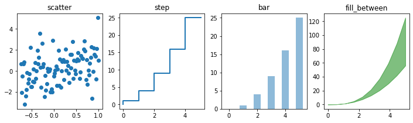

# Introduction to Jupyter

## What is Jupyter?

**A web app for interactive Python in a browser** 

- "Live coding"
- Instant visualization
- Sharable
- Reproducible
- Customizable
- Now supports other languages besides Python (R, Julia..)   
    - https://github.com/jupyter/jupyter/wiki/Jupyter-kernels
    - these slides were created using Markdown in Jupyter!

```python
import chart_studio.plotly as py
import plotly.figure_factory as ff
import pandas as pd
import numpy as np
import matplotlib
import matplotlib.pyplot as plt
x = np.linspace(0, 5, 10)
y = x ** 2
n = np.array([0,1,2,3,4,5])
xx = np.linspace(-0.75, 1., 100)

fig, axes = plt.subplots(1, 4, figsize=(12,3))

axes[0].scatter(xx, xx + 1.25*np.random.randn(len(xx)))
#axes[0].scatter(xx, xx + 0.25*np.random.randn(len(xx)))
axes[0].set_title("scatter")

axes[1].step(n, n**2.0, lw=2)
axes[1].set_title("step")

axes[2].bar(n, n**2, align="center", width=0.5, alpha=0.5)
axes[2].set_title("bar")

axes[3].fill_between(x, x**2.5, x**3, color="green", alpha=0.5);
axes[3].set_title("fill_between");
```





## Terminology - a Confusion of Words


### **Jupyterhub**
    * Multi-user "backend" server
    * Controls launching the single-user Jupyter server
    * NREL's "Europa" runs Jupyterhub
 
(In general, don't worry about JupyterHub--unless you're a sysadmin)

### **Jupyter/Jupyter Server/Notebook server**
    * The single-user server/web interface
    * Create/save/load .ipynb notebook files
    * What users generally interact with

### **Jupyter Notebook**
    * An individual .pynb file
    * Contains your Python code and visualizations
    * Sharable/downloadable

###  **Jupyter lab**
    * A "nicer" web interface for Jupyter - "notebooks 2.0"
    * Preferred by some
    * Lacking some features of "classic" notebooks

### **Kernel**
    * The Python environment used by a notebook
    * More on kernels later

## Using Europa

We run a Jupyterhub server that is available. 

### Europa's Advantages:
    * Fast and easy access
    * Use regular Eagle credentials
    * Great for light to moderate processing/debugging/testing

### Europa's Disadvantages:
    * Limited resource: 8 cores/128GB RAM per user beefore automatic throttling
    * Compete with other users for CPU/RAM on a single machine
    * No custom environments (for now)


### Simple Instructions:
    
    - Visit Europa at (https://europa.hpc.nrel.gov/)
    
    - Log in using your HPC credentials
     
    - Opens a standard "notebooks" interface
     
    - Change url end /tree to /lab for Lab interface


## Using a Compute Node

### Advantages:
    * Custom environments
    * 36 cores and up to ~750GB RAM
    * No competing with other users for cores

### Disadvantages:
    * Compete with other users for nodes
    * Costs AU
    
    


#### ...Is more than one node possible?

Yes... please see our advanced Jupyter documentation. 

## Using a Compute Node - Hard Way

### Start on a login node:

`ssh eagle.hpc.nrel.gov`

`[user@el1:]$ srun -A <account> -t 02:00:00 --pty /bin/bash`


### When the job starts on the compute node:

`[user@r2i7n35]$ module load conda`

`source activate myjupenv`

`jupyter-notebook --no-browser --ip=$(hostname -s)`

note the node name (r2i7n35 in this example)

and the url, e.g. `http://127.0.0.1:8888/?token=<alphabet soup>`

### In a terminal on your computer:

`[user@laptop]$ ssh -N -L 8888:<nodename>:8888 username@eagle.hpc.nrel.gov`
    
copy full url from jupyter startup into your web browser. e.g.: 

`http://127.0.0.1:8888/?token=<alphabet soup>`


## Using a Compute Node - Easy Way


Automation makes life better!

###  Auto-launching with an sbatch script

Full directions included in the [Jupyter repo](https://github.com/NREL/HPC/tree/master/general/Jupyterhub/jupyter).

Download [sbatch_jupyter.sh](https://github.com/NREL/HPC/blob/master/general/Jupyterhub/jupyter/sbatch_jupyter.sh) and [auto_launch_jupyter.sh](https://github.com/NREL/HPC/blob/master/general/Jupyterhub/jupyter/auto_launch_jupyter.sh)

Edit [sbatch_jupyter.sh](https://github.com/NREL/HPC/blob/master/general/Jupyterhub/jupyter/sbatch_jupyter.sh) to change:

`--account=*yourallocation*`

`--time=*timelimit*`

Run [auto_launch_jupyter.sh](https://github.com/NREL/HPC/blob/master/general/Jupyterhub/jupyter/auto_launch_jupyter.sh) and follow directions

That's it!

## Using a Login Node


Yes, you can run jupyter directly on a login node.


Should you run jupyter directly on a login node?


### Reasons to Not Run Jupyter Directly on a Login Node
    * Heavy lifting should be done via Europa or compute nodes
    * Using a highly shared resource (login nodes)
        * Competition for cycles
        * arbiter2 will throttle moderate to heavy usage

## Custom Conda Environments and Jupyter Kernels

### Creating a conda environment:

`conda create -n myjupyter -c conda-forge jupyter ipykernel`

`source activate myjupyter`

`conda install -c conda-forge scipy numpy matplotlib`


### Add custom ipykernel

`python -m ipykernel install --user --name=myjupyter`

Restart your jupyter server

New kernel will appear in drop-down as an option

### Remove custom ipykernel

`jupyter kernelspec list`

`jupyter kernelspec remove myoldjupyter`


## Magic commands


Magic commands are "meta commands" that add extra functionality.

Magic commands begin with % or %%.

### A Few Useful Examples
 
    * %lsmagic - list all magic commands
    * %run _file.py_ - run an external python script
    * %%time - placed at top of cell, prints execution time
    * %who - list all defined variables in notebook
    


```
%lsmagic

```


    Available line magics:
    %alias  %alias_magic  %autoawait  %autocall  %automagic  %autosave  %bookmark  %cat  %cd  %clear  %colors  %conda  %config  %connect_info  %cp  %debug  %dhist  %dirs  %doctest_mode  %ed  %edit  %env  %gui  %hist  %history  %killbgscripts  %ldir  %less  %lf  %lk  %ll  %load  %load_ext  %loadpy  %logoff  %logon  %logstart  %logstate  %logstop  %ls  %lsmagic  %lx  %macro  %magic  %man  %matplotlib  %mkdir  %more  %mv  %notebook  %page  %pastebin  %pdb  %pdef  %pdoc  %pfile  %pinfo  %pinfo2  %pip  %popd  %pprint  %precision  %prun  %psearch  %psource  %pushd  %pwd  %pycat  %pylab  %qtconsole  %quickref  %recall  %rehashx  %reload_ext  %rep  %rerun  %reset  %reset_selective  %rm  %rmdir  %run  %save  %sc  %set_env  %store  %sx  %system  %tb  %time  %timeit  %unalias  %unload_ext  %who  %who_ls  %whos  %xdel  %xmode
    
    Available cell magics:
    %%!  %%HTML  %%SVG  %%bash  %%capture  %%debug  %%file  %%html  %%javascript  %%js  %%latex  %%markdown  %%perl  %%prun  %%pypy  %%python  %%python2  %%python3  %%ruby  %%script  %%sh  %%svg  %%sx  %%system  %%time  %%timeit  %%writefile
    
    Automagic is ON, % prefix IS NOT needed for line magics.


## Shell Commands

You can also run shell commands inside a cell. For example:

`!conda list` - see the packages installed in the environment you're using


```python
!pwd
!ls
```

    /home/tthatche/jup
    auto_launch_jupyter.sh	  Jupyter Presentation.ipynb  slurm-6445885.out
    geojsondemo.ipynb	      old			              sshot1.png
    Interesting Graphs.ipynb  sbatch_jupyter.sh	          sshot2.png
    jup-logo.png		      slurm


## Interesting/Useful Notebooks

[Awesome Jupyter](https://github.com/markusschanta/awesome-jupyter)

[Awesome Jupyterlab](https://github.com/mauhai/awesome-jupyterlab)

[Plotting with matplotlib](https://nbviewer.jupyter.org/github/jrjohansson/scientific-python-lectures/blob/master/Lecture-4-Matplotlib.ipynb)

[Python for Data Science](https://nbviewer.jupyter.org/github/gumption/Python_for_Data_Science/blob/master/Python_for_Data_Science_all.ipynb)

[Numerical Computing in Python](https://nbviewer.jupyter.org/github/phelps-sg/python-bigdata/blob/master/src/main/ipynb/numerical-slides.ipynb)

[The Sound of Hydrogen](https://nbviewer.jupyter.org/github/Carreau/posts/blob/master/07-the-sound-of-hydrogen.ipynb)

[Plotting Pitfalls](https://anaconda.org/jbednar/plotting_pitfalls/notebook)

[GeoJSON Extension](https://github.com/jupyterlab/jupyter-renderers/tree/master/packages/geojson-extension)


## Happy Notebooking!

