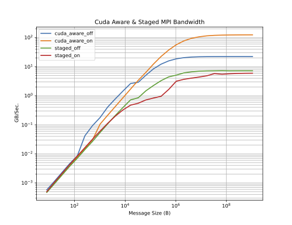

# Building and Running on Kestrel's H100 GPU nodes.
This page describes how to build and run on Kestrel's GPU nodes using several programming paradigms.  There are pure Cuda programs, Cuda aware MPI programs, MPI programs without Cuda, MPI programs with Cuda, MPI programs with Openacc, and pure Openacc programs. 

The examples are contained in a tarball available on Kestrel via the command:

```bash
tar -xzf /nopt/nrel/apps/examples/gpu/h100.tgz
```

Or you can use git to do a download:

```bash
git clone $USER@kestrel.hpc.nrel.gov:/nopt/nrel/apps/examples/gpu/0824 h100
```

After getting the source you can run all of the examples:

```bash
cd h100
sbatch --account=MYACCOUNT script
```
where you need to provide your account name.  This will run in about 22 minutes using 2 GPU nodes.  Some of the examples require 2 nodes but most will run on a single node.

## Helper files

There are a number of "helper" files  shipped with the examples.  The script *onnodes* is run while you have a job running.  You specify the jobid and it will report what is running on each node owned by the job.  This will include the core on which each task/thread is running.  On GPU nodes it will also report what you have running on each GPU.

??? example "onnodes script"
    ```bash
    [tkaiser2@kl6 h100]$ ./onnodes
    x3102c0s41b0n0
    PID    LWP PSR COMMAND         %CPU
    3658483 3659124   4 jacobi           0.0
    3653038 3653038  14 (sd-pam)         0.0
    3653037 3653037  16 systemd          0.0
    3659075 3659075  27 sshd             0.0
    3658483 3658499  52 cuda00001800007  0.0
    3658480 3658497  64 cuda00001800007  0.0
    3658481 3658481  65 jacobi          23.6
    3658481 3659129  66 jacobi           0.0
    3658482 3658482  72 jacobi          20.8
    3658482 3658498  79 cuda00001800007  0.0
    3658480 3658480  84 jacobi          64.6
    3658483 3658483  88 jacobi          20.2
    3658480 3659127  89 jacobi           0.0
    3658481 3658496  92 cuda00001800007  0.0
    3659076 3659076  95 ps               0.0
    3658482 3659125 101 jacobi           0.0
    /usr/bin/nvidia-smi
    Wed Aug 21 11:55:50 2024       
    +-----------------------------------------------------------------------------------------+
    | NVIDIA-SMI 550.54.15              Driver Version: 550.54.15      CUDA Version: 12.4     |
    |-----------------------------------------+------------------------+----------------------+
    | GPU  Name                 Persistence-M | Bus-Id          Disp.A | Volatile Uncorr. ECC |
    | Fan  Temp   Perf          Pwr:Usage/Cap |           Memory-Usage | GPU-Util  Compute M. |
    |                                         |                        |               MIG M. |
    |=========================================+========================+======================|
    |   0  NVIDIA H100 80GB HBM3          On  |   00000000:04:00.0 Off |                    0 |
    | N/A   42C    P0            126W /  699W |     532MiB /  81559MiB |      0%      Default |
    |                                         |                        |             Disabled |
    +-----------------------------------------+------------------------+----------------------+
    |   1  NVIDIA H100 80GB HBM3          On  |   00000000:64:00.0 Off |                    0 |
    | N/A   42C    P0            123W /  699W |     532MiB /  81559MiB |      0%      Default |
    |                                         |                        |             Disabled |
    +-----------------------------------------+------------------------+----------------------+
    |   2  NVIDIA H100 80GB HBM3          On  |   00000000:84:00.0 Off |                    0 |
    | N/A   42C    P0            123W /  699W |     532MiB /  81559MiB |      0%      Default |
    |                                         |                        |             Disabled |
    +-----------------------------------------+------------------------+----------------------+
    |   3  NVIDIA H100 80GB HBM3          On  |   00000000:E4:00.0 Off |                    0 |
    | N/A   43C    P0            119W /  699W |     532MiB /  81559MiB |      0%      Default |
    |                                         |                        |             Disabled |
    +-----------------------------------------+------------------------+----------------------+
                                                                                            
    +-----------------------------------------------------------------------------------------+
    | Processes:                                                                              |
    |  GPU   GI   CI        PID   Type   Process name                              GPU Memory |
    |        ID   ID                                                               Usage      |
    |=========================================================================================|
    |    0   N/A  N/A   3658480      C   ...try2/h100/mpi/openacc/cray/./jacobi        522MiB |
    |    1   N/A  N/A   3658481      C   ...try2/h100/mpi/openacc/cray/./jacobi        522MiB |
    |    2   N/A  N/A   3658482      C   ...try2/h100/mpi/openacc/cray/./jacobi        522MiB |
    |    3   N/A  N/A   3658483      C   ...try2/h100/mpi/openacc/cray/./jacobi        522MiB |
    +-----------------------------------------------------------------------------------------+
    [tkaiser2@kl6 h100]$
    ```

There is a function *module_restore* defined in /nopt/nrel/apps/env.sh.
Sourcing /nopt/nrel/apps/env.sh sets modules back to the original state.
module_restore also modifies $PATH and $LD_LIBRARY_PATH putting paths with your 
home directory at the beginning.


```
. /nopt/nrel/apps/env.sh
module_restore
```

As of October 2024, /nopt/nrel/apps/env.sh is sourced automatically when you login so the
function module_restore should be in you path.


### Just MPI
There is an extra slurm script *quick* which does a build of C and Fortran MPI hello world.  The script shows that to get a MPI program to build with the standard Programing environments PrgEnv-{cray,intel,gnu} you must module unload nvhpc and module load cuda.  These environments build using Cray's MPI and the various back end compilers.  There is a conflict between the default version of nvhpc and these environments.  Also, Cray MPI wants cuda even if the program being built does not require it.


## Programming paradigms Discussed
* Multiple GPUs & multiple nodes 
	- Pure Cuda programs
	- Cuda aware MPI programs
	- MPI programs without Cuda,
	- MPI programs with Cuda
	- MPI programs with Openacc
	- Pure Openacc programs.   
	- Library routines
* We’ll build with: 
	- Cray’s standard programming environment 
	- NVIDIA’s environment
	- Gcc
	- A few examples with Intel MPI

## Common issues addressed with these examples

* Can’t find library at run time
	- Need to set LD\_LIBRARY\_PATH to point to directory containing the library. Try to load modules at run time.
* Module xxx is not compatible with your cray-libsci.
	- Load an different version:  cray-libsci/22.10.1.2 or cray-libsci/22.12.1.1  or   cray-libsci/23.05.1.4
* Can’t find some function in the c++ library.
	- Load a newer version of gcc
* At link time libgcc_s.so.1: file not recognized: File format not recognized.
	- Linker is missing after some combinations of loads.
	- module load binutils
* Examples shown here don’t work.
	- Make sure you are running and or launching from a GPU node
* cc1: error: bad value ‘znver4’ for ‘-march=’ switch.
	- -march=skylake
* Package 'nccl', required by 'virtual:world', not found…
	- module unload nvhpc
* lib/libmpi_gtl_cuda.so: undefined reference to…
	- module load cuda

## The examples
The examples are spread across a number of directories.  All examples can be run with a single sbatch command.

* Our driver script is just "script".
* Each example directory contains a file "doit".
* Our driver looks for each directory with an example; Goes there and sources doit.
* We can select the default gcc compiler to use by setting the environmental variable MYGCC; This can be done outside of the script before sbatch. The possible versions of gcc are set as shown below:
	 - export MYGCC=gcc-native/12.1
	 - export MYGCC=gcc-stdalone/10.1.0
	 - export MYGCC=gcc-stdalone/12.3.0 
	 - export MYGCC=gcc-stdalone/13.1.0

* If we know that an example will not run with the chosen version of gcc "doit" will substitute on the fly
* You can run a subset of the tests by setting the variable doits.  For example:

```
export doits="./cudalib/factor/doit ./cudalib/fft/doit ./mpi/cudaaware/doit"
```


## General notes for all examples

* All examples run module_restore to set the environment to a know state.  See above.
* Many of the examples unload  PrgEnv-cray/8.5.0 and nvhpc/24.1 to prevent conflicts with other modules.
* There is a compile and run of one or more programs.  
* MPI programs are run with srun or mpirun on one or two nodes.  Mpirun is used with some versions of NVIDIA's environment because srun is not supported.
* GPU programs that use a single GPU are run on each GPU in turn.


## The script

Our script, shown below does the following:

1. Test to make sure we are starting from a GPU node.
1. Define a simple timer.
1. Save our environment and a copy of the script.
1. Bring the function module_restore into our environment (see above).
1. Set our default version of gcc.
1. Find our examples if the user has not set a list beforehand and echo our list.
1. Go into each directory and run the test.


??? example "script"
	```bash
	#!/bin/bash
	#SBATCH --time=0:30:00
	#SBATCH --partition=gpu-h100
	#SBATCH --nodes=2
	#SBATCH --gres=gpu:h100:4
	#SBATCH --exclusive
	#SBATCH --output=output-%j.out
	#SBATCH --error=infor-%j.out
	
	
	if echo $SLURM_SUBMIT_HOST | egrep "kl5|kl6" >> /dev/null  ; then : ; else echo Run script from a GPU node; exit ; fi
	# a simple timer
	dt ()
	{
		now=`date +"%s.%N"`;
		if (( $# > 0 )); then
			rtn=$(printf "%0.3f" `echo $now - $1 | bc`);
		else
			rtn=$(printf "%0.3f" `echo $now`);
		fi;
		echo $rtn
	}
	
	printenv > env-$SLURM_JOB_ID.out
	cat $0 > script-$SLURM_JOB_ID.out
	
	#runs script to put our restore function in our environment
	. /nopt/nrel/apps/env.sh
	module_restore
	
	#some possible values for gcc module
	#export MYGCC=gcc-native/12.1
	#export MYGCC=gcc-stdalone/10.1.0
	#export MYGCC=gcc-stdalone/12.3.0 
	#export MYGCC=gcc-stdalone/13.1.0
	
	if [ -z ${MYGCC+x} ]; then export MYGCC=gcc-native/12.1  ; else echo MYGCC already set ; fi
	echo MYGCC=$MYGCC
	
	if [ -z ${doits+x} ]; then 
		doits=`find . -name doit | sort -t/ -k2,2`
	else 
		echo doits already set 
	fi
	
	for x in $doits ; do
		echo running example in `dirname $x`
	done
	
	startdir=`pwd`
	t1=`dt`
	for x in $doits ; do
	 dir=`dirname $x`
	 echo ++++++++ $dir >&2 
	 echo ++++++++
	 echo $dir
	 cd $dir
	 tbegin=`dt`
	 . doit | tee  $SLURM_JOB_ID
	 echo Runtime `dt $tbegin` $dir `dt $t1` total
	 cd $startdir
	done
	echo FINISHED `dt $t1`
	
	# post  (this is optional)
	mkdir -p /scratch/$USER/gputest/$SLURM_JOB_ID
	cp *out  /scratch/$USER/gputest/$SLURM_JOB_ID
	# . cleanup
	
	```


## cuda/cray
Here we build and run a single GPU code stream.cu.  This code is a standard benchmark that measures the floating point performance for a GPU.

In this case we are loading PrgEnv-nvhpc/8.4.0 which requires cray-libsci/23.05.1.4.  We compile with the "wrapper" compiler CC which, in this case builds with NVIDIA's backend compiler.  CC would "pull in" Cray's MPI it it was required.

We run on each GPU of each Node in our allocation.

??? example "cuda/cray"
	```bash
	: Start from a known module state, the default
	module_restore
	
	: Load modules
	#module unload PrgEnv-cray/8.5.0
	#module unload nvhpc/24.1
	
	
	if [ -z ${MYGCC+x} ]; then module load gcc ; else module load $MYGCC ; fi
	ml PrgEnv-nvhpc/8.4.0
	ml cray-libsci/23.05.1.4
	ml binutils
	: << ++++ 
	 Compile our program
	 CC as well as cc, and ftn are wrapper compilers. Because
	 we have PrgEnv-nvidia loaded they map to Nvidia's compilers
	 but use would use Cray MPI if this was an MPI program.
	 Note we can also use nvcc since this is not an MPI program.
	++++
	
	rm -rf ./stream.sm_90
	CC -gpu=cc90  -cuda -target-accel=nvidia90  stream.cu  -o stream.sm_90
	# nvcc -std=c++11 -ccbin=g++ stream.cu -arch=sm_90 -o stream.sm_90
	
	: Run on all of our nodes
	nlist=`scontrol show hostnames | sort -u`
	for l in $nlist ; do   
	  echo $l
	  for GPU in 0 1 2 3 ; do
	: stream.cu will read the GPU on which to run from the command line
		  srun -n 1 --nodes=1 -w $l ./stream.sm_90 -g $GPU
	  done
	  echo
	done
	```

## cuda/gccalso

Here we build and run a single GPU code stream.cu. This code is a standard benchmark that measures the floating point performance for a GPU.  In this case we break the compile into two parts; compiling the "normal" C portions with gcc and the Cuda portions with compilers enabled via the load nvhpc-nompi.  This is NVIDIA's compilers without MPI.

??? example "cuda/gccalso"
	```bash
	: Start from a known module state, the default
	module_restore
	
	: Load modules
	#module unload  PrgEnv-cray/8.5.0
	#module unload nvhpc/24.1
	
	if [ -z ${MYGCC+x} ]; then module load gcc ; else module load $MYGCC ; fi
	ml nvhpc-nompi/24.1
	ml binutils
	
	ml 2>&1 | grep gcc-stdalone/13.1.0 ; if [ $? -eq 0 ]  ; then echo REPLACING gcc-stdalone/13.1.0 ; ml gcc-stdalone/12.3.0  ; fi
	
	: << ++++ 
	 Compile our program
	 The module nvhpc-nompi gives us access to Nvidia's compilers
	 nvc, nvc++, nvcc, nvfortran as well as the Portland Group 
	 compilers which are actually links to these.  We do not
	 have direct access to MPI with this set of modules loaded.
	 Here we compile routines that do not containe cuda with g++.
	++++
	
	
	g++ -c normal.c 
	nvcc -std=c++11 -arch=sm_90 cuda.cu normal.o -o stream.sm_90
	
	: Run on all of our nodes
	nlist=`scontrol show hostnames | sort -u`
	for l in $nlist ; do   
	  echo $l
	  for GPU in 0 1 2 3 ; do
	: stream.cu will read the GPU on which to run from the command line
		  srun -n 1 --nodes=1 -w $l ./stream.sm_90 -g $GPU
	  done
	  echo
	done
	```

## cuda/nvidia

Steam.cu runs a standard benchmark showing the computational speed of the gpu for simple math operations.

We use nvhpc-nompi which is a NREL written environment that builds cuda programs without MPI and run on each of the GPUs one at a time.

??? example "cuda/nvidia"
	```bash
	: Start from a known module state, the default
	module_restore
	
	: Load modules
	#module unload  PrgEnv-cray/8.5.0
	#module unload nvhpc/24.1
	
	ml nvhpc-nompi/24.1
	: << ++++ 
	 Compile our program
	 The module nvhpc-nompi gives us access to Nvidia's compilers
	 nvc, nvc++, nvcc, nvfortran as well as the Portland Group 
	 compilers which are actually links to these.  We do not
	 have direct access to MPI with this set of modules loaded.
	++++
	
	
	nvcc -std=c++11 -arch=sm_90 stream.cu -o stream.sm_90
	
	: Run on all of our nodes
	nlist=`scontrol show hostnames | sort -u`
	for l in $nlist ; do   
	  echo $l
	  for GPU in 0 1 2 3 ; do
	: stream.cu will read the GPU on which to run from the command line
		  srun -n 1 --nodes=1 -w $l ./stream.sm_90 -g $GPU
	  done
	  echo
	done
	```


## mpi/normal/cray

We are building MPI programs that do not contain Cuda.  We unload nvhpc and load an older version to prevent compile issues.  We need to load cuda because Cray's MPI expects it, even for nonCuda programs.  We compile with ftn and cc which are "replacements" for the more traditional mpicc and mpifort.  These will pull in MPI as needed.  These should be used for codes even if they don't contain MPI.  Parallel programs built with PrgEnv-* should be launched with srun as shown here.

??? example "mpi/normal/cray"
	```bash
	: Start from a known module state, the default
	module_restore
	
	
	: Load modules
	#module unload nvhpc/24.1
	ml PrgEnv-cray/8.4.0 
	
	ml cuda
	: << ++++ 
	 Compile our program.
	 
	 Here we use cc and ftn.  These are wrappers
	 that point to Cray C (clang) Cray Fortran
	 and Cray MPI. cc and ftn are part of PrgEnv-cray
	 with is part of the default setup.
	++++
	
	cc helloc.c -o helloc
	ftn hellof.f90 -o hellof
	
	: We run with two tasks per nodes an two tasks on one node.
	for arg in "--tasks-per-node=2" "-n 2 --nodes=1" ; do 
	   echo running Fortran version
	   srun $arg hellof
	   echo
	   echo running C version
	   srun $arg helloc
	   echo
	done
	
	: With PrgEnv-intel we get the Intel backend compilers
	ml PrgEnv-intel
	ml cray-libsci/23.05.1.4
	#ml gcc-stdalone/13.1.0
	ml binutils
	
	cc helloc.c -o helloc.i
	ftn hellof.f90 -o hellof.i
	
	: We run with two tasks per nodes an two tasks on one node.
	for arg in "--tasks-per-node=2" "-n 2 --nodes=1" ; do 
	   echo running Fortran version with Intel backend
	   srun $arg hellof.i
	   echo
	   echo running C version with Intel backend
	   srun $arg helloc.i
	   echo
	done
	
	: With PrgEnv-gnu we get the gnu backend compilers
	: As of 04/04/24 the -march=znver3 flag is required
	: because the default version of gcc does not support the
	: current CPU on the GPU nodes.  Or you could
	: ml craype-x86-milan
	ml PrgEnv-gnu
	ml cray-libsci/23.05.1.4
	cc  -march=znver3 helloc.c -o helloc.g
	ftn -march=znver3 hellof.f90 -o hellof.g
	
	: We run with two tasks per nodes an two tasks on one node.
	for arg in "--tasks-per-node=2" "-n 2 --nodes=1" ; do 
	   echo running Fortran version with gnu backend
	   srun $arg hellof.g
	   echo
	   echo running C version with gnu backend
	   srun $arg helloc.g
	   echo
	done
	
	```

## mpi/normal/intel+abi

In this case we are building hello world using Intel's compilers and Intel's MPI.  We load the intel-onapi-{mpi,compilers} modules and build with mpiicx and and mpifc.

These hello world programs will report the version of the MPI library used.  The report they are using Intel MPI.

However, if we load the modules craype and cray-mpich-abi the Intel MPI library gets replaced with Cray MPI at runtime.  This is reported in the program output.  the advantage is better performance for off node communication.  Cray-mpich-abi will not work if the program contains C++ MPI calls but will work if C++ calls normal C MPI routines as dictated by the standard.

??? example "mpi/normal/intel+abi"
	```bash
	: Start from a known module state, the default
	module_restore
	
	: Load modules
	#module unload PrgEnv-cray/8.5.0
	#module unload nvhpc/24.1
	
	if [ -z ${MYGCC+x} ]; then module load gcc ; else module load $MYGCC ; fi
	ml intel-oneapi-mpi
	ml intel-oneapi-compilers
	ml binutils
	
	: << ++++ 
	 Compile our program.
	 
	 There are many ways to compile using Intel MPI.
	 Here we use the "Intel Suggested" way using mpiicx
	 and mpifc.  This gives us new Intel backend compilers
	 with Intel MPI. mpif90 and mpicc would give us gcc
	 and gfortan instead
	++++
	
	mpiicx helloc.c -o helloc
	mpifc hellof.f90 -o hellof
	
	: We run with two tasks per nodes an two tasks on one node.
	for arg in "--tasks-per-node=2" "-n 2 --nodes=1" ; do 
	   echo running Fortran version
	   srun $arg hellof
	   echo
	   echo running C version
	   srun $arg helloc
	   echo
	done
	
	: Finally we module load cray-mpich-abi.  With this module
	: loaded Intel MPI is replaced with Cray MPI without needing
	: to recompile. After the load we rerun and see Cray MPI
	: in the output
	
	ml craype
	ml cray-mpich-abi
	
	for arg in "--tasks-per-node=2" "-n 2 --nodes=1" ; do 
	   echo running Fortran version
	   srun $arg hellof
	   echo
	   echo running C version
	   srun $arg helloc
	   echo
	done
	```

## mpi/normal/nvidia/nrelopenmpi

In this case we are building normal MPI programs but using a NREL built OpenMPI and a NREL installed version of NVIDIA's environment.  This particular OpenMPI was built using NVIDIA's compilers and thus is more compatible with other NVIDIA packages.  NREL's MPI versions are built with slurm support so these programs are launched with srun.

??? example "mpi/normal/nvidia/nrelopenmpi"
	```bash
	: Start from a known module state, the default
	module_restore
	
	: Load modules
	#module unload PrgEnv-cray/8.5.0
	#module unload nvhpc/24.1
	
	if [ -z ${MYGCC+x} ]; then module load gcc ; else module load $MYGCC ; fi
	ml openmpi/4.1.6-nvhpc
	ml nvhpc-nompi/24.1
	ml binutils
	
	: << ++++ 
	 Compile our program
	 Here we use mpicc and mpif90.  There is support for Cuda
	 but we are not using it in this case.
	++++
	
	mpicc helloc.c -o helloc
	mpif90 hellof.f90 -o hellof
	
	: We run with two tasks per nodes an two tasks on one node.
	for arg in "--tasks-per-node=2" "-n 2 --nodes=1" ; do 
	   echo running Fortran version
	   srun $arg hellof
	   echo
	   echo running C version
	   srun $arg helloc
	   echo
	done
	```

## mpi/normal/nvidia/nvidiaopenmpi

In this case we are building normal MPI programs but using a nvhpc/24.1.  This particular MPI was built using NVIDIA's compilers and thus is more compatible with other NVIDIA packages.  This version of MPI does not support slurm's srun command so we launch with mpirun.

??? example "mpi/normal/nvidia/nvidiaopenmpi"
	```bash
	: Start from a known module state, the default
	module_restore
	
	: Load modules
	#module unload PrgEnv-cray/8.5.0
	#module unload nvhpc/24.1
	
	if [ -z ${MYGCC+x} ]; then module load gcc ; else module load $MYGCC ; fi
	ml  nvhpc-stdalone/24.1
	
	: << ++++ 
	 Compile our program
	 Here we use mpicc and mpif90.  There is support for Cuda
	 but we are not using it in this case.
	++++
	
	mpicc helloc.c -o helloc
	mpif90 hellof.f90 -o hellof
	
	: This version of MPI does not support srun so we use mpirun
	: We run with two tasks per nodes an two tasks on one node.
	for arg in "-N 2" "-n 2" ; do 
	   echo running Fortran version
	   mpirun $arg hellof
	   echo
	   echo running C version
	   mpirun $arg helloc
	   echo
	done
	```

## mpi/withcuda/cray
This example is a MPI ping-pong test where the data starts and ends up on a GPU but passes through CPU memory. Here are the Cuda copy routines and MPI routines. d_A is a GPU (device) array.  It is copied to/from A a CPU array using cudaMemcpy.  A is sent/received via the MPI calls.

```bash
for(int i=1; i<=loop_count; i++){
	if(rank == 0){
		cudaMemcpy(A, d_A, N*sizeof(double), cudaMemcpyDeviceToHost) ;
		MPI_Send(A, N, MPI_DOUBLE, 1, tag1, MPI_COMM_WORLD);
		MPI_Recv(A, N, MPI_DOUBLE, 1, tag2, MPI_COMM_WORLD, &stat);
		cudaMemcpy(d_A, A, N*sizeof(double), cudaMemcpyHostToDevice) ;
	}
	else if(rank == 1){
		MPI_Recv(A, N, MPI_DOUBLE, 0, tag1, MPI_COMM_WORLD, &stat);
		cudaMemcpy(d_A, A, N*sizeof(double), cudaMemcpyHostToDevice) ;
		cudaMemcpy(A, d_A, N*sizeof(double), cudaMemcpyDeviceToHost) ;
		MPI_Send(A, N, MPI_DOUBLE, 0, tag2, MPI_COMM_WORLD);
	}
}
```


We are using PrgEnv-nvhpc which combines Cray MPI and NVIDIA's back end compilers.  As of the date of this writing this version of with NVIDIA's compilers are not compatible with GCC 13.  So we test to see if it is loaded and replace it as needed.

Here we use CC. If we were compiling Fortran then ftn instead of CC.  These are wrappers that point to Cray MPI.

We also build and run a multi-GPU version of stream which measures numerical performance of the GPU Stream is run simultaneously on all GPUs.  This code can test that can be run to test if a GPU is running properly.  

Since PrgEnv-* is compatible with slurm we launch using srun. We do a on-node and off-node test.

??? example "mpi/withcuda/cray"
	```bash
	: Start from a known module state, the default
	module_restore
	
	: Load modules
	#module unload PrgEnv-cray/8.5.0
	#module unload nvhpc/24.1
	
	ml >&2
	if [ -z ${MYGCC+x} ]; then module load gcc ; else module load $MYGCC ; fi
	#######
	ml 2>&1 | grep gcc-native/12.1 ; if [ $? -eq 0 ]  ; then echo REPLACING gcc-native/12.1 ; ml gcc-stdalone/13.1.0 ; fi
	#######
	ml >&2
	
	ml PrgEnv-nvhpc
	ml cray-libsci/23.05.1.4
	ml binutils
	: << ++++ 
	 Compile our program.
	 
	 Here we use CC. If we were compiling Fortran
	 then ftn instead of CC.  These are wrappers
	 that point to Cray MPI and with PrgEnv-nvhpc
	 we get Nvidia's back end compilers.  
	++++
	
	CC -gpu=cc90   ping_pong_cuda_staged.cu -o staged
	
	
	: We run with 2 tasks total. One 1 and two nodes
	echo running staged on node
	srun  --nodes=1 --tasks-per-node=2 ./staged
	
	echo running staged off node
	srun  --nodes=2 --tasks-per-node=1 ./staged
	
	echo running multi-gpu stream
	CC -gpu=cc90  -DNTIMES=1000  mstream.cu -o mstream
	export VSIZE=3300000000
	export VSIZE=330000000
	srun --tasks-per-node=4  ./mstream -n $VSIZE
	```


## mpi/withcuda/nvidia/nrelopenmpi

This example is a MPI ping-pong test where the data starts and ends up on a GPU but passes through CPU memory.  See the explanation in the previous example.

We are using ml openmpi/4.1.6-nvhpc and ml nvhpc-nompi/24.1.  These supply a NREL built version of OpenMPI with NVIDIA's backend compilers.

Here we use mpiCC. If we were compiling Fortran then ftn instead of CC.  These are wrappers that point to Cray MPI.

We also build and run a multi-GPU version of stream which measures numerical performance of the GPU Stream is run simultaneously on all GPUs.  This code cone test that can be run to test if a GPU is running properly.  

Since PrgEnv-* is compatible with slurm we launch using srun. We do a on-node and off-node test.

??? example "mpi/withcuda/nvidia/nrelopenmpi"
	```bash
	: Start from a known module state, the default
	module_restore
	
	: Load modules
	#module unload PrgEnv-cray/8.5.0
	#module unload nvhpc/24.1
	
	if [ -z ${MYGCC+x} ]; then module load gcc ; else module load $MYGCC ; fi
	ml openmpi/4.1.6-nvhpc
	ml nvhpc-nompi/24.1
	ml binutils
	
	: << ++++ 
	 Compile our program
	 Here we use mpiCC which uses, in this case a NREL built  version
	 of MPI and Nvidia's backend compiler. 
	++++
	
	mpiCC ping_pong_cuda_staged.cu -o staged
	
	: We run with 2 tasks total.
	: This version of MPI does not support srun so we use mpirun
	
	echo Run on a single node
	srun --tasks-per-node=2 --nodes=1 ./staged
	
	echo Run on two nodes 
	srun --tasks-per-node=1 --nodes=2 ./staged
	
	echo running multi-gpu stream
	mpiCC -gpu=cc90  -DNTIMES=1000  mstream.cu -o mstream
	export VSIZE=3300000000
	export VSIZE=330000000
	srun --tasks-per-node=4  ./mstream -n $VSIZE
	```

## mpi/withcuda/nvidia/nvidiaopenmpi
This example is a MPI ping-pong test where the data starts and ends up on a GPU but passes through CPU memory.  See the explanation two examples previous.


Here we use nvhpc/24.1.  (Note we actually unload this module and then reload it.  This is not actually necessary but is here for historical reasons.  In this case we could have just left it loaded.)

We compile with mpiCC.  Since NVIDIA's MPI does not support srun we launch with mpirun.  

??? example "mpi/withcuda/nvidia/nvidiaopenmpi"
	```bash
	: Start from a known module state, the default
	module_restore
	
	: Load modules
	#module unload PrgEnv-cray/8.5.0
	#module unload nvhpc/24.1
	
	if [ -z ${MYGCC+x} ]; then module load gcc ; else module load $MYGCC ; fi
	ml 2>&1 | grep gcc-stdalone/13.1.0 ; if [ $? -eq 0 ]  ; then echo REPLACING gcc-stdalone/13.1.0 ; ml gcc-stdalone/12.3.0 ; fi
	
	ml nvhpc-stdalone/24.1
	
	: << ++++ 
	 Compile our program
	 Here we use mpiCC which uses Nvidia's version of MPI and
	 their backend compiler. The "hpcx" has a few more optimizations.
	++++
	
	mpiCC ping_pong_cuda_staged.cu -o staged
	
	: We run with 2 tasks total.
	: This version of MPI does not support srun so we use mpirun
	
	echo Run on a single node
	mpirun -n 2 -N 2 ./staged
	
	echo Run on two nodes 
	mpirun -n 2 -N 1 ./staged
	
	
	echo running multi-gpu stream
	mpiCC -gpu=cc80  -DNTIMES=1000  mstream.cu -o mstream
	export VSIZE=3300000000
	export VSIZE=330000000
	mpirun -n 8 -N 4  ./mstream -n $VSIZE
	```

## mpi/cudaaware

This example is a ping-pong test where the dat starts and ends up on a GPU. Unlike the previous three examples There is no explicit copy to/from the GPU and CPU.  Data is sent directly between GPUs.  The array d_A is a device array and is not defined on the CPU.  This is much faster than doing an explicit copy.  

```bash
for(int i=1; i<=5; i++){
    if(rank == 0){
        MPI_Send(d_A, N, MPI_DOUBLE, 1, tag1, MPI_COMM_WORLD);
        MPI_Recv(d_A, N, MPI_DOUBLE, 1, tag2, MPI_COMM_WORLD, &stat);
    }
    else if(rank == 1){
        MPI_Recv(d_A, N, MPI_DOUBLE, 0, tag1, MPI_COMM_WORLD, &stat);
        MPI_Send(d_A, N, MPI_DOUBLE, 0, tag2, MPI_COMM_WORLD);
    }
}
```
Here we use PrgEnv-nvhpc and also need to load a specific version cray-libsci/23.05.1.4.

We need to  MPICH_GPU_SUPPORT_ENABLED=1 to make this work.  Depending on the code setting MPICH_OFI_NIC_POLICY=GPU may improve performance.

	??? example "mpi/cudaaware"
	```bash
	: Start from a known module state, the default
	module_restore
	
	: Load modules
	#module unload nvhpc/24.1
	#module unload PrgEnv-cray/8.5.0
	
	if [ -z ${MYGCC+x} ]; then module load gcc ; else module load $MYGCC ; fi
	ml PrgEnv-nvhpc
	ml cray-libsci/23.05.1.4  
	ml binutils
	
	: << ++++ 
	 Compile our program.
	 
	 Here we use cc and CC.  These are wrappers
	 that point to Cray MPI but use Nvidia backend 
	 comilers.
	++++
	
	CC -gpu=cc90  -cuda -target-accel=nvidia90  -c ping_pong_cuda_aware.cu
	cc -gpu=cc90  -cuda -target-accel=nvidia90 -lcudart -lcuda ping_pong_cuda_aware.o -o pp_cuda_aware
	
	export MPICH_GPU_SUPPORT_ENABLED=1
	export MPICH_OFI_NIC_POLICY=GPU
	srun -n 2 --nodes=1 ./pp_cuda_aware
	srun --tasks-per-node=1 --nodes=2 ./pp_cuda_aware
	unset MPICH_GPU_SUPPORT_ENABLED
	unset MPICH_OFI_NIC_POLICY
	
	```

Here is a plot comparing the bandwidth using Staged and Cuda aware MPI.



## openacc/cray

Here we run one of NVIDIA's examples.  It is a single GPU version nbody calculation.  It runs the same calculation on the CPU and the GPU and reports the difference in performance.

We are using PrgEnv-nvhpc/8.5.0 which gives us access to NVIDIA's compilers and Cray's MPI.  However, we don't use MPI.

We run on each GPU of each node in turn.  The variable CUDA_VISIBLE_DEVICES sets the GPU number.  

Since this is not a MPI program we don't actually need srun.  However, we use it in this case with the -w option to select the node on which we will launch the application.

??? example "openacc/cray"
	```bash
	: Start from a known module state, the default
	module_restore
	
	: Load modules
	#module unload PrgEnv-cray/8.5.0
	#module unload nvhpc/24.1
	module load binutils
	if [ -z ${MYGCC+x} ]; then module load gcc ; else module load $MYGCC ; fi
	ml PrgEnv-nvhpc/8.5.0
	
	
	: << ++++ 
	 Compile our program
	 The module PrgEnv-nvhpc/8.5.0 gives us access to Nvidia's 
	 compilers nvc, nvc++, nvcc, nvfortran as well as the Portland 
	 Group compilers which are actually links to these.  Since we 
	 are not using MPI we could have also used nvhpc-nompi/24.1 or
	 even nvhpc-native/24.1.
	++++
	
	
	nvc -fast -Minline -Minfo -acc -DFP64 nbodyacc2.c -o nbody
	
	
	
	: Run on all of our nodes
	nlist=`scontrol show hostnames | sort -u`
	for l in $nlist ; do   
	  echo $l
	  for GPU in 0 1 2 3 ; do
	: This is one way to set the GPU on which a openacc program runs.
		  export CUDA_VISIBLE_DEVICES=$GPU
		  echo running on gpu $CUDA_VISIBLE_DEVICES
	: Since we are not running MPI we actaully do not need srun here.
		  srun -n 1 --nodes=1 -w $l ./nbody
	  done
	  echo
	done
	
	unset CUDA_VISIBLE_DEVICES
	```


## openacc/nvidia

Here we run one of NVIDIA's examples.  It is a single GPU version nbody calculation.  It runs the same calculation on the CPU and the GPU and reports the difference in performance.

Here we use nvhpc which gives us access to NVIDIA's compilers.  We don't use MPI.

We run on each GPU of each node in turn.  The variable CUDA_VISIBLE_DEVICES sets the GPU number.  

Since this is not a MPI program we don't actually need srun.  However, we use it in this case with the -w option to select the node on which we will run.


??? example "openacc/nvidia"
	```bash
	: Start from a known module state, the default
	module_restore
	
	: Load modules
	#module unload PrgEnv-cray/8.5.0
	#module unload nvhpc/24.1
	
	if [ -z ${MYGCC+x} ]; then module load gcc ; else module load $MYGCC ; fi
	ml nvhpc-stdalone/24.1
	
	
	: << ++++ 
	 Compile our program
	 The module nvhpc-stdalone gives us access to Nvidia's compilers
	 nvc, nvc++, nvcc, nvfortran as well as the Portland Group 
	 compilers which are actually links to these.  Since we are
	 not using MPI we could have also used nvhpc-nompi/24.1 or
	 even PrgEnv-nvhpc/8.5.0.
	++++
	
	
	nvc -fast -Minline -Minfo -acc -DFP64 nbodyacc2.c -o nbody
	
	
	: Run on all of our nodes
	nlist=`scontrol show hostnames | sort -u`
	for l in $nlist ; do   
	  echo $l
	  for GPU in 0 1 2 3 ; do
	: This is one way to set the GPU on which a openacc program runs.
		  export CUDA_VISIBLE_DEVICES=$GPU
		  echo running on gpu $CUDA_VISIBLE_DEVICES
	: Since we are not running MPI we actaully do not need srun here.
		  srun -n 1 --nodes=1 -w $l ./nbody
	  done
	  echo
	done
	
	unset CUDA_VISIBLE_DEVICES
	```

## mpi/openacc/cray
This is a somewhat contrived example.  If does, in fact combine MPI and OpenACC but the MPI does almost nothing.  At the MPI level it is embarrassingly parallel and each MPI task does the same calculation which is enhanced via OpenACC.  MPI starts the tasks and reports a summary of timings.  However, MPI combined with OpenACC is a important paradigm.  The GPU version of VASP can combine MPI and OpenACC.

Here we load PrgEnv-nvhpc which requires cray-libsci/23.05.1.4 giving us Cray MPI and nvidia backend compilers.  Again recall that cc and ftn are wrappers that will build MPI and non-MPI programs.  

We launch with srun since PrgEnv-* supports the slurm scheduler.

??? example "mpi/openacc/cray"
    ```bash
	: Start from a known module state, the default
	module_restore
	
	: Load modules
	#module unload PrgEnv-cray/8.5.0
	#module unload nvhpc/24.1
	
	if [ -z ${MYGCC+x} ]; then module load gcc ; else module load $MYGCC ; fi
	ml PrgEnv-nvhpc
	ml cray-libsci/23.05.1.4
	ml binutils
	
	: << ++++ 
	 Compile our program.
	 
	 Here we use cc and ftn.  These are wrappers
	 that point to Cray C (clang) Cray Fortran
	 and Cray MPI. cc and ftn are part of PrgEnv-cray
	 which is part of the default setup.
	++++
	
	cc -acc -Minfo=accel -fast acc_c3.c  -o jacobi
	
	: We run with 4 tasks per nodes.
	srun --tasks-per-node=4 ./jacobi 46000 46000 5 nvidia
    ```

## mpi/openacc/nvidia/nrelopenmpi

As discussed above this is a somewhat contrived example.  If does, in fact combine MPI and OpenACC but the MPI does almost nothing.  At the MPI level it is embarrassingly parallel and each MPI task does the same calculation which is enhanced via OpenACC.  MPI starts the tasks and reports a summary of timings.  However, MPI combined with OpenACC is a important paradigm.  The GPU version of VASP can combine MPI and OpenACC.

Here we load openmpi/4.1.6-nvhpc and  nvhpc-nompi/24.1 which together give us a Cuda aware MPI with NVIDIA's OpenACC compile capability.

We launch with srun since NREL's OpenMPI supports the slurm scheduler.

??? example "mpi/openacc/nvidia/nrelopenmpi"
    ```bash
	cat doit
	: Start from a known module state, the default
	module_restore
	
	: Load modules
	#module unload PrgEnv-cray/8.5.0
	#module unload nvhpc/24.1
	
	if [ -z ${MYGCC+x} ]; then module load gcc ; else module load $MYGCC ; fi
	ml openmpi/4.1.6-nvhpc
	ml nvhpc-nompi/24.1
	ml binutils
	
	: << ++++ 
	 Compile our program
	 Here we use mpicc and mpif90.  There is support for Cuda
	 but we are not directly using it in this case, just openacc.
	++++
	
	mpicc -acc -Minfo=accel -fast acc_c3.c -o jacobi
	
	: We run with 4 tasks per nodes.
	srun --tasks-per-node=4 ./jacobi 46000 46000 5 nvidia
	```

## mpi/openacc/nvidia/nvidiaopenmpi

As discussed above this is a somewhat contrived example.  If does, in fact combine MPI and OpenACC but the MPI does almost nothing.  At the MPI level it is embarrassingly parallel and each MPI task does the same calculation which is enhanced via OpenACC.  MPI starts the tasks and reports a summary of timings.  However, MPI combined with OpenACC is a important paradigm.  The GPU version of VASP can combine MPI and OpenACC.

Here we load PrgEnv-cray/8.5.0.  We do not unload  and  nvhpc-nompi/24.1 so we have NVIDIA's version of MPI in our path.  

We launch with mpirun since NVIDIA's MPI lacks support for the slurm scheduler.

??? example "mpi/openacc/nvidia/nvidiaopenmpi"
    ```bash
	: Start from a known module state, the default
	module_restore
	
	: Load modules
	if [ -z ${MYGCC+x} ]; then module load gcc ; else module load $MYGCC ; fi
	ml nvhpc-stdalone/24.1
	
	
	: << ++++ 
	 Compile our program
	 Here we use mpicc and mpif90.  There is support for Cuda
	 but we are not using it in this case but we are using 
	 openacc.
	++++
	
	mpicc -acc -Minfo=accel -fast acc_c3.c -o jacobi
	
	: We run with 4 tasks per nodes.
	: This version of MPI does not support srun so we use mpirun
	mpirun -N 4 ./jacobi 46000 46000 5 nvidia

    ```

## cudalib/factor

We have two programs here.  Both do a linear solve, actually a factorization.   cpu.C is a CPU program and it does its solve using a LAPACK routine dgetrs.  This program is built and run against Cray's libsci and Intel's MKL.  The program cusolver_getrf_example.cu calls a NVIDIA cuda linear solver cusolverDnDgetrf.

We first build cpu.C using PrgEnv-gnu.  Note that we need to load cuda even though we don't use it because PrgEnv-gnu expects it.

We next build the GPU version using nvhpc-stdalone which gives us access to Cuda and the libraries. For our compile/link line we need to provide the path to the include files and library.

Next we run these two examples.  For the CPU version we run using 32 threads.  For the GPU version we run on each of the GPUs in turn.  

For the Intel version we

```
ml intel-oneapi-mkl
ml intel-oneapi-compilers
```

build and run.

??? example "cudalib/factor"
    ```bash
	cat doit
	: Size of our matrix to solve
	export MSIZE=4500
	
	: Start from a known module state, the default
	: We are going to Cray libsci version with the GPU
	: environment even though it does not use GPUs
	: Start from a known module state, the default
	module_restore
	
	: Load modules
	#module unload PrgEnv-cray/8.5.0
	#module unload nvhpc/24.1
	
	ml PrgEnv-gnu/8.4.0 
	ml cuda
	
	# Here we build the CPU version with libsci We don't actaully use Cuda but the compiler wants it
	CC  -DMINE=$MSIZE  -fopenmp -march=native cpu.C -o invert.libsci
	
	: << ++++
	 Compile our GPU programs.
	 The module nvhpc-native gives us access to Nvidia's compilers
	 nvc, nvc++, nvcc, nvfortran as well as the Portland Group 
	 compilers which are actually links to these.
	++++
	#ml nvhpc-native
	ml nvhpc-stdalone
	: GPU version with libcusolver
	export L1=$NVHPC_ROOT/math_libs/lib64
	export L3=$NVHPC_ROOT/REDIST/cuda/12.3/targets/x86_64-linux/lib
	nvcc  -DMINE=$MSIZE -L$L1 -lcusolver -L$L3 -lnvJitLink cusolver_getrf_example.cu -o invert.gpu
	
	
	export OMP_NUM_THREADS=32
	echo 
	echo 
	echo ++++++++++++++++++++++
	echo running libsci version 
	echo ++++++++++++++++++++++
	./invert.libsci
	
	for GPU in 0 1 2 3 ; do
	echo 
	echo 
	echo ++++++++++++++++++++++
	echo running gpu version on GPU $GPU
	echo ++++++++++++++++++++++
	: invert.gpu will read the GPU on which to run from the command line
	./invert.gpu $GPU
	done
	
	: We are going to compile the Intel version using 
	: the CPU environment
	module_restore
	ml intel-oneapi-mkl
	ml intel-oneapi-compilers
	icpx  -DMINE=$MSIZE -qopenmp -D__INTEL__ -march=native cpu.C -mkl -lmkl_rt -o invert.mkl
	
	echo 
	echo 
	echo ++++++++++++++++++++++
	echo running MKL version
	echo ++++++++++++++++++++++
	
	./invert.mkl
	
	module unload  intel-oneapi-compilers
	module unload intel-oneapi-mkl
	
	unset L1
	unset L3
	unset OMP_NUM_THREADS
	unset MSIZE


    ```

## cudalib/fft

We are doing FFTs on a cube.  There are two versions.  3d_mgpu_c2c_example.cpp is a multi GPU program that will also run on a single GPU.  fftw3d.c calls fftw; in this case Cray's version.  fftw3d.c can also be compiled for 1d and 2d; see the source.

For the GPU version we use nvhpc-stdalone which gives us access to NVIDIA's compilers and libraries.  We compile with nvcc and also link with nvcc specifying the path to the Cuda fft library.

The first command line argument is the size of the cube.

In a single invocation the program will run on both 1 and then 4 GPUs.  If the second command line option is 1 it will run on a single GPU version then on all 4 gpus.  When it is 2 it will run the 4 gpu version first.  

We actually run the code 4 times and see different runtimes.

For the FFTW version we load ml  PrgEnv-cray/8.4.0, cray-fftw, and cuda.  This program does not use cuda but the MPI compiler requires it for a proper link. 

Again we run on a cube of size 512.

??? example "cudalib/fft"
    ```bash
	: Start from a known module state, the default
	module_restore
	
	
	
	: Load modules
	#module unload nvhpc/24.1
	#module unload PrgEnv-cray/8.5.0
	
	if [ -z ${MYGCC+x} ]; then module load gcc ; else module load $MYGCC ; fi
	ml nvhpc-stdalone
	ml binutils
	
	ml 2>&1 | grep gcc-stdalone/13.1.0 ; if [ $? -eq 0 ]  ; then echo REPLACING gcc-stdalone/13.1.0 ; ml gcc-stdalone/12.3.0 ; fi
	
	: << ++++ 
	 Compile our GPU programs.
	 The module nvhpc-stdalone gives us access to Nvidia's compilers
	 nvc, nvc++, nvcc, nvfortran as well as the Portland Group 
	 compilers which are actually links to these.
	++++
	
	nvcc -O3 -forward-unknown-to-host-compiler  --generate-code=arch=compute_90,code=[compute_90,sm_90] -std=c++11 -x cu 3d_mgpu_c2c_example.cpp -c
	export L1=$NVHPC_ROOT/REDIST/math_libs/12.3/targets/x86_64-linux/lib
	nvcc  -o 3dfft 3d_mgpu_c2c_example.o -L$L1 -lcufft
	
	: Run our program on a cube. The first parameter gives our cube size.
	: 2048 should work on the H100s.
	: Second parameter determines which algorithm runs first 1 GPU version or 4 GPU version
	echo
	echo
	for DOIT in `seq 1 4` ; do
	  echo set $DOIT
	  echo ++++++++++++++
	  echo RUN SINGLE GPU VERSION FIRST
	  ./3dfft 512 1
	  echo
	  echo
	  echo ++++++++++++++
	  echo RUN FOUR GPU VERSION FIRST
	  ./3dfft 512 2
	  echo
	  echo
	done
	
	: Build and run a fftw version
	module_restore
	#module unload nvhpc/24.1
	#module unload PrgEnv-cray/8.5.0
	ml  PrgEnv-cray/8.4.0 
	
	ml cray-fftw
	ml cuda
	cc -O3 fftw3d.c -o fftw3.exe
	
	echo
	echo
	echo ++++++++++++++
	echo run fftw libsci version
	./fftw3.exe 512

    ```


## Source credits

1. stream.cu - https://github.com/bcumming/cuda-stream with mods for MPI
1. nbodyacc2.c - Nvidia, part of the nvhpc distribution
1. acc_c3.c - Nvidia, part of the nvhpc distribution
1. helloc.c, hellof.f90 - Tim Kaiser tkaiser2@nrel.gov
1. ping\_pong\_cuda\_aware.cu, ping\_pong\_cuda\_staged.cu [https://github.com/olcf-tutorials/MPI_ping_pong]()
1. cpu.C - Multiple sources with significant mods 
1. cusolver\_getrf\_example.cu - https://github.com/NVIDIA/CUDALibrarySamples.git with significant mods
1. 3d\_mgpu\_c2c\_example.cpp - https://github.com/NVIDIA/CUDALibrarySamples.git
1. ftw3d.c - Tim Kaiser tkaiser2@nrel.gov

