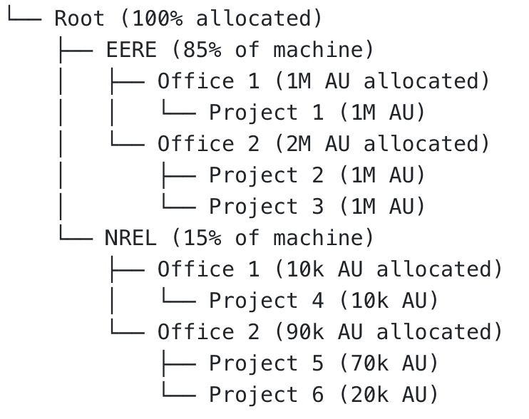

# Job Priorities on Kestrel
*Job priority on Kestrel is determined by a number of factors including time the job is eligible to run in the queue (age),
the size of the job (jobsize), resources requested and their partition (partition), quality of service and the 
associated priority (qos), and the relative fair-share of the individual allocation.*

Learn about [job partitions and scheduling policies](./index.md).

## Job Priority & Scheduling

The Slurm scheduler has two scheduling loops: 

1. **Main scheduling loop**, which schedules jobs in strict priority order, 
2. **Backfill scheduling loop**, that allows lower priority jobs to be scheduled (as long as the expected start time of higher priority jobs is not affected).  

In both cases, Slurm schedules in strict priority, with higher priority jobs being considered first for scheduling; however, due to the resources requested or other configuration options, there may be availability for backfill to schedule lower priority jobs (with the same caveat as before, that lower priority jobs can not affect the expected start time of higher priority jobs).  The backfill scheduler uses the user defined wallclock during submission for scheduling, which can result in scheduler inefficiencies as the estimates diverge from actual wallclock.

An individual job's priority is a combination of multiple factors: (1) age, (2) nodes requested or jobsize, (3) partition
factor, (4) quality of service (qos), and (5) the relative fair-share of the individual allocation.  There is a weighting
factor associated with each of these components (shown below) that determines the relative contribution of each factor:

| Component | Weighting Factor | Nominal Weight| Note |
| :---| :---: | :---: | :--- | 
| age | 30,589,200 |4% | Jobs accumulate AGE priority while in the queue and eligible to run (up to a maximum of 14 days) |
| jobsize | 221,771,700 | 29%| Jobs receive increasing size priority as number of nodes requested increases.
| partition | 38,236,500 | 5% | Additional boost for certain partitions (e.g., nvme), so that jobs requesting specific resources receive priority.|
| qos | 76,473,000 | 10%| A job may request high-priority using --qos=high and receive the full qos priority.  Jobs without this flag receive no qos priority.
| fairshare| 397,659,600 | 52% |  A project is under-served (and receives a higher fair-share priority) if the projects' usage is low relative to the size of its' allocation.  There is additional complexity discussed below.|

## Fairshare

Fairshare is a scheduling system where the size of a project's allocation relative to the size of the machine determines their relative fairshare.  A project's fairshare priority would be elevated if the utilization is low relative to their fairshare, where utilization is a function of sibling projects (same office).  Similarily, a project's fairshare priority would be lower if the utilization is high relative to the allocation.  

A fairtree with a hypothetical allocation is illustrated below:



In this hypothetical scenario, fairshare values would be calculated at each point in the fairtree.  The fairshare calculations are a function of: (1) the allocation, (2) the sum of the sibling allocations, and (3) recent usage of both the allocation and the siblings.  For example, the utilization and allocations of all projects in **EERE / Office 2** would be used to calculate the individual level fairshare value for the individual projects contained in that office.  Similarly, the fairshare values for all offices within EERE would be used to calculate the fairshare values for **EERE / Office 1** and **EERE / Office 2**.

The level fairshare values are calculated as follows:

$$Level Fairshare = \frac{S}{U}$$

where 

$$S = \frac{Sraw_{self}}{Sraw_{self+siblings}}, \quad U = \frac{Uraw_{self}}{Uraw_{self+siblings}}$$

This is repeated at each level of the fairtree, and a ranked list is built using a depth first traversal of the fairshare tree.  A project's fairshare priority is proportional to its position on this list.  

The list is descended depth first in part to prioritize the higher level assigned percentages (e.g.,  the EERE and NREL utilization is balanced first, then individual offices within EERE and NREL, and so on).  Due to the depth first traversal it is hypothetically possible that an underserved allocation exists with a high level fairshare value, but is lower on the ranked list as the order of traversal is determined from its siblings and parents' usage.   

As additional complexity, the above usage calculations are modified by a half-decay system that emphasizes more recent usage and de-emphasizes historical usage:

$$ U = U_{currentperiod} + ( D * U_{lastperiod}) + (D * D * U_{period-2}) + ...$$

The decay factor, *D*, is a number between 0 and 1 that achieves the half-decay rate specified by the Slurm configruation files (14 day on Kestrel).


## How to Get High Priority for a Job
You can submit your job to run at high priority or you can request a node reservation.

### Running a Job at High Priority 
**Jobs that are run at high priority will be charged against the project's allocation at twice the normal rate.** If your job would have taken 60 hours to complete at normal priority, it will be charged 120 hours against your allocation when run with high priority.

If you've got a deadline coming up and you want to **reduce the queue wait time** for your jobs, you can run your jobs at high priority by submitting them with the ```--qos=high``` option. This will provide a small priority boost.

### Requesting a Node Reservation
If you are doing work that requires real-time Kestrel access in conjunction with other ESIF user facility laboratory resources, you may request that nodes be reserved for specific time periods.

Your project allocation will be charged for the entire time you have the nodes reserved, whether you use them or not.

To request a reservation, contact [HPC Help](mailto://hpc-help@nrel.gov).

## How to Get Standby Priority for a Job

All partitions have a matching `-standby` partition, which has *lower* priority. You can always opt to run jobs in standby at no cost towards your project’s AU consumption. To submit a standby job to any partition, simply add `#SBATCH --qos=standby` to your job submission script. Standby jobs only run when nodes are otherwise idle (i.e., regular AU-charged jobs will always take priority over standby jobs). Submitting jobs with `--qos=standby` can be a good option if: 
    1) Wait time is not a concern for your jobs, and/or
    2) Your desired Slurm partition is relatively open, and you want to save AUs for other jobs. Please [see here](../../../Slurm/monitor_and_control.md#sinfo) for instructions on how to estimate a partition's availability.

Note that `standby` is the default QoS for allocations which have already consumed all awarded AUs for the year.

