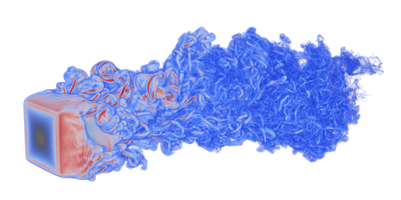

# ParaView

*ParaView is an open-source, multi-platform data analysis and visualization application. ParaView users can quickly build visualizations to analyze their data using qualitative and quantitative techniques. The data exploration can be done interactively in 3D or programmatically using ParaView's batch processing capabilities. ParaView was developed to analyze extremely large data sets using distributed memory computing resources. It can be run on supercomputers to analyze data sets of terascale as well as on laptops for smaller data.*

The following tutorials are meant for Eagle and Kestrel supercomputers. 


## Using ParaView in Client-Server Mode 

Running ParaView interactively in client-server mode is a convenient worflow for researchers who have a large amount of remotely-stored data that they'd like to visualize using a locally-installed copy of ParaView.  
In this model, the HPC does the heavy lifting of reading file data and applying filters, taking advantage of parallel processing when possible, then "serves" the rendered data to the ParaView client running locally on your desktop.  
This allows you to interact with ParaView as you normally would (i.e., locally) with all your preferences and shortcuts intact *without* the time consuming step of transferring data from the supercomputer to your desktop or relying on a remote desktop environment.

The first step is to install ParaView. 
It is recommended that you use the binaries provided by Kitware on your workstation matching the NREL installed version. 
This ensures client-server compatibility. 
The version number that you install must identically match the version installed at NREL. 
To determine which version of ParaView is installed on the cluster, connect to Eagle or Kestrel as you normally would, load the ParaView module with `module load paraview`, then check the version with `pvserver --version`.  
The version number, e.g., 5.11.0, will then be displayed to your terminal.  
To download the correct ParaView client binary version for your desktop environment, visit the ParaView [website](https://www.paraview.org/download/).


1. Reserve Compute Nodes

    The first step is to reserve the computational resources on Eagle/Kestrel that will be running the ParaView server.
    
    This requires using the Slurm `salloc` directive and specifying an allocation name and time limit for the reservation.
    
    Note that this is one of the few times where `salloc` is used instead of srun to launch the job, since we'll be launching multiple instances of pvserver using srun inside the job allocation in a later step. 
    In previous versions of Slurm (prior to 20.11) you would use srun instead of salloc, but that behavior has been deprecated due to changes in the way Slurm handles job steps inside an allocation. 
    The old "srun-then-srun" behavior may be replicated using the `srun --overlap` flag (see `man srun` and Slurm documentation for details), but the 'salloc-then-srun' construct works quite well and is what we'd recommend in this case for ease of use.
    
    (Otherwise, for interactive jobs that just require one process on one node, the "salloc-then-srun" construct isn't necessary at all; for that type of job you may just use `srun -A <account> -t <time> --pty $SHELL` to land on a compute node and run your software as per normal, without needing an srun in front.)
    
    To reserve the computational resources on Eagle/Kestrel:
    
    ```bash
    salloc -A <alloc_name> -t <time_limit>
    ```
    
    where `<alloc_name>` will be replaced with the allocation name you wish to charge your time to and `<time_limit>` is the amount of time you're reserving the nodes for. 
    At this point, you may want to copy the name of the node that the Slurm scheduler assigns you (it will look something like r1i0n10, r4i3n3, etc., and follow immediately after the "@" symbol at the command prompt ) as we'll need it in Step 3.
    
    In the example above, we default to requesting only a single node which limits the maximum number of ParaView server processes we can launch to the maximum number of cores on a single Eagle node (on Eagle, this is 36) or Kestrel node (on Kestrel, this is 104).  
    If you intend to launch more ParaView server processes than this, you'll need to request multiple nodes with your `salloc` command.
    
    ```bash
    salloc -A <alloc_name> -t <time_limit> -N 2
    ```
    
    where the `-N 2` option specifies that two nodes be reserved, which means the maximum number of ParaView servers that can be launched in Step 2 is 36 x 2 = 72 (Eagle) 104 x 2 = 208 (Kestrel).  
    Although this means you'll be granted multiple nodes with multiple names, the one to copy for Step 3 is still the one immediately following the "@" symbol.  
    See the table of recommended workload distributions in Step 2 for more insight regarding the number of nodes to request.

2. Start ParaView Server

    After reserving the compute nodes, load the ParaView module with
    
    ```bash
    module load paraview
    ```
    
    Next, start the ParaView server with another call to the Slrum `srun` directive
    
    ```bash
    srun -n 8 pvserver --force-offscreen-rendering
    ```
    
    In this example, the ParaView server will be started on 8 processes.  
    The `--force-offscreen-rendering` option is present to ensure that, where possible, CPU-intensive filters and rendering calculations will be performed server-side (i.e., on the Eagle/Kestrel compute nodes) and *not* on your local machine.  
    Remember that the maximum number of ParaView server processes that can be launched is limited by the amount of nodes reserved in Step 1.  
    Although every dataset may be different, ParaView offers the following recommendations for balancing grid cells to processors.
    
    | Grid Type         | Target Cells/Process | Max Cells/Process |
    | ----------------- | -------------------- | ----------------- |
    | Structured Data   | 5-10 M               | 20 M              |
    | Unstructured Data | 250-500 K            | 1 M               |
    
    So for example, if you have data stored in an unstructured mesh with 6 M cells, you'd want to aim for between 12 and 24 ParaView server processes, which easily fits on a single Eagle or Kestrel nodes.  
    If the number of unstructured mesh cells was instead around 60 M, you'd want to aim for 120 to 240 processes, which means requesting a minimum of 4 eagle nodes at the low end (36 x 4 = 144) or 2 Kestrel nodes.  
    Note, this 4-node/2-nodes request may remain in the queue longer while the scheduler looks for resources, so depending on your needs, it may be necessary to factor queue times into your optimal cells-per-process calculation.
    
    Note: The `--server-port=<port>` option may be used with pvserver if you wish to use a port other than 11111 for Paraview. 
    You'll need to adjust the port in the SSH tunnel and tell your Paraview client which port to use, as well. 
    See the following sections for details.

3. Create SSH Tunnel

    Next, we'll create what's called an SSH tunnel to connect your local desktop to the compute node(s) you reserved in Step 1.  
    This will allow your local installation of ParaView to interact with files stored remotely on Eagle/Kestrel.  
    **In a new terminal window**, execute the following line of code **on your own computer**:
    
    For Kestrel:
    ```bash
    ssh -L 11111:<node_name>:11111 <user_name>@kestrel.hpc.nrel.gov
    ```
    For Eagle:
    ```bash
    ssh -L 11111:<node_name>:11111 <user_name>@eagle.hpc.nrel.gov
    ```
    
    where `<node_name>` is the node name you copied in Step 1 and `<user_name>` is your HPC username.
    
    Note that if you changed the default port to something other than 11111 (see the previous section) you'll need to change the port settings in your SSH tunnel, as well. 
    The SSH command construct above follows the format of `<local_port>:<node_name>:<remote_port>`. 
    The `<local_port>` is the "beginning" of the tunnel on your computer, and is often the same as the "end" port of the tunnel, though this is not required. 
    You may set this to anything convenient to you, but you will need to tell your Paraview client the right port if you change it (see the next section for details.) <remote_port> is the port on the Eagle/Kestrel compute node where pvserver is running. 
    The default for pvserver is 11111, but if you changed this with pvserver `--server-port=` flag, you'll need to change <remote_port> in your ssh command to match.

4. Connect ParaView Client

    Now that the ParaView server is running on a compute node and your desktop is connected via the SSH tunnel, you can open ParaView as usual.  
    From here, click the "Connect" icon or `File > Connect`.  
    Next, click the "Add Server" button and enter the following information.
    
    | Name        | Value         |
    |-------------|---------------|
    | Name        | Eagle HPC or Kestrel HPC   |
    | Server Type | Client/Server |
    | Host        | localhost     |
    | Port        | 11111         |
    
    Only the last three fields, Server Type, Host, and Port, are strictly necessary (and many of them will appear by default) while the Name field can be any recognizable string you wish to associate with this connection.  
    When these 4 fields have been entered, click "Configure" to move to the next screen, where we'll leave the Startup Type set to "Manual".  
    Note that these setup steps only need to be completed the first time you connect to the ParaView server, future post-processing sessions will require only that you double click on this saved connection to launch it.
    
    When finished, select the server just created and click "Connect".  
    The simplest way to confirm that the ParaView server is running as expected is to view the Memory Inspector toolbar (`View > Memory Inspector`) where you should see a ParaView server for each process started in Step 2 (e.g., if `-n 8` was specified, processes `0-7` should be visible).
    
    That's it!  You can now `File > Open` your data files as you normally would, but instead of your local hard drive you'll be presented with a list of the files stored on Eagle or Kestrel.

### General Tips

* The amount of time you can spend in a post-processing session is limited by the time limit specified when reserving the compute nodes in Step 1.  If saving a large time series to a video file, your reservation time may expire before the video is finished.  Keep this in mind and make sure you reserve the nodes long enough to complete your job.
* Adding more parallel processes in Step 2, e.g., `-n 36`, doesn't necessarily mean you'll be splitting the data into 36 blocks for each operation.  ParaView has the *capability* to use 36 parallel processes, but may use many fewer as it calculates the right balance between computational power and the additional overhead of communication between processors.


## High-quality Rendering With ParaView 

How to use ParaView in batch mode to generate single frames and animations on Eagle/Kestrel



###  Building PvBatch Scripts in Interactive Environments

1.  Begin by connecting to an Eagle or Kestrel login node:

        ssh {username}@eagle.hpc.nrel.gov 

        or

        ssh {username}@Kestrel.hpc.nrel.gov 

2.  Request an interactive compute session for 60 minutes):

        salloc -A {allocation} -t 60

    Note: Slurm changes in January 2022 resulted in the need to use salloc to start your interactive session, since we'll be
    running pvbatch on the compute node using srun in a later step. This "srun-inside-an-salloc" supercedes
    the previous Slurm behavior of "srun-inside-an-srun", which will no longer work.

3.  Once the session starts, load the appropriate modules:

        module purge
        module load paraview/osmesa

    Note: In this case, we select the `paraview/server` module as opposed to the default ParaView build,
    as the server version is built for rendering using offscreen methods suitable for compute nodes.

4.  and start your render job:

        srun -n 1 pvbatch --force-offscreen-rendering render_sphere.py

    where `render_sphere.py` is a simple ParaView Python script to add a sphere source and
    save an image.

###  Transitioning to Batch Post-Processing

Tweaking the visualization options contained in the `pvrender.py` file inevitably requires some amount of trial
and error and is most easily accomplished in an interactive compute session like the one outlined above.  Once
you feel that your script is sufficiently automated, you can start submitting batch jobs that require no user interaction.

1.  Prepare your script for `sbatch`. A minimal example of a batch script named `batch_render.sh` could look like:

        #!/bin/bash

        #SBATCH --account={allocation}
        #SBATCH --time=60:00
        #SBATCH --job-name=pvrender
        #SBATCH --nodes=2

        module purge
        module load paraview/$version-server

        srun -n 1 pvbatch --force-offscreen-rendering render_sphere.py 1 &
        srun -n 1 pvbatch --force-offscreen-rendering render_sphere.py 2 &
        srun -n 1 pvbatch --force-offscreen-rendering render_sphere.py 3 &

        wait

    where we run multiple instances of our dummy sphere example, highlighting that different options can be
    passed to each to post-process a large batch of simulated results on a single node.  Note also that for more
    computationally intensize rendering or larger file sizes (e.g., tens of millions of cells) the option `-n 1`
    option can be set as suggested in the [client-server guide](client_server_setup.md).


2.  Submit the job and wait:

        sbatch batch_render.sh


###  Tips on Creating the PvBatch Python Script

Your ParaView python script can be made in a number of ways. The easiest
is to run a fresh session of ParaView (use version 5.x on your local
machine) and select "Tools→Start Trace," then "OK". Perform all the
actions you need to set your scene and save a screenshot. Then select
"Tools → Stop Trace" and save the resulting python script (we will use
`render_sphere.py` in these examples).
 

Here are some useful components to add to your ParaView Python script.

-   Read the first command-line argument and use it to select a data
    file to operate on.

        import sys
        doframe = 0
        if len(sys.argv) > 1:
            doframe = int(sys.argv[1])
        infile = "output%05d.dat" % doframe

    Note that `pvbatch` will pass any arguments after the script name to
    the script itself. So you can do the following to render frame 45:

        srun -n 1 pvbatch --force-offscreen-rendering render_sphere.py 45

    You could programmatically change this value inside the `batch_render.sh` script, your script would need
    to iterate using something like:

        for frame in 45 46 47 48
        do
            srun -n 1 pvbatch --force-offscreen-rendering render_sphere.py $frame
        done

<!--     And you would need to submit the script as such:

        sbatch -F "45" batchrender.sh -->

-   Set the output image size to match FHD or UHD standards:

        renderView1.ViewSize = [3840, 2160]
        renderView1.ViewSize = [1920, 1080]

-   Don't forget to actually render the image!

        pngname = "image%05d.png" % doframe
        SaveScreenshot(pngname, renderView1)


## Insight Center

ParaView is supported in the Insight Center's immersive virtual environment. 
[Learn about the Insight Center](https://www.nrel.gov/computational-science/insight-center.html). 

For assistance, contact [Kenny Gruchalla](Kenny.Gruchalla@nrel.gov).
