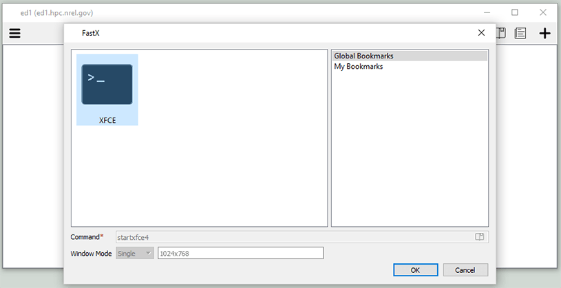
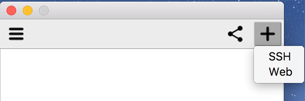
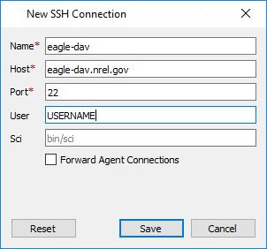
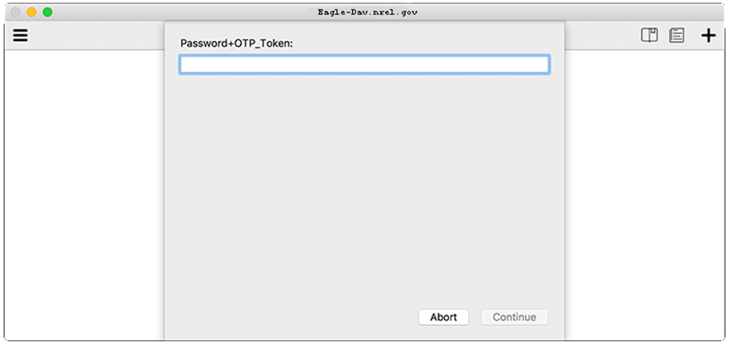
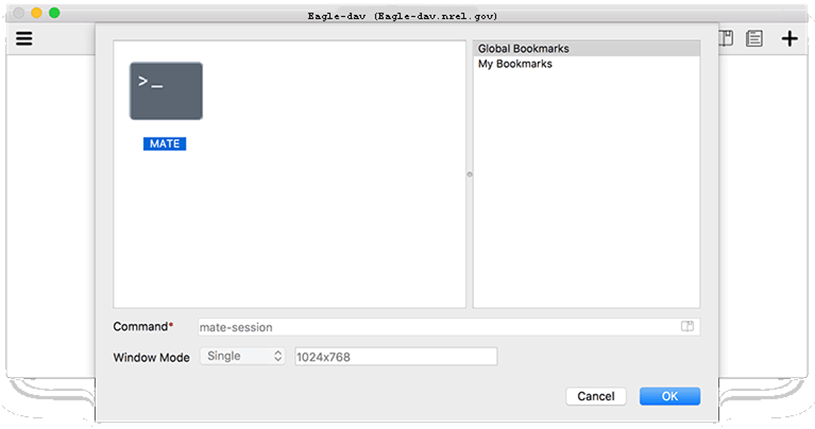

#Using VirtualGL and FastX on the Eagle System

VirtualGL and FastX provide remote desktop and visualization capabilities for graphical applications.

##Introduction
VirtualGL is an open-source package that gives any Linux remote display software the ability to run OpenGL applications with full 3D hardware acceleration. The traditional method of displaying graphics applications to a remote X server (indirect rendering) supports 3D hardware acceleration, but this approach causes all of the OpenGL commands and 3D data to be sent over the network to be rendered on the client machine. With VirtualGL, the OpenGL commands and 3D data are redirected to a 3D graphics accelerator on the application server, and only the rendered 3D images are sent to the client machine. VirtualGL "virtualizes" 3D graphics hardware, allowing users to access and share large-memory visualization nodes with high-end graphics processing units (GPUs) from their energy-efficient desktops. For more information, refer to the current documentation or the background article.

FastX provides a means for sharing a graphical desktop. By connecting to a FastX session on a DAV node, users can run graphical applications on a data analysis and visualization (DAV) node with a similar experience to running on their workstation.  Another benefit is that you can disconnect from a FastX connection, go to another location and reconnect to that same session, picking up where you left off.

##Remote Visualization
NREL has large-memory GPU-equipped data analysis and visualization (DAV) nodes attached to Eagle. You can remotely run visualization applications on these servers. In addition, the regular Eagle login nodes can also host VNC server processes. Please remember that these nodes are shared resources, and highly compute-intensive workloads will be felt by all other active users. If possible, use the regular Eagle batch queue to run compute-intensive jobs in batch mode, rather than in an interactive session.

##Connecting to DAV Nodes Using FastX
Launch a FastX session using Web browser or Desktop Client.

??? abstract "NREL On-Site and VPN Users" 
    ####Using Web Browser
    
    Launch a web browser on your local machine and connect to https://eagle-dav.hpc.nrel.gov. After logging in with your HPC username/password you will be able to launch a FastX session by choosing a desktop environment of your choice.
    
    **"KNOWN BUG":
    
    When launching a new session, the new session browser tab may load an error page.
    
    Cause: FastX Load Balancer. We see this when the load balancer redirects to the least utilized node.
    
    Workaround: Simply reload the page in the new session browser tab or close the tab and relaunch the active session
    
    
    
    ####Using Desktop Client
    
    Download the [Desktop Client](https://www.nrel.gov/hpc/eagle-software-fastx.html#download) and install it on your local machine, then follow these instructions to connect to one of the DAV nodes.
    
    
    
    ####Step 1:
    
    Launch the FastX Desktop Client.
    
    
    
    ####Step 2:
    
    Add a profile using the + button on the right end corner of the tool using the Web protocol.
    
    
    ####Step 3:
    
    Give your profile a name and enter the settings...
    
    URL: <https://eagle-dav.hpc.nrel.gov>
    
    Username: <HPC Username>
    
    ...and then save the profile.
    
    ####Step 4:
    
    Once your profile is saved, you will be prompted for your password to connect.
    
    
    
    ####Step 5:
    
    If a previous session exists, click (double click if in "List View") on current session to reconnect.
    
    
    
    OR
    
    ####Step 5a:
    
    Click the PLUS (generally in the upper right corner of the session window) to add a session and continue to step 6.
    
    ####Step 6:
    
    Select a Desktop environment of your choice and click OK to launch.
    


??? abstract "Off-Site or Remote Users"
    Remote users must use the Desktop Client via SSH for access. NREL Multifactor token (OTP) required.
    
    Download the Desktop Client and install it on your local machine, then follow these instructions to connect to one of the DAV nodes.
    
    
    
    ####Step 1:
    
    Launch the FastX Desktop Client.
    
    ####Step 2:
    
    Add a profile using the + button on the right end corner of the tool using the SSH protocol.
    

    ####Step 3:
    
    Give your profile a name and enter the settings...
    
    Host: eagle-dav.nrel.gov
    
    Port: 22
    
    Username: <HPC Username>
    
    ...and then save the profile.
    
    
    
    ####Step 4:
    
    Once your profile is saved. You will be prompted for your password+OTP_token (your multifactor authentication code) to connect.
    
    
    
    ####Step 5:
    
    Select a Desktop environment of your choice and click OK.
    
    

##Launching OpenGL Applications
You can now run applications in the remote desktop. You can run X applications normally; however, to run hardware-accelerated OpenGL applications, you must run the application prefaced by the vglrun command. For example, to run the vaporgui application, use:

```
$ module load matlab
$ vglrun matlab
```

##Download FastX Desktop Client

|Operating System |	Installer|
|Mac	          |Download](https://starnet.com/files/private/FastX31/FastX3-3.1.22.dmg) |
|Linux	          |Download](https://starnet.com/files/private/FastX31/FastX3-3.1.21.rhel7.x86_64.tar.gz) |
|Windows          |Download](https://starnet.com/files/private/FastX31/FastX-3.1.22-setup.exe) |
