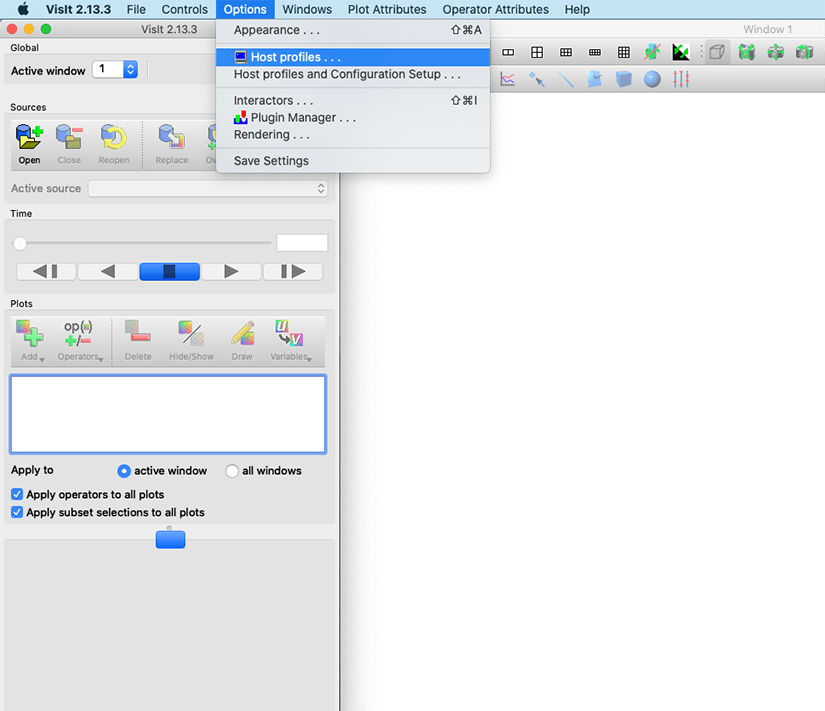
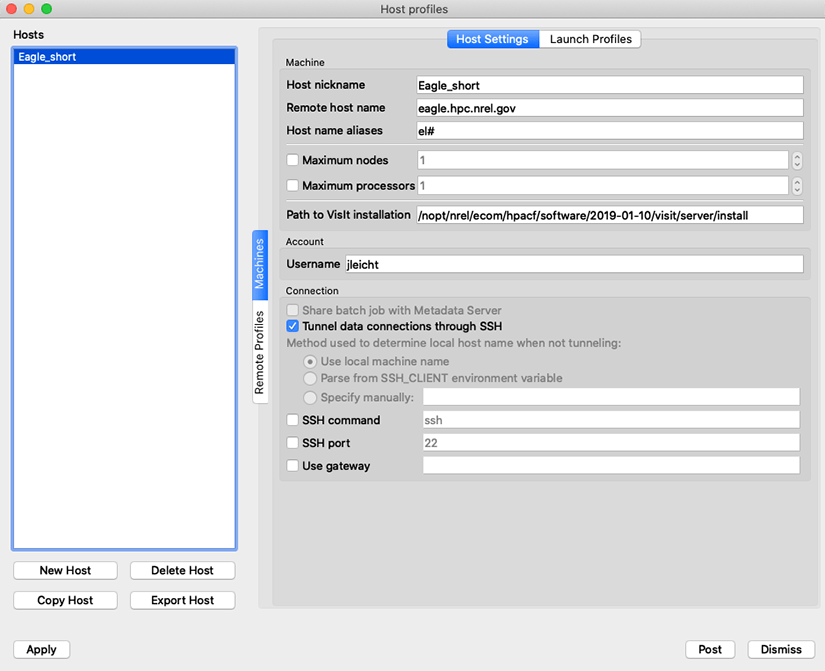
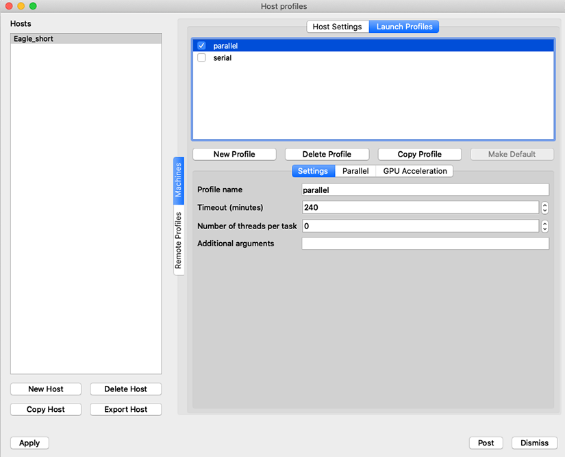
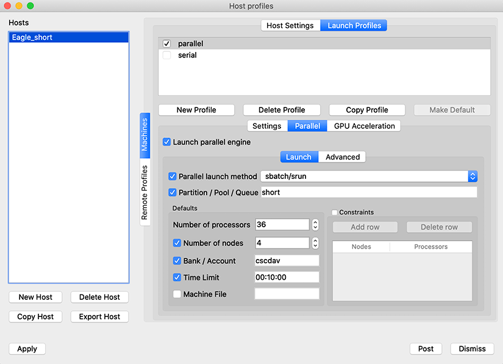
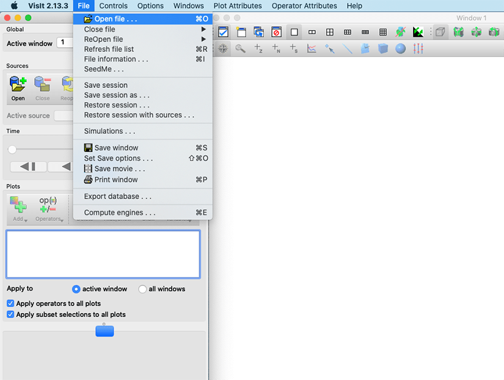
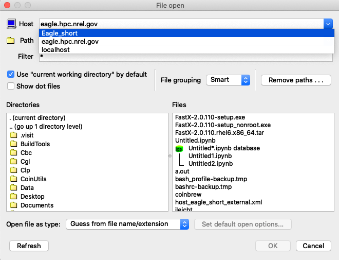
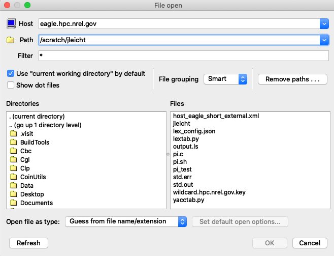

# Running VisIt Software 

On Eagle, learn how to run VisIt software—a free interactive parallel visualization and graphical analysis tool for viewing scientific data on Unix and PC platforms.

With VisIt, users can quickly generate visualizations from their data, animate them through time, manipulate them, and save the resulting images for presentations. It contains a rich set of visualization features so that you can view your data in a variety of ways. Also, it can be used to visualize scalar and vector fields defined on two- and three-dimensional (2D and 3D) structured and unstructured meshes.

VisIt was designed to handle very large data set sizes in the terascale range, and yet can also handle small data sets in the kilobyte range.

For more information on VisIt, see the [Lawrence Livermore National Laboratory website](https://wci.llnl.gov/simulation/computer-codes/visit). 

## Using Visit on Eagle
VisIt features a robust remote visualization capability.  
To enable remote visualization (client/server), follow these steps.

1. Add the following lines to you bashrc

    ```bash
    module use /nopt/nrel/apps/modules/centos74/modulefiles
    module load visit
    ```

2. On a local machine, download VisIt 2.13.3 for the appropriate platform from the Lawrence Livermore National Laboratory VisIt site.

3. Copy the file host-eagle.xml to $HOME/.visit/hosts on your local machine.

4. Restart VisIt.

5. The installed profile can be viewed and edited by clicking on 'Options --> Host profiles ... '. A remote host profile should appear.

    
    

6. Go to Launch Profiles.

    

7. Go to the Parallel tab, set up the job parameters, select sbatch/srun for ‘Parallel launch method’ and then click Apply.

    

8. To connect to VisIt, bo to File -> Open file

    

9. In the Host option, click on the drop down menu and choose the host Eagle_short

    

10. It will display a window with an option to change the username, if the username is not correct, then click on change username. *This is your HPC username
11. Type your HPC username and click Confirm username.
12. Enter your HPC password and click OK.
13. Wait for visit client to connect to the server on Eagle.
14. Enter the directory where your data is located into Path.

    

15. Once you choose your data file, VisIt will display the job information; you can change them and then click OK.
16. VisIt will display the following window.
17. Once the job is submitted, you can start applying visualization filters to your data. For the job information:

    * Bank / Account: enter the project name you are charging to.
    
    * Time limit: enter the time you need for the job in the following format H:M:S.

