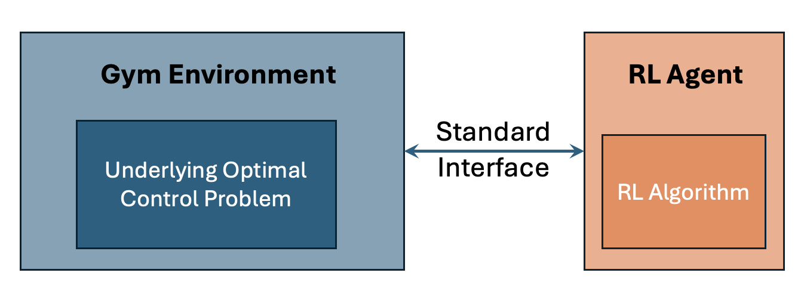
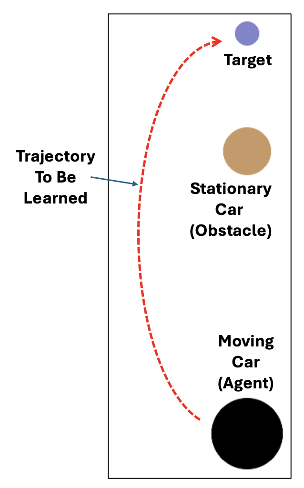

# Create a customized Gym environment

This section demonstrate how one can create their own Gym environment, carefully tailor-made to one's needs. At NREL, this could be for an optimal control problem in grid operation, building energy management or traffic control.

## High-level overview

To facilitate the deep RL implementation and tests of new algorithms, OpenAI Gym has been the standard interface to connect RL agent/algorithms with the problems. Given such a standard interface, RL training and experiments can be done in a plug-and-play manner, as shown in the figure below. We can use any RL agent implementation (e.g., RLlib and Stable-Baseline3) with different RL algorithms (e.g., PPO, SAC, A3C, and DDPG) to learn a policy for different problems (e.g., cart-pole, lunar landing or the problem of your interest) via the standard interface.

<p align="center">
    <br>
    <em>The interaction between Gym environment and RL agent.</em>
</p>

To allow using RL training framework such as RLlib in this tutorial to train an optimal policy for the problem of our interest, the customized environment should follow the Gym API standard.

## Gym environment API structure 

After the latest release of 0.26.2, in the [OpenAI Gym repo](https://github.com/openai/gym), it is [announced](https://github.com/openai/gym?tab=readme-ov-file#important-notice) that all future maintenance and updates are moved to [Gymnasium](https://github.com/Farama-Foundation/Gymnasium). So this tutorial will follow the Gymnasium API guidelines, but we will still refer the environment as "gym" environment for simplicity.

This tutorial also focuses on __episodic__ environment, meaning the optimal control is implemented on a limited step control horizon. The episode ends either when a fixed number of steps are reached or terminal states are reached. 

As the first step, import gymnasium
```
import gymnasium as gym
```

The cusmtom-made gym environment should follow the following structure with three core functions:

```
class CustomEnv(gym.Env):

    def __init__(self):
        # Initialized the environment.
        # Called only once when instantiate this class.
        ...
    
    def reset(self, seed=None, options={}):
        # Reset the environment to the beginning of the control episode.
        # Called once an episode is complete.
        ...
        return obs, info
    
    def step(self, action):
        # Implement the control using the provided action.
        # Called at each step/control interval within the episode.
        ...
        return obs, reward, terminated, truncated, info
```

Next, we explain more details:

Typically, the environment should inherit the `gym.Env` class by definining `class CustomEnv(gym.Env)`. The three core gym functions are:

 * `def __init__(self)`: Initializes the environment. More specifically, it generally involves the following three tasks:
   - Defining necessary variables/hyperparameters.  
   - Defining the dimensionality of the observation and action space for the problem, which are given using the parameters `self.observation_space` and `self.action_space`, respectively. Depending on their nature, they can take discrete, continuous, or a combination of values. See [this link](https://gymnasium.farama.org/api/spaces/) for more details.
   - [Optional] Initializing the external simulator if you need one.
 * `def reset(self, seed=None, options={})`: RL training requires repeated trial-and-error. Once an episode ends, either terminated or truncated, the `reset` function allows the agent to reset the environment back to the initial state, start over  and try again. 
 Specific things could include:
   - Resetting the state of the environment
   - Resetting other utilities, such as setting the step counter back to zero, i.e., `self.step_count = 0`.
   - Resetting the simulator if you have one.

   Argument `seed` is used to set the random seed and `options` can pass in some desired configuration for resetting, i.e., resetting to a specific inital state if otherwise generated randomly.

   Outputs of the reset function are `obs` and `info`, `obs` is the observation that the RL agent uses as a policy input, while `info` can be a dictionary including some auxilary information (not necessary for learning, but could be used for other purposes such as debugging.)

 * `def step(self, action)`: It defines the inner mechanics of the environment, and moves the simulation one step ahead using the provided `action`. Specific tasks inside this function can be categorized into the following four:
    - Advance the system for one step through the state transition function $s_{t+1} = f(s_t, a_t)$ defined by the Markov decision process. If you have external simulator, take one step in the simulator as well. Obtain the new observation and remember to increase to the step counter if necessary: `self.step_count += 1`.
    - Calculate the reward based on this step's control.
    - Determine if current episode should end or not, either terminated or truncated. For example, if `self.step_count >= MAX_STEP_ALLOWED`, set `truncated=True`.
    - [Optional] Prepare additional information and put them in the `info` dictionary. 

    Outputs of this function are:
    - `obs`: Usually a Numpy array collecting the new observation after the control of this step.
    - `reward`: A scalar reward reflecting the performance of this step's control.
    - `terminated`: A Boolean reflecting if terminal states are reached. E.g., the goal area is reached.
    - `truncated`: A Boolean reflecting if time limit is reached or other conditions that require stops the simulation.
    - `info`: A python dictionary containing auxilary information. If none, use `info={}`.

## Example: create a customized environment

This tutorial provides an example of customized environment called "CarPass", letting an RL agent to learn how to control a moving car to the target way point as fast as possible while avoid colliding with a parked stationary car and be out of bound. The figure below shows an illustration.

<p align="center">
    <br>
    <em>Illustration of the car pass environment.</em>
</p>

See the [full implementation](custom_env.py) for details, and the comments and docstrings should provide some explanations. 

One thing to notice is that there is a `render()` function in the customized environment, which is used to render the 2D image as shown above for visualization purpose. It is optional, so no need to implement `render()` if not necessary.
