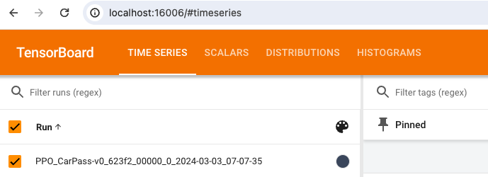

## Training RL policy on Kestrel

This directory contains examples of using RLlib for RL policy training.

### 1. Files in this directory

`train_script.py`: The main python file that sets up and initiates the training process. **It not only works on Kestrel, but can be used for local training if you want to test on your local computer.**

`config_parser.py`: Use to create an argparser with the options to customize training hyperparameters. Default values are also set within the file.

`train_single_node.sh`: The SLURM sbatch script for job submission. This script shows an example of using a single computing node for training.

`train_multi_nodes.sh`: The SLURM sbatch script for job submission. This script shows an example of using multiple Kestrel nodes for training.

### 2. Main training script

Here, we walk though the code in `train_script.py` to help the readers understand what each part of the code is doing.

Firstly, loading configuration arguments for this training experiment.

```
from config_parser import create_parser
parser = create_parser()
args = parser.parse_args()

print(f"Running with following CLI options: {args}")
```

This allows setting different configuration values in the SLURM sbatch script for the training: `python train_script.py --worker-num 100`. See [`config_parser.py`](config_parser.py) for different configuration options.

RLlib training relies on the distributed computing framework called [Ray](https://www.ray.io/), so a Ray cluster needs to be initialized.

When the `ip_head` configuration is provided, we will connect to the Ray server at that address. This usually happens when using multiple nodes for training and the Ray cluser is started in [train_multi_nodes.sh](train_multi_nodes.sh). Otherwise, we start the Ray server using `ray.init(local_mode=args.local_mode)`, and this happens in single node training.

```
# Ray cluster initialization
if args.ip_head is not None:
    ray.init(address=args.ip_head, 
             _redis_password=args.redis_password,
             local_mode=False)
else:
    ray.init(local_mode=args.local_mode)
```

Register the Gym environment. RLlib prefers a registered Gym environment, but it is just as simple as creating a name that follows typical Gym env name convention (e.g., EnvName-v0, EnvName-v1) and map this to an `env_creator` function:
```
env_name = 'CarPass-v0'

def env_creator(config):
    ...
    return env

register_env(env_name, env_creator)
```

Setting up the learning configuration and stopping criteria for the training task.
```
config = (
    get_trainable_cls(args.run)
    .get_default_config()
    .environment(env_name, env_config={})
    .framework(args.framework)
    .rollouts(num_rollout_workers=args.worker_num)
    .training(train_batch_size=args.train_batch_size, 
              lr=args.lr,
              model={"fcnet_hiddens": [256, 256]})
    # Use GPUs iff `RLlib_NUM_GPUS` env var set to > 0.
    .resources(num_gpus=int(os.environ.get("RLlib_NUM_GPUS", "0")))
)

# Stopping criteria
stop = {
    # "training_iteration": args.stop_iters,
    "timesteps_total": args.stop_timesteps,
    "episode_reward_mean": args.stop_reward,
}
```

Here, `args.run` could be a string such as 'PPO', 'A3C', etc., indicating which RL algorithms to be used, and `get_trainable_cls` goes and fetches the right trainable class according to `args.run`. `.environment(env_name, ...)` specifies which environment to train on. `args.framework` defines the ML framework to use, either Tensorflow or PyTorch, and we use PyTorch as an example here. `.rollouts()` allows setting the number of parallel workers. This number is usually limited to the number of CPU cores, since a Kestrel node has 104 cores, we can have 103 rollout workers (leaving one core for other tasks.) When using multiple nodes for training, the rollout worker number is calculated [here](train_multi_nodes.sh#L17). In `.training(...)`, hyperparameters of the RL algorithm can be set. The neural network architecture can also be defined: we are using a [256, 256] fully connected network, but RLlib allows the user to set a customized network as well, see an example of a pre-trained network [here](https://github.com/NREL/rlc4clr/blob/main/train/train_stg2.py#L178).

The actual training starts with the following code snippet, by putting everything, e.g., RL algorithm, stopping criteria and other configurations, together.

```
tuner = tune.Tuner(
    args.run,
    param_space=config.to_dict(),
    run_config=air.RunConfig(
        stop=stop, local_dir=LOG_PATH,
        checkpoint_config=air.CheckpointConfig(
            checkpoint_frequency=args.checkpoint_frequency,
            num_to_keep=args.checkpoint_to_save,
            checkpoint_score_attribute='sampler_results/episode_reward_mean'
        )),
)
results = tuner.fit()
```
There is an option to set up how model checkpoints are to be saved in the `checkpoint_config`. Within it, `checkpoint_frequency=x` is how frequent the policy model needs to be saved, e.g., every x iterations; `num_to_keep=y` indicates how many best checkpoints to be saved, i.e., the Top y performing policies; and `checkpoint_score_attribute` specifies using which attribute to evaluate the policies (and determine which ones are the "best".)

### 3. SLURM Sbatch scripts

**NOTE: You will need to change the $HPC_HANDLE and $USER variable in the script to be able to run on Kestrel.**

There are two files for submitting training jobs: one for _single node job_ and the other for _multi-node job_, they follow the following two or three steps.

#### Step 1 Loading the conda env

```
module purge
module load anaconda3
conda activate /projects/$HPC_HANDLE/$USER/conda_envs/rl_hpc
```

#### Step 2 Starting Ray cluster (Only needed for multi-node case)

Code snippet omitted here, see the [multi-node train script](train_multi_nodes.sh) for details. In general, this step will calculate the worker number, obtain node name list, and start the Ray cluster on the head node and all worker nodes.

#### Step 3 Starting RL training

Start RL training by calling the main training script. This is where some hyperparameters or configurations can be set: e.g., `--run PPO` as shown below.

```
python -u train_script.py --run PPO --redis-password $redis_password --worker-num $worker_num --ip-head $ip_head
```

### 4. Viewing learning curves on Tensorboard

Despite the deep learning framework we used is PyTorch, RLlib can help write the training logs so that TensorBoard can be used to visualize the training performance.

As defined in `train_script.py`, the trained policy/model will be saved under the path of `LOG_PATH`, which is the `results` folder in the `train` folder.

After obtaining a computing node on Kestrel, navigate to the train results folder, and you will see different policies from train instances initiated earlier, for example `PPO_2024-03-03_07-07-34` (which is the one we uploaded for an example). Use either of the following commands to start the Tensorboard (with your conda environment activated):

```
tensorboard --logdir=. --bind_all
```

or

```
tensorboard --logdir=PPO_CarPass-v0_623f2_00000_0_2024-03-03_07-07-35 --bind_all
```

The difference between these two is that the first one will show you the learning curves of all the training instances whereas the latter one specifies one specific instance to show. Once this command is executed, the Tensorboard will start its server to allow you to connect and browse, it's ready when you see the following output in the terminal. 

```
(rl_hpc)[xzhang2@dummynodeid PPO_2024-03-03_07-07-34]$ tensorboard --logdir=. --bind_all
TensorFlow installation not found - running with reduced feature set.
TensorBoard 2.16.2 at http://dummynodeid.hsn.cm.kestrel.hpc.nrel.gov:6006/ (Press CTRL+C to quit)
```

The `--bind_all` is needed to allow network traffic from your local machine to visit the Tensorboard server.

The URL in the terminal output above does not work directly if you are using local computer's web browser. To make it work, an SSH tunnel needs to be established using the following command from a terminal window on your local machine (assuming you are using Mac, if using Windows machine, please search online on the exact command).

```
ssh -L 16006:dummynodeid:6006 $USER@kestrel.hpc.nrel.gov
```
Remember to replace `dummynodeid` above with your actual computing node's ID. This builds a tunnel between your local computer's 16006 port with the 6006 port on the computing node. Now, when you visit `localhost:16006` on your local machine, you will be able to see the Tensorboard website. Using 16006 here is just in case you have local tensorboard server running on 6006.

<p align="center">
    <br>
    <em>You can visit Tensorboard from `localhost:16006` while the server runs on a computing node.</em>
</p>

### 5. Local computer training

To train on local computer, the following command can be used:

```
python train_script.py --worker-num 5
```

The worker number needs to be specified here because otherwise the default value (102) will be used, see the [default configuration](config_parser.py). Since local computer usually don't have this many CPU cores, the training will hang in there (waiting for resources that will never come). So, using a smaller number (less than the CPU cores number) is needed for local training.
